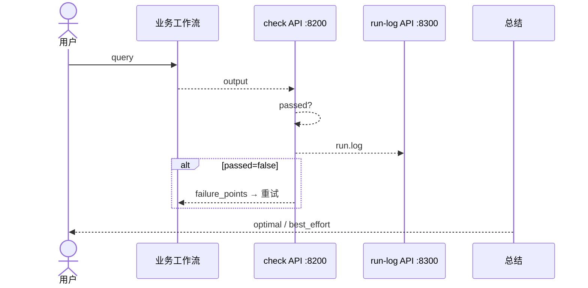

# Agent 循环调优：完整历程与技术方案

> **版本：** v2.0（历程整合版）  
> **日期：** 2026-06-25  
> **仓库：** https://github.com/wangxiaomo12138/lqy2026  
> **适用：** 仅能接入 Agent 平台、不可改底层；平台 MCP 联调存在卡点时的完整记录与现行方案

---

## 目录

1. [背景与约束](#1-背景与约束)
2. [要解决什么问题](#2-要解决什么问题)
3. [总体架构（最终形态）](#3-总体架构最终形态)
4. [完整尝试历程](#4-完整尝试历程)
5. [各方案对比与选型结论](#5-各方案对比与选型结论)
6. [现行推荐方案（API + Flask）](#6-现行推荐方案api--flask)
7. [组件清单与成熟度](#7-组件清单与成熟度)
8. [接入路径（给他人用）](#8-接入路径给他人用)
9. [本地验证与兜底方案](#9-本地验证与兜底方案)
10. [离线 Tune Engine](#10-离线-tune-engine)
11. [数据流与联合闭环](#11-数据流与联合闭环)
12. [路线图与待办](#12-路线图与待办)
13. [经验总结与决策记录](#13-经验总结与决策记录)
14. [附录：API 接口速查](#14-附录api-接口速查)

---

## 1. 背景与约束

### 1.1 平台现状

```text
用户 query
  → 规划模型（按工作流描述路由，最多 5 步）
  → 工作流执行
  → 总结模型输出
```

平台可配置：**Agent / 工作流 / Skill / MCP / API**，**不能修改**规划引擎、执行引擎等底层。

已有业务：**合同解析** Agent + 工作流。

### 1.2 硬约束

| 约束 | 影响 |
|------|------|
| 不改平台底层 | 循环逻辑必须外挂：Skill + 服务 + 引用模板 |
| 规划最多 5 步 | 单次循环步数预算紧，需 Skill 精确分配 |
| 平台 MCP 联调报 500 | 不能直接依赖 MCP 作为唯一接入方式 |
| 团队技术栈 Flask | 服务侧优先 Flask，与平台 API 节点一致 |

---

## 2. 要解决什么问题

| 编号 | 问题 | 场景 | 目标 |
|------|------|------|------|
| A | 单次输出质量差 | 合同解析第一次缺字段 | 当次自动检查、重试、输出最优 |
| B | 长期配置难优化 | 改 Prompt/工作流不知效果 | 批量 benchmark、自动迭代版本 |
| C | 失败 case 丢失 | 线上坏结果没沉淀 | 落盘 → 导入 Tune Engine |
| D | 他人复用成本高 | 每个业务重写一套 | 引用模板 + 改配置即可 |

---

## 3. 总体架构（最终形态）

```text
┌─────────────────────────────────────────────────────────────┐
│                    用户 / 总 Agent                           │
└───────────────────────────┬─────────────────────────────────┘
                            │
         ┌──────────────────┴──────────────────┐
         ▼                                      ▼
┌─────────────────────┐              ┌─────────────────────┐
│ 方案一：在线单次循环  │              │ 方案二：Tune Engine  │
│ Skill + API(Flask)  │              │ 离线批量调优 :8100   │
│ check :8200         │              │ Mock 已跑通          │
│ run-log :8300       │              │ 待接真实 Agent API   │
└──────────┬──────────┘              └──────────┬──────────┘
           │                                      │
           └────────────────┬─────────────────────┘
                            ▼
              ┌─────────────────────────┐
              │   Agent 平台（不修改）    │
              │ 规划 → 工作流 → 总结     │
              └─────────────────────────┘
```

**分工原则：**

- **Skill**：教规划何时执行、检查、重试、停止（软策略）
- **check-mcp**：客观规则评分（硬判断）
- **run-log-mcp**：运行落盘（数据层）
- **工作流/API 节点**：在平台内触发 HTTP 调用（传输层）
- **Tune Engine**：离线提升配置版本（长期优化）

---

## 4. 完整尝试历程

按时间线记录「试过什么 → 遇到什么问题 → 怎么调整」。

### 阶段 0：问题定义（方案设计）

| 动作 | 结论 |
|------|------|
| 分析平台能力 | 只能挂 MCP/Skill/工作流，不能改底层 |
| 确定双方案 | **内层单次循环** + **外层 Tune Engine** 互补 |
| 输出文档 | `Agent自调优技术方案总览.md`、`技术路线图与业务流程图.md` |

---

### 阶段 1：MCP 伪 REST（第一版 check-mcp）

**做法：**

- `check-mcp/server.py` 用 FastAPI 暴露 `GET /mcp/tools`、`POST /mcp/tools/call`
- 模拟 MCP 工具调用，内联合同解析评估规则
- Skill `auto-retry-replan` 教规划调 `check.evaluate`

**结果：**

- ✅ 本地 curl 可测，逻辑正确
- ❌ **平台要求标准 MCP SSE**，伪 REST 无法正常挂载
- ❌ 与 run-log-mcp 评估逻辑重复

**调整：**

- 评估逻辑抽到 `shared/evaluators.py` 统一口径
- 准备改 SSE

---

### 阶段 2：MCP SSE（第二版 check-mcp）

**做法：**

- 引入官方 `mcp` Python SDK + `SseServerTransport`
- `GET /sse` + `POST /messages/?session_id=...`
- 平台地址改为 `http://HOST:8200/sse`
- 记录见 `update.md`

**结果：**

- ✅ 本地 `curl -N /sse` 可收到 `endpoint` 事件
- ✅ `POST /mcp/tools/call` 仍可自测评估逻辑
- ❌ **平台挂 MCP 仍报 500**（联调未通，原因待平台侧排查）

**调整：**

- 保留 SSE 实现于 `server_mcp.py`（可选）
- 不再把 MCP 作为唯一接入路径
- 增加 REST API：`POST /api/v1/check/evaluate`

---

### 阶段 3：REST API 接入（第三版）

**做法：**

- check-mcp 增加标准 REST：`/api/v1/check/evaluate`、`/api/v1/tasks`
- run-log-mcp 增加：`/api/v1/run/log`、`/api/v1/run/stats`
- 新建 API 版 Skill：`auto-retry-replan-api`
- 新建工作流模板：`wf_retry_wrapper_api.json`（每步 URL/body 写好）
- 新建 Agent 模板：`retry-assistant-api.json`

**思路：**

平台 MCP 不通时，在工作流里用 **API/HTTP 节点** 直接 POST，循环逻辑不变。

**结果：**

- ✅ API 本地测试通过
- ✅ 可封装为「标准包」供他人引用
- ⚠️ 需在平台工作流中配置 HTTP 节点（比挂 MCP 多几步配置）

---

### 阶段 4：Flask 化（第四版，现行服务框架）

**背景：** 团队使用 **Flask API**，FastAPI 与部署习惯不一致。

**做法：**

| 服务 | 结构 |
|------|------|
| check-mcp | `core.py` + `app.py`(Flask) + `server_mcp.py`(可选 SSE) |
| run-log-mcp | `core.py` + `app.py`(Flask) |

- 默认启动：`python app.py`
- Docker / `start-all.sh` 改为 Flask
- API 路径**不变**，平台配置无需改 URL

**结果：**

- ✅ 与团队 Flask 栈一致
- ✅ 评估、落盘逻辑与 MCP/API 版完全共用 `core.py`

---

### 阶段 5：平台联调受阻 → 本地兜底

**背景：** 平台单次循环 MCP/API 节点联调仍不通。

**做法：**

- 新建 `single-loop-local/`：直接调**封装的模型服务** + 本地 evaluators
- 不依赖 Agent 平台，验证「执行 → 检查 → 重试 → 总结」闭环

**结果：**

- ✅ 可独立演示循环逻辑
- ✅ 可接真实模型 API（`config.yaml` 配置 OpenAI 兼容或自定义 HTTP）
- 用途：平台通之前的**逻辑验证**和**汇报演示**

---

### 阶段 6：离线 Tune Engine（并行推进）

**做法：**

- 独立 Python 服务 `tune-engine/`（FastAPI :8100）
- Mock Agent 模拟版本迭代，端到端 demo 可跑
- `failure_cases.jsonl` → `import_failure_cases.py` → benchmark

**结果：**

- ✅ `python scripts/run_demo.py` 可演示批量调优闭环
- ❌ 真实 Agent API 未接（`agent_platform.py` 仍为 Mock）
- ❌ `shadow_compare`、自动晋升未做

---

### 历程一览表

| 阶段 | 接入方式 | 状态 | 遗留 |
|------|----------|------|------|
| 1 | MCP 伪 REST | 废弃作平台接入 | 保留 curl 自测 |
| 2 | MCP SSE | 本地通，平台 500 | `server_mcp.py` 可选保留 |
| 3 | REST API | ✅ 现行 | 工作流 API 节点对接 |
| 4 | Flask API | ✅ **默认** | 与团队栈一致 |
| 5 | single-loop-local | ✅ 兜底 | 平台不通时演示 |
| 6 | Tune Engine Mock | ✅ 离线验证 | 待接真实 API |

---

## 5. 各方案对比与选型结论

### 5.1 接入方式对比

| 方式 | 优点 | 缺点 | 结论 |
|------|------|------|------|
| MCP SSE | 平台原生、规划自动调工具 | 当前 500 未通 | 保留可选，非主路径 |
| REST API (FastAPI) | 标准 HTTP、易测 | 团队用 Flask | 已迁移到 Flask |
| **Flask API + 工作流节点** | 与平台一致、可控 | 工作流需配节点 | **★ 现行推荐** |
| 纯 Skill 自评 | 零部署 | 不稳定、不可追溯 | ❌ 不采用 |
| single-loop-local | 不依赖平台 | 不能给业务方直接用 | 开发验证用 |

### 5.2 最终选型

```text
生产接入（平台通后）：retry-assistant-api + wf_retry_wrapper_api + Flask API
平台 MCP 将来通了：可切回 MCP 版 Skill，core 逻辑不变
开发验证：single-loop-local 或 curl API
长期优化：Tune Engine 离线批量
```

---

## 6. 现行推荐方案（API + Flask）

### 6.1 标准包组成

| 组件 | 路径 | 作用 |
|------|------|------|
| Skill | `skills/auto-retry-replan-api/SKILL.md` | 循环策略（API 版） |
| 工作流 | `integrations/workflows/wf_retry_wrapper_api.json` | 每步 API URL/body |
| Agent 模板 | `integrations/agents/retry-assistant-api.json` | 可引用壳 |
| check 服务 | `check-mcp/app.py` :8200 | Flask 检查 |
| run-log 服务 | `run-log-mcp/app.py` :8300 | Flask 落盘 |
| 业务配置 | `integrations/task-registry.yaml` | task_type + 字段 |

### 6.2 单次循环流程



### 6.3 启动服务

```bash
# 方式 1
bash scripts/start-all.sh

# 方式 2
cd check-mcp && pip install -r requirements.txt && python app.py    # :8200
cd run-log-mcp && pip install -r requirements.txt && python app.py  # :8300
```

### 6.4 别人怎么用

1. 部署 check-mcp + run-log-mcp  
2. `YOUR_HOST` 改为实际 IP  
3. 引用 `retry-assistant-api` 或 `wf_retry_wrapper_api`  
4. 挂 Skill `auto-retry-replan-api`  
5. 配置自己的业务工作流 + `task_type` / `expected_fields`  

---

## 7. 组件清单与成熟度

| 组件 | 端口 | 框架 | 状态 | 说明 |
|------|------|------|------|------|
| check-mcp | 8200 | Flask | ✅ MVP | `/api/v1/check/evaluate` |
| run-log-mcp | 8300 | Flask | ✅ MVP | `/api/v1/run/log` |
| tune-engine | 8100 | FastAPI | ✅ Mock | 待接真实 Agent |
| single-loop-local | — | 脚本 | ✅ 可用 | 平台不通时验证 |
| Skill (MCP 版) | — | 文档 | ✅ | MCP 通后用 |
| Skill (API 版) | — | 文档 | ✅ | **现行推荐** |
| integrations 模板 | — | JSON/YAML | ✅ | 含 API 版 |
| shadow_compare | — | — | ❌ | 路线图 Phase 4 |
| 平台联调 | — | — | ⚠️ | MCP 500 / API 节点待验证 |

---

## 8. 接入路径（给他人用）

### 路径 A：引用 Agent（推荐）

`integrations/agents/retry-assistant-api.json` → 总 Agent 引用 → 内部路由业务工作流

### 路径 B：引用工作流

`wf_retry_wrapper_api.json` → 业务 query 先走重试壳 → 再路由具体业务

### 路径 C：直接挂业务 Agent

业务 Agent + Skill `auto-retry-replan-api` + 工作流内 API 节点

### 新业务

只改 `task-registry.yaml`，**不改** check/run-log 代码：

```yaml
invoice-parse:
  task_type: invoice-parse
  expected_fields: [seller, buyer, amount, tax_id, invoice_date]
```

---

## 9. 本地验证与兜底方案

### 9.1 API 自测

```bash
curl http://127.0.0.1:8200/health
curl -X POST http://127.0.0.1:8200/api/v1/check/evaluate \
  -H 'Content-Type: application/json' \
  -d '{"task_type":"contract-parse","output":{"party_a":"甲"},"expected_fields":["party_a","party_b"]}'
```

### 9.2 single-loop-local

```bash
cd single-loop-local
cp config.yaml.example config.yaml   # 填模型服务地址
python run.py --file examples/contract.txt
```

用途：平台联调前验证循环逻辑；接封装模型服务做端到端演示。

---

## 10. 离线 Tune Engine

### 10.1 循环

```text
tune.start → benchmark 批量跑 → 评分 → 未达标 → 补丁 → 新版本 → 再跑
```

### 10.2 演示

```bash
cd tune-engine
python scripts/init_demo.py
python scripts/run_demo.py
```

### 10.3 与在线方案衔接

```text
run.log → failure_cases.jsonl → import_failure_cases.py → Tune benchmark → tune.start
```

---

## 11. 数据流与联合闭环

```text
                在线（每次 query）
用户 ──→ 工作流 ──→ check API ──→ run.log API
                              │
                              ▼
                    run_logs.jsonl
                    failure_cases.jsonl
                              │
                离线（批量）   ▼
                    Tune Engine
                              │
                              ▼
                    最优版本 vN（人工晋升）
                              │
                              └──→ 生产工作流配置
```

---

## 12. 路线图与待办

| 优先级 | 任务 | 负责 | 验收 |
|--------|------|------|------|
| P0 | 平台 API 节点联调通 wf_retry_wrapper_api | 开发 + 平台 | 合同解析可自动重试 |
| P0 | 排查 MCP 500（可选） | 平台侧 | SSE 能列出工具 |
| P1 | tune-engine 接真实 Agent API | 开发 | Mock 替换 |
| P1 | 合同解析 benchmark 10～20 条 | 业务 | Tune 可跑真数据 |
| P2 | failure_cases 自动回流 Tune | 开发 | 周级调优 |
| P3 | shadow_compare、监控 | 开发 | Phase 4 |

---

## 13. 经验总结与决策记录

### 13.1 关键认知

1. **Skill 不能替代客观检查** — 判分必须走规则引擎/API，不能靠模型自评  
2. **MCP 只是传输层** — 核心是 `run_evaluate` / `log_run`，传输可换 API  
3. **平台卡点要用兜底** — single-loop-local 保证逻辑可验证、可汇报  
4. **通用接入靠配置** — `task_type` + `expected_fields`，不是每个业务 fork 代码  
5. **在线 + 离线互补** — 单次循环救体验，Tune Engine 提长期能力  

### 13.2 决策记录（ADR 摘要）

| 决策 | 选项 | 选择 | 原因 |
|------|------|------|------|
| 改平台底层？ | 改 / 不改 | 不改 | 无权限，Skill+MCP/API 外挂 |
| 检查放哪？ | Skill / MCP/API | API 服务 | 确定性、可复现、可对接 Tune |
| MCP 500 后 | 放弃 / 改 API | 改 API + 保留 MCP | 双路径，降低平台依赖 |
| 服务框架 | FastAPI / Flask | Flask | 团队栈一致 |
| 晋升生产 | 自动 / 人工 | 人工 | MVP 风险可控 |

---

## 14. 附录：API 接口速查

### check-mcp (:8200)

```http
POST /api/v1/check/evaluate
Content-Type: application/json

{
  "task_type": "contract-parse",
  "output": { "party_a": "甲公司", "party_b": "乙公司" },
  "expected_fields": ["party_a", "party_b", "amount", "sign_date"],
  "summary": ""
}
```

### run-log-mcp (:8300)

```http
POST /api/v1/run/log
Content-Type: application/json

{
  "target_id": "contract-parse",
  "task_type": "contract-parse",
  "query": "用户原始问题",
  "output": { },
  "expected_fields": ["party_a", "party_b", "amount", "sign_date"],
  "attempt": 1,
  "check_result": { "passed": false, "score": 0.5, "failure_points": {} }
}
```

### 相关文档索引

| 文档 | 用途 |
|------|------|
| [Agent自调优技术方案总览](Agent自调优技术方案总览.md) | 原始完整技术细节 |
| [技术路线图与业务流程图](技术路线图与业务流程图.md) | 流程图、里程碑 |
| [单次循环-他人接入指南](单次循环-他人接入指南.md) | 业务方接入 |
| [Agent循环调优-领导汇报版](Agent循环调优-领导汇报版.md) | 汇报用 |
| [update.md](../update.md) | MCP SSE 改造记录 |
| [single-loop-local/README.md](../single-loop-local/README.md) | 本地兜底 |

---

**文档维护：** 平台联调有新进展（MCP 通 / API 节点通）时，更新第 4 节历程表和第 7 节成熟度。
