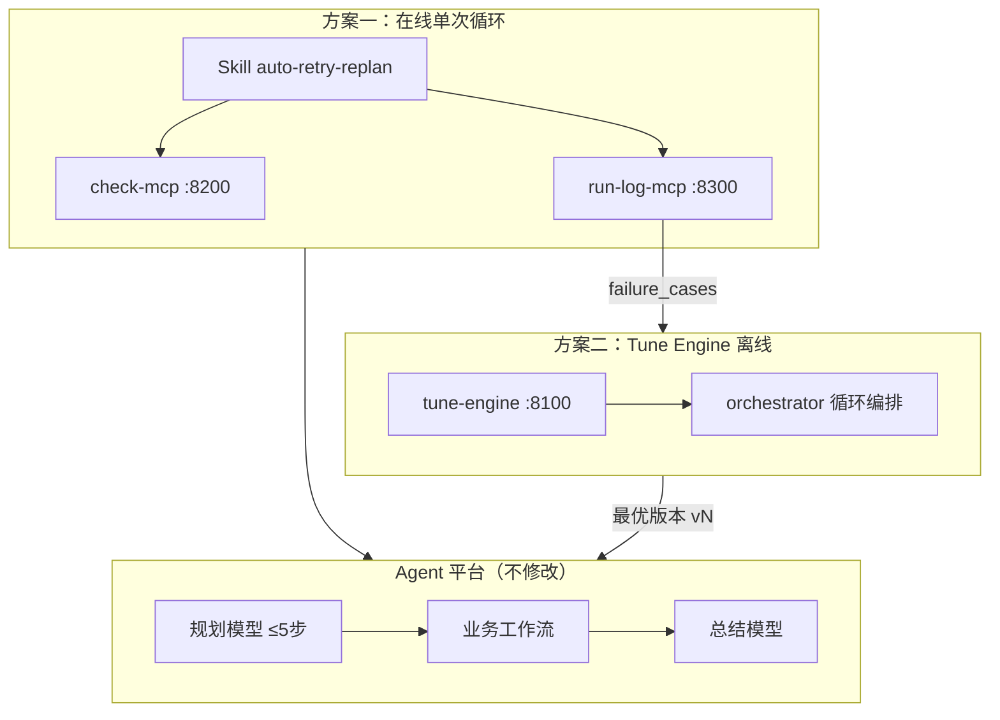
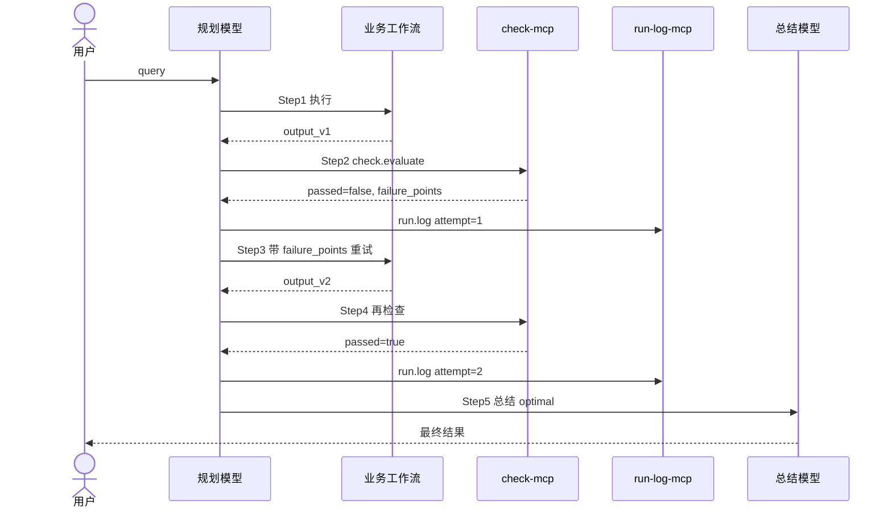

# Agent 循环调优技术方案（汇报版）

> **版本：** v1.0  
> **日期：** 2026-06-24  
> **听众：** 领导 + 开发  
> **定位：** 方案设计已完成，MVP 已验证，平台 MCP 联调推进中  
> **代码仓库：** https://github.com/wangxiaomo12138/lqy2026

---

# 第一部分：汇报大纲（15～20 分钟）

## 建议时长分配

| 序号 | 章节 | 时长 | 主要听众 | 要讲清什么 |
|------|------|------|----------|------------|
| 1 | 背景与痛点 | 2 min | 领导 | 为什么要做、不做会怎样 |
| 2 | 总体思路（两层循环） | 3 min | 领导 + 开发 | 内层在线、外层离线，互补不冲突 |
| 3 | Agent 侧怎么转起来 | 5 min | 开发为主 | Skill / MCP / 工作流分工 |
| 4 | 技术架构与组件 | 4 min | 开发为主 | 服务、接口、数据流 |
| 5 | 现状与演示 | 3 min | 全体 | 有什么、缺什么、能演示什么 |
| 6 | 路线图与资源诉求 | 3 min | 领导 | 阶段、里程碑、需要支持什么 |

## 各段口播要点

### 1. 背景与痛点（给领导）

**问题 A — 单次体验差：** 用户问一次，工作流第一次常缺字段、格式错，直接总结输出，体验差。

**问题 B — 长期能力难提升：** 改 Prompt、改工作流描述，没有客观评分和批量验证，不知道改得有没有效。

**约束：** 我们只能**接入** Agent 平台（挂 MCP、Skill、引用工作流），**不能改平台底层**。

**目标一句话：** 在平台外层补上「当场重试」和「离线调优」两层能力。

---

### 2. 总体思路（两层循环）

```text
┌────────────────────────────────────────────┐
│ 内层：单次循环（每次用户 query）              │
│ 执行 → 检查 → 不过就重试 → 输出最优          │
│ 解决：这一次答得更好                         │
└──────────────────┬─────────────────────────┘
                   │ 失败 case 沉淀
                   ▼
┌────────────────────────────────────────────┐
│ 外层：批量调优（Tune Engine，离线）           │
│ benchmark → 评分 → 改配置 → 新版本再跑       │
│ 解决：工作流/Skill 长期变优                  │
└────────────────────────────────────────────┘
```

**给领导：** 不是二选一，是「在线救当场、离线提长期」。

**给开发：** 两套系统共用同一套评估规则（`shared/evaluators.py`），口径一致。

---

### 3. Agent 侧怎么转（开发重点）

平台原有链路不变：

```text
用户 query → 规划模型(≤5步) → 工作流 → 总结
```

我们在外层加三件事：

| 组件 | 作用 | 类型 |
|------|------|------|
| **Skill** `auto-retry-replan` | 教规划：何时执行、检查、重试、总结 | 平台配置（Prompt） |
| **check-mcp** | 客观检查 output，`passed` + `failure_points` | 外挂服务 :8200 |
| **run-log-mcp** | 每次跑完落盘，失败写入 benchmark 池 | 外挂服务 :8300 |

**5 步规划分配：**

| 步 | 动作 |
|----|------|
| 1 | 执行业务工作流 |
| 2 | `check.evaluate` + `run.log` |
| 3 | 未通过则带 failure_points 重跑 |
| 4 | 再检查 + 再记录 |
| 5 | 总结输出（optimal / best_effort） |

**关键设计原则：** 循环策略在 Skill，客观判分在 MCP，业务差异在配置（`task_type` + `expected_fields`），不改 MCP 代码。

---

### 4. 技术架构（开发重点）

```text
                    ┌──────────────┐
                    │   总 Agent    │
                    └──────┬───────┘
           Skill ──────────┼────────── MCP
                           ▼
                    ┌──────────────┐
                    │ 业务工作流    │  合同解析 / 发票 / …
                    └──────┬───────┘
                           │ output
                           ▼
              ┌────────────────────────┐
              │ check-mcp  check.evaluate│  规则评分
              └────────────┬───────────┘
                           │ passed?
              ┌────────────┴───────────┐
              ▼                          ▼
         failure_points            run-log-mcp
         → 重规划重试               → run_logs.jsonl
                                    → failure_cases.jsonl
                                           │
                                           ▼
                                    Tune Engine :8100
                                    批量调优配置版本
```

**三个外挂服务：**

| 服务 | 端口 | 协议 | 工具 |
|------|------|------|------|
| check-mcp | 8200 | MCP SSE `/sse` | `check.evaluate` |
| run-log-mcp | 8300 | REST MCP | `run.log`, `run.stats` |
| tune-engine | 8100 | REST MCP | `tune.start`, `tune.status`, `tune.get_result` |

---

### 5. 现状与演示（诚实讲）

| 模块 | 状态 | 说明 |
|------|------|------|
| 方案设计 / 流程图 | ✅ 完成 | 本文档 + 技术路线图 |
| check-mcp 规则检查 | ✅ MVP | 本地 SSE / curl 可测 |
| run-log-mcp 落盘 | ✅ MVP | jsonl 可导入 Tune |
| Skill + 接入模板 | ✅ 完成 | `integrations/` 开箱即用 |
| **平台 MCP 联调** | ⚠️ 推进中 | 平台挂 MCP 报 500，SSE 已改造待联调 |
| Tune Engine | ✅ Mock 可跑 | 端到端调优闭环已验证 |
| 真实 Agent API | ❌ 待做 | 替换 Mock 即可接生产 |
| 自动晋升生产 | ❌ 本期不做 | 人工审批闸门 |

**可演示：**
1. check-mcp：`curl` 演示 passed=false → 知道缺哪些字段  
2. Tune Engine：`python scripts/run_demo.py` 演示批量调优  
3. 本地单次循环：`single-loop-local/` 接模型服务演示重试（平台不通时的替代）

---

### 6. 路线图与诉求（给领导）

| 阶段 | 周期 | 目标 | 验收 |
|------|------|------|------|
| 阶段 1 | 1～3 周 | 在线单次循环上线 | 平台 MCP 通，用户提问可自动重试 |
| 阶段 2 | 2～4 周 | Tune Engine 接真实 API | Mock 换真实工作流调用 |
| 阶段 3 | 2～3 周 | 联合闭环 | 失败 case 自动进 benchmark |
| 阶段 4 | 4～6 周 | 工程化 | shadow_compare、监控、多业务扩展 |

**需要支持：**
1. 平台侧：MCP SSE 接入问题排查（当前 500）  
2. 业务侧：提供 1 个标杆场景（合同解析）+ 10～20 条 benchmark  
3. 运维：三台服务部署（或 Docker Compose 一键）  

---

# 第二部分：技术方案（可直接使用）

## 1. 背景

### 1.1 平台现状

```text
用户 query
    ↓
规划模型（按工作流描述路由，最多 5 步）
    ↓
工作流执行 → 返回 output
    ↓
总结模型 → 最终答案
```

平台可配置：Agent、工作流、Skill、MCP、API。  
**不可改：** 规划引擎、执行引擎、步数上限等底层逻辑。

### 1.2 要解决的问题

| 编号 | 问题 | 典型场景 | 期望结果 |
|------|------|----------|----------|
| A | 单次输出质量不稳定 | 合同解析缺字段 | 当次自动重试到最优 |
| B | 配置优化缺乏闭环 | 工作流描述改了不知效果 | 批量跑分、自动迭代版本 |
| C | 真实失败无法反哺 | 线上坏 case 丢失 | 沉淀为 benchmark |

### 1.3 设计原则

1. **不改平台底层** — 全部通过 Skill + MCP + 引用模板实现  
2. **客观评估与主观规划分离** — 判分用规则引擎，不靠模型自评  
3. **在线 + 离线互补** — 单次循环救体验，Tune Engine 提长期能力  
4. **通用接入** — 新业务只配 `task_type` + `expected_fields`  
5. **人工晋升** — 最优版本上生产需审批，不自动全量切换  

---

## 2. 总体架构

### 2.1 双方案架构



### 2.2 组件职责

| 组件 | 层级 | 职责 |
|------|------|------|
| Skill | 策略层 | 规定何时执行、检查、重试、停止 |
| check-mcp | 评估层 | 规则打分，输出 failure_points |
| run-log-mcp | 数据层 | 运行记录、失败 case 入库 |
| tune-engine | 优化层 | 批量 benchmark、补丁、版本迭代 |
| integrations | 接入层 | Agent/工作流模板，他人零代码接入 |

---

## 3. 方案一：在线单次循环

### 3.1 流程



### 3.2 check.evaluate 接口

**请求：**

```json
{
  "task_type": "contract-parse",
  "output": {"party_a": "甲公司", "party_b": "乙公司"},
  "expected_fields": ["party_a", "party_b", "amount", "sign_date"],
  "summary": "可选，参与综合评分"
}
```

**响应：**

```json
{
  "passed": false,
  "score": 0.5,
  "field_score": 0.5,
  "summary_score": 0.0,
  "failure_points": {
    "missing_fields": ["amount", "sign_date"],
    "failures": [{"type": "missing_field", "field": "amount"}],
    "summary_issues": ["总结未体现字段 amount"]
  },
  "recommendation": "补全缺失字段后重试"
}
```

**评分规则（合同解析）：**
- 字段完整性：expected_fields 不能为空  
- 格式：sign_date 为 YYYY-MM-DD，amount 为数字  
- 综合分：字段 70% + 总结 30%  
- 通过：无 failure 且 field_score ≥ 0.8 且 summary_score ≥ 0.6  

### 3.3 平台接入配置

| 配置项 | 值 |
|--------|-----|
| MCP 传输 | HTTP SSE |
| check-mcp 地址 | `http://HOST:8200/sse` |
| run-log-mcp 地址 | `http://HOST:8300/mcp` |
| Skill | `skills/auto-retry-replan/SKILL.md` |
| 引用模板 | `integrations/agents/retry-assistant.json` |

### 3.4 通用接入（新业务）

在 `integrations/task-registry.yaml` 增加一段即可，无需改 MCP 代码：

```yaml
invoice-parse:
  task_type: invoice-parse
  expected_fields: [seller, buyer, amount, tax_id, invoice_date]
  workflow_ref: wf_invoice_parse
```

---

## 4. 方案二：Tune Engine 离线调优

### 4.1 循环逻辑

```text
tune.start(target_id)
    ↓
loop（最多 N 轮）:
    批量跑 benchmark cases
    → 逐条评分聚合 pass_rate
    → 达标？返回 optimal
    → 未达标？diagnose + propose_patch → 新版本 v+1
    ↓
返回 best_entry_ref + 报告
```

### 4.2 核心 MCP 工具

| 工具 | 作用 |
|------|------|
| `tune.start` | 启动调优会话 |
| `tune.status` | 查进度 |
| `tune.get_result` | 取最终结果 |

### 4.3 与方案一的衔接

```text
用户日常 query
  → 单次循环 + run.log
  → failure_cases.jsonl
  → import_failure_cases.py
  → Tune Engine benchmark 库
  → tune.start 批量调优
  → 人工晋升最优版本 vN
  → 生产工作流配置更新
```

---

## 5. 代码与部署

### 5.1 仓库结构

```text
lqy2026/
├── check-mcp/              # :8200 在线检查（MCP SSE）
├── run-log-mcp/            # :8300 运行记录
├── tune-engine/            # :8100 批量调优
├── single-loop-local/      # 平台不通时本地验证单次循环
├── shared/evaluators.py    # 共用评分逻辑
├── skills/auto-retry-replan/
├── integrations/           # 接入模板
├── data/                   # run_logs / failure_cases
└── docs/                   # 文档
```

### 5.2 一键启动

```bash
bash scripts/start-all.sh
# 或
docker compose up -d
```

### 5.3 验证命令

```bash
# check-mcp 健康检查
curl http://127.0.0.1:8200/health

# 评估逻辑自测
curl -X POST http://127.0.0.1:8200/mcp/tools/call \
  -H 'Content-Type: application/json' \
  -d '{"tool":"check.evaluate","arguments":{"task_type":"contract-parse","output":{"party_a":"甲"},"expected_fields":["party_a","party_b"]}}'

# Tune Engine 演示
cd tune-engine && python scripts/init_demo.py && python scripts/run_demo.py
```

---

## 6. 成熟度与风险

### 6.1 组件成熟度

| 组件 | 状态 | 下一阶 |
|------|------|--------|
| check-mcp | ✅ MVP | 多 task_type 插件化 |
| run-log-mcp | ✅ MVP | 失败阈值自动触发 tune |
| tune-engine | ✅ MVP（Mock） | 接真实 Agent API |
| 平台 MCP 联调 | ⚠️ 卡点 | 排查 SSE 500 |
| shadow_compare | ❌ 未做 | 晋升前必跑 |
| 自动晋升生产 | ❌ 本期不做 | 人工审批 |

### 6.2 风险与对策

| 风险 | 影响 | 对策 |
|------|------|------|
| 平台 MCP 接入失败 | 在线方案无法上线 | 已改 SSE；本地 single-loop-local 先行验证 |
| 规划模型不按 Skill 执行 | 循环失效 | 工作流描述加强约束；后续考虑平台侧强制 |
| 评估规则过简 | 误判 passed | 按业务扩展 evaluators；引入 ground_truth |
| Mock 与生产差距 | Tune 结果不可信 | 阶段 2 接真实 API；benchmark 人工审核 |

---

## 7. 实施路线图

建议总周期约 **12 周**，阶段 1 与阶段 2 可并行。

### 阶段 1：在线能力（第 1～3 周）

- 部署 check-mcp、run-log-mcp  
- 平台挂 MCP + Skill  
- 合同解析标杆场景联调  
- **验收：** 用户提问可自动重试，失败有 failure_points  

### 阶段 2：离线 MVP（第 2～5 周）

- tune-engine 接真实 Agent API  
- 注册 contract-parse target + benchmark  
- **验收：** `tune.start` 可跑通，输出最优版本建议  

### 阶段 3：联合闭环（第 6～8 周）

- failure_cases 回流 Tune  
- 每周 tune.start 机制  
- **验收：** 线上失败 case 可导入并参与调优  

### 阶段 4：工程化（第 9～12 周）

- shadow_compare、监控告警  
- 多业务 task 扩展  
- **验收：** 第二业务（如发票）接入 < 1 天  

---

## 8. 角色分工

| 角色 | 在线单次循环 | 离线 Tune | 接入模板 |
|------|--------------|-----------|----------|
| 运维/SRE | 部署 MCP 服务 | 部署 tune-engine | Docker/脚本 |
| 算法/Agent | 维护 Skill、evaluator | 维护 benchmark、target | integrations |
| 业务运营 | 看 run.stats | 补 ground_truth | — |
| 架构/领导 | — | 审批版本晋升 | 评审接入 |

---

## 9. 汇报结论（可直接念）

> 我们在 Agent 平台外层建设循环调优能力，分两层：**在线单次循环**让用户每次提问自动检查重试，**离线 Tune Engine** 用 benchmark 持续提升工作流配置版本。  
> 实现上不修改平台底层，通过 Skill 规定循环策略、MCP 提供客观检查与数据落盘、独立服务完成批量调优。  
> 方案设计、MCP 服务、Skill 模板、离线调优引擎 MVP 均已完成；**当前瓶颈是平台 MCP SSE 联调**，同步提供 `single-loop-local` 用于本地验证。  
> 建议以合同解析为标杆，12 周内完成在线上线、离线接真、联合闭环三阶段，版本晋升保持人工审批。

---

## 10. 附录：相关文档

| 文档 | 用途 |
|------|------|
| [Agent自调优技术方案总览](Agent自调优技术方案总览.md) | 完整技术细节 |
| [技术路线图与业务流程图](技术路线图与业务流程图.md) | 流程图、里程碑 |
| [单次循环-他人接入指南](单次循环-他人接入指南.md) | 业务方接入 |
| [他人接入指南](他人接入指南.md) | Tune Engine 接入 |
| [update.md](../update.md) | check-mcp SSE 改造说明 |
| [single-loop-local/README.md](../single-loop-local/README.md) | 平台不通时本地验证 |
