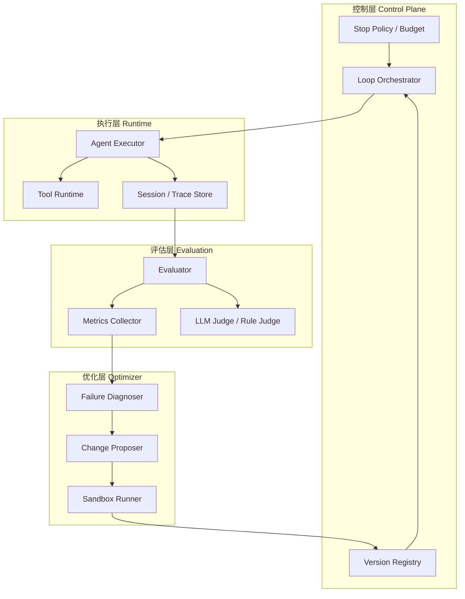
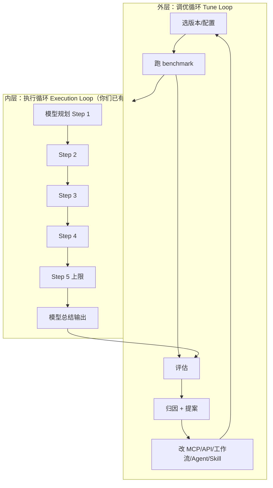
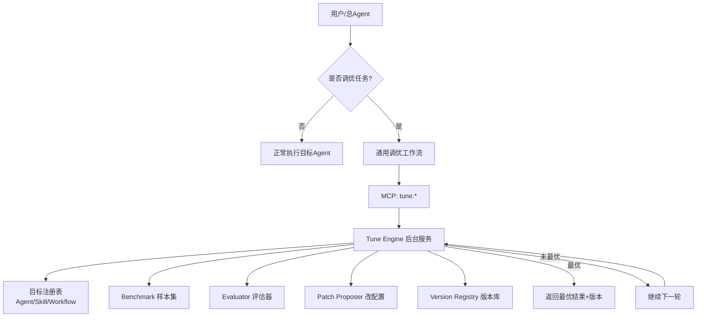
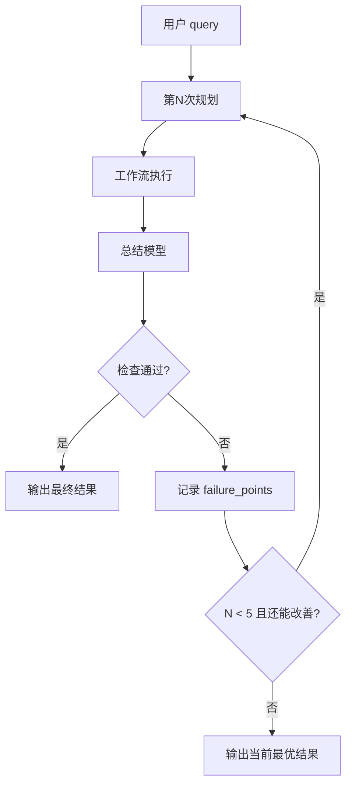

# General agent capabilities
_Exported on 2026/6/25 at GMT+8 8:38:29 from Cursor (3.8.11)_

---

**User**

通用 agent 能力有哪些

---

**Cursor**

你问的「通用 agent」可以指两类东西：**我作为 Cursor 里的通用编程 Agent 能做什么**，以及**系统里 `generalPurpose` 这类子 Agent 的定位**。下面按这两层说明。

## 一、通用 Agent 的核心能力

### 1. 代码理解与编辑
- 阅读、搜索整个代码库（语义搜索、关键词搜索、按路径查找）
- 修改、创建、删除文件
- 遵循项目现有风格与约定，做**最小必要改动**
- 解释代码逻辑、架构、数据流

### 2. 终端与命令执行
- 运行 shell 命令（构建、测试、安装依赖、Git 操作等）
- 在沙箱中执行，必要时申请网络或更高权限
- 监控后台任务与终端输出

### 3. 调试与排错
- 分析报错、日志、CI 失败
- 定位根因并修复
- 查看 linter / 诊断信息

### 4. Git 与协作
- `status` / `diff` / `log` 等查看变更
- 按你的要求创建 commit（不会擅自提交）
- 用 `gh` 创建 PR、查 issue、看 CI

### 5. 研究与信息获取
- 联网搜索技术文档、版本信息
- 抓取网页内容
- 在代码库内做定向探索

### 6. 任务规划与执行
- 复杂任务拆步、跟踪进度
- 多文件、多步骤协同修改
- 在实现 / 规划 / 调试模式间切换

### 7. 专业技能（Skills）
- 按任务自动选用技能（Vue、Docker、OpenSpec、前端设计、安全审查等）
- 技能提供领域最佳实践与固定工作流

### 8. 子 Agent 委派
复杂任务可启动专门子 Agent，例如：

| 子 Agent | 用途 |
|----------|------|
| **generalPurpose** | 通用研究、搜索、多步任务 |
| **explore** | 快速只读探索代码库 |
| **shell** | 命令执行、Git 操作 |
| **cursor-guide** | Cursor 产品使用说明 |
| **ci-investigator** | 分析 PR CI 失败原因 |
| **bugbot** | 代码变更审查 |
| **security-review** | 安全审查 |

### 9. 交互与产出
- 用代码引用格式指向具体文件与行号
- 用 Mermaid / ASCII 画架构与流程
- 需要时用 Canvas 做可视化分析
- 结构化提问（多选）以澄清需求

### 10. 图像
- 读取你提供的图片
- 在你明确要求时生成图片

---

## 二、能力边界（不会擅自做）

- **不主动 commit / push**，除非你明确要求  
- **不擅自扩大范围**，只做你要求或任务必需的事  
- **不跳过 Git hooks**，除非你明确要求  
- **不提交含密钥的文件**  
- 沙箱下部分操作需额外权限（如广域网络）

---

## 三、`generalPurpose` 子 Agent 的定位

`generalPurpose` 是「通用子 Agent」，适合：

- 需要多步自主完成的复杂任务  
- 跨模块搜索与研究  
- 父 Agent 一次难以覆盖的大范围探索  

与主 Agent 相比，它更偏**在子任务里自主跑完一段流程**，再把结果汇总回来。

---

## 四、典型使用场景

1. **实现功能**：「给登录页加验证码」  
2. **修 Bug**：「这个接口 500，帮我查原因」  
3. **重构**：「把这个模块改成 Composition API」  
4. **代码审查**：「Review 我这次改动」  
5. **文档 / 说明**：「解释这个 API 怎么工作」  
6. **运维**：「写 Dockerfile」「配 GitHub Actions」  
7. **探索**：「这个项目目录结构是怎样的？」

---

如果你关心的是 **Cursor 里某一个具体 Agent 类型**（例如 Cloud Agent、Bugbot）或 **你自己项目里的 agent 模块**，说一下场景，我可以按那个范围列能力清单。

---

**User**

我们有个 agent 平台，我想用他实现 agent循环调优，如何设计

---

**Cursor**

先看一下你们工作区里是否已有 agent 平台相关代码，再据此给出可落地的循环调优设计。


你们工作区里暂时没有现成的 agent 平台代码，下面按「在自有 agent 平台上实现循环调优」给一套可落地的设计，重点放在架构与关键接口，而不是泛泛概念。

---

## 1. 先明确「循环调优」调什么

常见有三类，建议分开设计，不要混在一个 loop 里：

| 类型 | 调优对象 | 典型场景 |
|------|----------|----------|
| **任务循环** | 单次任务输出质量 | 写代码、写报告、多步推理 |
| **工作流循环** | Agent 编排（步骤、工具、分支） | 复杂业务流程 |
| **平台循环** | Prompt、工具描述、模型参数、策略 | 长期提升成功率 |

核心闭环可以统一抽象为：

```
Observe → Evaluate → Diagnose → Propose → Apply → Verify → (继续/结束)
```

---

## 2. 总体架构



三层职责：

1. **Runtime**：跑 agent（你们平台已有能力）
2. **Evaluation**：判断「好不好、差在哪」
3. **Control + Optimize**：决定是否继续、改什么、怎么验证

---

## 3. 核心抽象：把一次循环变成可编排对象

建议平台统一这几类对象：

### 3.1 `Run`（一次执行）

```json
{
  "run_id": "run_001",
  "agent_version": "v3",
  "input": { "task": "生成登录接口", "context": {} },
  "trace": [],
  "output": {},
  "status": "success | failed | partial",
  "cost": { "tokens": 12000, "latency_ms": 4500 }
}
```

### 3.2 `Evaluation`（评估结果）

```json
{
  "run_id": "run_001",
  "score": 0.72,
  "passed": false,
  "dimensions": {
    "correctness": 0.6,
    "completeness": 0.8,
    "safety": 1.0
  },
  "failures": [
    { "type": "missing_validation", "evidence": "未校验密码长度" }
  ],
  "feedback": "需要补充输入校验与错误码定义"
}
```

### 3.3 `Patch`（优化提案）

```json
{
  "target": "system_prompt | tool_schema | workflow_step | model_config",
  "change": { "...": "..." },
  "rationale": "上一轮缺少校验逻辑",
  "risk": "low"
}
```

### 3.4 `LoopSession`（一次调优会话）

```json
{
  "session_id": "loop_abc",
  "goal": "让登录接口生成成功率 >= 90%",
  "baseline_version": "v3",
  "current_version": "v3.2",
  "iterations": [
    { "run_id": "...", "eval_id": "...", "patch_id": "..." }
  ],
  "stop_reason": "budget_exceeded | target_met | no_improvement"
}
```

有了这四个对象，循环调优就可以平台化，而不是写死在某个业务里。

---

## 4. 循环编排器（Loop Orchestrator）设计

### 4.1 标准循环伪代码

```python
def agent_tune_loop(session):
    version = session.baseline_version
    
    for i in range(session.max_iters):
        run = execute_agent(version, session.input, budget=session.budget)
        eval_result = evaluate(run, session.criteria)
        
        record(session, run, eval_result)
        
        if should_stop(eval_result, session):
            return finalize(session, version, "target_met")
        
        diagnosis = diagnose(run, eval_result)          # 失败归因
        patches = propose_changes(diagnosis, version)   # 生成候选修改
        
        best_patch = select_patch(patches, session.policy)
        candidate = apply_patch(version, best_patch)
        
        # 关键：先沙箱验证，再晋升
        verify = sandbox_verify(candidate, session.test_cases)
        if verify.improved:
            version = promote(candidate)
        else:
            version = rollback_or_keep(version)
        
        if no_improvement(session.history, window=3):
            return finalize(session, version, "no_improvement")
    
    return finalize(session, version, "budget_exceeded")
```

### 4.2 停止策略（必须有）

避免无限循环，建议同时满足多条：

- **目标达成**：`score >= threshold` 且关键维度全过
- **预算耗尽**：token / 时间 / 迭代次数
- **收益停滞**：连续 N 轮提升 < ε
- **风险阈值**：改动过大或评测波动异常
- **人工中断**：HITL 审批点

---

## 5. 评估层怎么设计（决定调优是否有效）

### 5.1 评估器分层

| 层级 | 方式 | 优点 | 缺点 |
|------|------|------|------|
| L1 规则 | 单元测试、schema 校验、lint | 稳定、可复现 | 覆盖有限 |
| L2 程序化 | 执行结果对比、API 回放 | 客观 | 需测试集 |
| L3 LLM Judge |  rubric 打分 + 证据引用 | 灵活 | 有波动 |
| L4 人工 | 抽检 / 关键节点审批 | 最准 | 成本高 |

推荐：**L1/L2 做 gate，L3 做细粒度反馈，L4 做高风险场景兜底**。

### 5.2 Rubric 示例（给 Judge）

```yaml
criteria:
  - name: correctness
    weight: 0.5
    checks:
      - "是否满足功能需求"
      - "是否有明显逻辑错误"
  - name: robustness
    weight: 0.3
    checks:
      - "边界条件处理"
      - "错误处理完整性"
  - name: maintainability
    weight: 0.2
    checks:
      - "结构清晰"
      - "命名合理"
```

评估输出必须带 **evidence**（引用 trace 中的步骤/工具调用/输出片段），否则无法做有效归因。

---

## 6. 优化层：改什么、怎么改

### 6.1 可调参对象（建议版本化）

- `system_prompt` / `developer_prompt`
- `tool descriptions` / `tool selection policy`
- `workflow graph`（步骤顺序、分支条件）
- `retrieval config`（topK、rerank）
- `model routing`（模型、温度、max tokens）
- `memory policy`（短期记忆窗口、摘要策略）

每一项都进 **Version Registry**，支持 diff、回滚、A/B。

### 6.2 归因 → 提案映射（很实用）

| 失败类型 | 典型补丁 |
|----------|----------|
| 工具选错 | 优化 tool schema / 增加示例 |
| 步骤遗漏 | workflow 增加 mandatory step |
| 格式错误 | 加强 output schema + 自动修复器 |
| 幻觉 | 加强 grounding / 强制检索 |
| 过度冗长 | 压缩 prompt / 降 max_tokens |
| 不安全输出 | 加 guardrail + refusal 模板 |

### 6.3 一次只改一个变量（强烈建议）

否则无法判断哪项改动有效。平台层可做：

```text
Patch Policy: single-knob-per-iteration
```

---

## 7. 沙箱与晋升机制（避免「越调越差」）

每次 patch 不要直接上线，走：

```
Candidate → Shadow Run → Compare with Baseline → Promote/Rollback
```

- **Shadow Run**：同一批 test cases 跑 baseline 与 candidate
- **晋升条件**：`candidate_score - baseline_score >= delta` 且关键 gate 全过
- **回滚**：任一安全项失败立即回滚

测试集建议分两套：

- **开发集**（调优时可看，防过拟合也要控制）
- **_holdout 集**（只在最终晋升时用）

---

## 8. 可观测性：没有 trace 就没有调优

每次循环至少记录：

- 输入、输出、工具调用链
- token / latency / 成本
- 每轮 eval 分数与失败标签
- patch 内容与前后 diff
- 晋升/回滚决策原因

建议提供「Loop Timeline」视图：

```text
Iter1: score 0.55 -> patch(prompt+example) -> Iter2: 0.68
Iter2: score 0.68 -> patch(tool_schema)     -> Iter3: 0.67 (rollback)
Iter3: score 0.68 -> patch(workflow_step)   -> Iter4: 0.81 (promote)
```

---

## 9. 人机协同（HITL）建议放哪

全自动循环适合低风险任务；高风险场景在三个点加人：

1. **Patch 审批**：改 system prompt / 工具权限前
2. **晋升审批**：新版本影响生产流量前
3. **失败复盘**：连续停滞时人工标注根因，反哺规则库

---

## 10. API 设计草案（平台化）

```text
POST /loops                  创建调优会话
POST /loops/{id}/iterate     执行一轮（run+eval+propose）
POST /loops/{id}/apply       应用 patch 到 candidate
POST /loops/{id}/verify      沙箱对比
POST /loops/{id}/promote     晋升版本
GET  /loops/{id}/timeline    查看迭代轨迹

POST /evaluations            对任意 run 评估
POST /diagnostics            失败归因
POST /patches/propose          基于诊断生成补丁
```

Agent 执行层保持你们现有接口，调优层通过 **version pin** 调用：

```text
POST /agents/{agent_id}/runs?version=v3.2
```

---

## 11. 推荐落地路径（分三期）

### Phase 1：任务循环（2–3 周）
- Run / Trace / Evaluation
- 固定 rubric + 规则 gate
- 手动 patch（人工改 prompt）+ 自动重跑

### Phase 2：半自动调优（3–5 周）
- 自动 diagnose + propose
- 沙箱对比 + 版本晋升/回滚
- Loop Orchestrator + stop policy

### Phase 3：平台化调优（持续）
- 多 agent、多目标优化
- 测试集管理、实验平台（A/B）
- 成本/成功率联动优化

---

## 12. 常见坑

1. **没有客观 gate，只靠 LLM 打分** → 容易自嗨循环  
2. **每轮改太多变量** → 无法归因  
3. **没有 holdout** → 过拟合测试样例  
4. **没有预算上限** → 成本失控  
5. **trace 不完整** → 无法解释「为什么变好/变差」  
6. **直接把调优结果上线** → 必须沙箱 + 晋升流程  

---

## 13. 一个最小可行方案（MVP）

如果你们想最快验证价值，MVP 可以只做：

1. 固定 20 条 benchmark 任务  
2. 每轮：执行 → 规则评测（通过率）→ LLM 给出 3 条改进建议  
3. 人工选 1 条建议改 prompt  
4. 自动重跑并对比分数  
5. 分数提升才保存新版本  

这已经是一个可用的「agent 循环调优」闭环，之后再逐步自动化 diagnose/propose/promote。

---

如果你愿意，我可以下一步按你们平台现状细化一版，例如：

- 你们 agent 是 **单 Agent + 工具**，还是 **多 Agent 工作流**？
- 调优目标是 **Prompt/工具**，还是 **业务流程成功率**？
- 有没有现成的 **trace / eval / version** 模块？

有这三点信息，我可以给出更贴近你们系统的模块划分、表结构和接口定义。

---

**User**

我们的agent 里面有 mcp\api\工作流、agent、skill 都能添加进去，总agent 里面有模型规划，最多五次，结果会有模型总结输出

---

**Cursor**

你们已经有一层**内置执行循环**（总 Agent 模型规划，最多 5 次，最后模型总结）。循环调优要设计成**外层优化环**，去改「总 Agent 里装什么、怎么规划」，而不是和这 5 步抢控制权。

---

## 1. 先分清两层循环



| 层级 | 作用 | 次数 | 调什么 |
|------|------|------|--------|
| **内层** | 完成单次任务 | ≤ 5 步规划 | 不改配置，只执行 |
| **外层** | 提升成功率/质量 | 你们平台控制（建议 3–10 轮） | 改 MCP/API/工作流/Agent/Skill/规划策略 |

原则：**内层负责「这次怎么做」，外层负责「下次用什么配置做得更好」。**

---

## 2. 把你们平台能力映射成「可调对象」

总 Agent 是一个**编排容器**，里面挂的资源都可以版本化、可 diff、可回滚：

```text
MasterAgent (v1.3)
├── PlannerConfig      # 规划策略（步数上限、是否允许跳步、总结模板）
├── Agents[]           # 子 Agent
├── Skills[]           # Skill 绑定与优先级
├── Workflows[]        # 工作流节点/分支
├── MCPs[]             # MCP 工具集
└── APIs[]             # 外部 API 定义
```

### 每层适合调什么

| 组件 | 常见失败 | 调优动作 |
|------|----------|----------|
| **Skill** | 领域规范没生效 | 换 Skill、调优先级、补约束 |
| **Agent** | 子任务分工错 | 拆/合 Agent、改职责描述 |
| **Workflow** | 步骤顺序/分支错 | 改 DAG、加 mandatory 节点 |
| **MCP** | 工具选错/参数错 | 改 tool 描述、过滤工具、加示例 |
| **API** | 调用失败/字段错 | 改 schema、重试策略、mock 兜底 |
| **Planner** | 5 步内做不完或空转 | 改规划 prompt、步数分配、早停规则 |

建议平台约束：**每轮外层调优只改 1 类组件**（例如只改 Skill，或只改 Workflow），否则无法归因。

---

## 3. 内层 5 步规划：怎么给外层提供信号

你们最后有「模型总结输出」，这是调优的关键输入，但要补**结构化轨迹**，否则只能人工看总结。

### 3.1 每次执行建议落库

```json
{
  "run_id": "run_xxx",
  "master_agent_version": "v1.3",
  "plan_trace": [
    {
      "step": 1,
      "intent": "分析需求并选择 Skill",
      "selected": { "type": "skill", "id": "vue-best-practices" },
      "tool_calls": [],
      "status": "ok"
    },
    {
      "step": 3,
      "intent": "调用 MCP 查库表",
      "selected": { "type": "mcp", "id": "db-mcp" },
      "tool_calls": [{ "name": "query", "args": {}, "error": "timeout" }],
      "status": "failed"
    }
  ],
  "steps_used": 4,
  "summary": "最终总结文本...",
  "artifacts": { "output": "...", "files": [] }
}
```

### 3.2 评估不要只看 summary

建议三层 gate：

1. **硬规则**：API 成功率、workflow 是否跑完、是否超 5 步、超时
2. **任务指标**：准确率、通过率、业务 checklist
3. **总结质检**：summary 是否覆盖结论、证据、未完成项

```text
最终得分 = 0.5 * 任务指标 + 0.3 * 执行质量 + 0.2 * 总结质量
```

---

## 4. 外层调优循环（贴合你们架构）

```python
def tune_master_agent(session):
    config = session.baseline_config  # MasterAgent 全量配置快照

    for iter in range(session.max_tune_iters):
        runs = [execute_master(config, case) for case in session.benchmarks]
        evals = [evaluate(run) for run in runs]
        aggregate = aggregate_scores(evals)

        if aggregate.passed:
            return promote(config, reason="target_met")

        diagnosis = diagnose(runs, evals)  
        # 例: "step3 频繁选错 MCP", "5步内未触发 workflow"

        patch = propose_single_knob_patch(diagnosis, config)
        candidate = apply_patch(config, patch)

        shadow = compare(
            baseline=session.baseline_config,
            candidate=candidate,
            benchmarks=session.holdout_cases
        )

        if shadow.improved:
            config = candidate
            session.baseline_config = candidate  # 滚动提升
        else:
            log_rollback(patch)

        if stagnation(session.history, n=3):
            break

    return finalize(config)
```

### 归因 → 改哪类组件（很实用）

| 诊断标签 | 优先改 |
|----------|--------|
| `PLANNER_WRONG_ROUTE` | Planner prompt / Agent 编排 |
| `SKILL_NOT_APPLIED` | Skill 优先级、触发条件 |
| `WORKFLOW_NOT_REACHED` | Workflow 入口条件、强制节点 |
| `MCP_TOOL_MISMATCH` | MCP tool 描述、可见工具白名单 |
| `API_CALL_FAILED` | API schema、超时重试、fallback |
| `STEP_BUDGET_EXHAUSTED` | 规划策略（前 2 步只做拆解，后 3 步执行） |
| `SUMMARY_LOW_QUALITY` | 总结模板、要求引用 plan_trace 证据 |

---

## 5. 和你们「最多 5 次规划」的配合方式

内层 5 步是硬上限，外层调优要**减少无效步数**，而不是简单加到 6 步。

### 5.1 规划策略可配置项（建议做成 PlannerConfig）

```yaml
planner:
  max_steps: 5
  step_budget_policy:
    - phase: understand   # step 1-2
      max: 2
    - phase: execute    # step 3-4
      max: 2
    - phase: verify     # step 5
      max: 1
  early_stop:
  enabled: true
  conditions:
    - "任务完成且评估通过"
    - "连续两步无有效工具调用"
  summary:
    require_evidence: true
    require_open_issues: true
```

### 5.2 两种循环的停止条件

**内层（单次任务）**

- 达到 5 步 → 强制进入总结
- 或提前完成 → 总结

**外层（调优）**

- benchmark 达标
- 或连续 3 轮分数提升 < 2%
- 或达到调优预算（token/时间）

---

## 6. 平台模块设计（建议 6 个服务）

```text
1) Config Registry     # MCP/API/Workflow/Agent/Skill/MasterAgent 版本管理
2) Run Recorder        # 记录 5 步 plan_trace + summary + artifacts
3) Evaluator           # 规则 + 任务指标 + 总结评分
4) Diagnoser           # 基于 trace 打失败标签
5) Patch Proposer      # 生成「单旋钮」补丁
6) Tune Orchestrator   # 外层循环编排、shadow 对比、晋升/回滚
```

### 关键接口

```text
POST /master-agents/{id}/runs
  body: { version, input, benchmark_id? }

GET  /runs/{run_id}/trace
  -> plan_trace(1..5), tool_calls, summary

POST /tune-sessions
  body: { master_agent_id, benchmarks[], max_iters }

POST /tune-sessions/{id}/iterate
  -> 自动跑一轮：run + eval + diagnose + propose + shadow

POST /configs/{component}/{id}/versions
  -> 发布 MCP/API/Workflow/Agent/Skill 新版本

POST /master-agents/{id}/compose
  -> 组装总 Agent 新版本（挂载各组件版本）
```

---

## 7. Skill / Agent / Workflow 在总 Agent 里的推荐编排

避免「什么都能加」导致规划混乱，建议总 Agent 规划时分层决策：

```text
Step1: 识别任务类型 -> 选 Skill（领域约束）
Step2: 选 Workflow（流程骨架）
Step3-4: 调度子 Agent + MCP/API 执行
Step5: 校验 + 触发总结模板
```

调优时分别优化：

- **Skill**：提升 Step1 命中率
- **Workflow**：提升 Step2 路径正确率
- **Agent/MCP/API**：提升 Step3-4 执行成功率
- **Summary 模板**：提升最终可交付性

---

## 8. Shadow 对比（必须有）

每次改配置都在同一批 benchmark 上跑：

```text
baseline: MasterAgent v1.2
candidate: MasterAgent v1.3 (只改了 MCP 描述)

指标:
- 任务通过率
- 平均使用步数（越少越好，但不能牺牲质量）
- MCP 调用成功率
- API 失败率
- 平均成本/时延
```

晋升条件示例：

```text
通过率提升 >= 3%
且 API/MCP 失败率不升高
且 p95 时延涨幅 <= 10%
```

---

## 9. MVP 落地（按你们现状最快路径）

### 第 1 周：可观测
- 给 5 步规划落 `plan_trace`
- summary 结构化（结论/证据/风险/未完成）
- 导出单次 run 报告

### 第 2 周：可评估
- 10–30 条 benchmark
- 规则 gate + 任务评分
- 失败自动打标签（至少 6 类）

### 第 3 周：可循环
- 外层 `tune-session`
- 每轮只允许改 1 个组件版本
- shadow 晋升/回滚

### 第 4 周：半自动
- Diagnoser + Patch Proposer（先建议，人工点确认）
- 再逐步全自动

---

## 10. 一个完整例子

**任务**：「根据接口文档生成 CRUD 并联调」

**Iter0（baseline）**

- Step3 选错 MCP（查成了别的库）
- Step5 总结看起来完整，但接口 404
- 评估：失败，`MCP_TOOL_MISMATCH`

**外层补丁（只改 MCP）**

- 给 `db-mcp.query` 增加更清晰描述和示例
- 限制总 Agent 可见工具白名单

**Iter1**

- Step3 调对接口
- 4 步完成，summary 带验证结果
- Shadow 通过率 60% → 78%，晋升 `MasterAgent v1.4`

---

## 11. 设计要点（结合你们平台）

1. **总 Agent 是「版本化组合体」**，不是单一 prompt  
2. **内层 5 步不动**，外层改组件与规划策略  
3. **评估看 trace + 结果 + summary**，不只看总结  
4. **单轮单旋钮**，否则 MCP/Skill/Workflow 互相干扰  
5. **先 shadow 后晋升**，避免调优回退影响线上  

---

如果你愿意，我下一步可以直接给你两份可落地的产物（按你们后端技术栈写）：

1. **数据表设计**（`master_agent_version`、`run_trace`、`tune_session`、`patch`）  
2. **Tune Orchestrator 状态机**（含停止条件、晋升/回滚伪代码）

你们现在更缺的是 **评估体系** 还是 **自动改配置（Patch Proposer）**？我可以按那个优先级展开。

---

**User**

没理解，我这边需要干啥，写代码实现然后以 mcpx形式放到 agent 里面吗？还是说我这边直接在 agent 平台操作，我现在有之前做好的 agent 以及工作流实现合同解析的，可以对其进行调优码

---

**Cursor**

你**不用一上来就写 MCP**。可以把它理解成两件事，先选对入口：

---

## 先回答你的三个问题

### 1. 要不要写代码，做成 MCP 放进 Agent？

**不是必须。** 有两种做法：

| 方式 | 你这边要干啥 | 适合阶段 |
|------|--------------|----------|
| **A. 先在平台里手工调优** | 不改代码，在平台上改 Agent / 工作流 / Skill / MCP 配置，反复试 | **现在就可以做** |
| **B. 再做自动化调优** | 写代码实现「跑批 → 评分 → 建议改什么」，可做成 MCP 或平台后台服务 | 手工调通之后 |

**建议路径：先做 A，验证有效后再做 B。**

MCP 适合这种情况：你希望总 Agent 在对话里说「帮我调优合同解析」，然后自动跑测试、出报告。那是**第二阶段**，不是第一步。

---

### 2. 是写代码，还是直接在 Agent 平台操作？

**第一步：直接在 Agent 平台操作。**

你已经有：
- 合同解析 **Agent**
- 合同解析 **工作流**

调优就是：用一批合同样本反复跑这套 Agent + 工作流，看哪里错，然后在平台上改配置，再跑，直到变好。

你还**不需要**新开发一个「调优系统」。

---

### 3. 现有的合同解析 Agent，能不能拿来调优？

**可以，而且应该从它开始。**

它就是你的 **baseline（基线）**。调优不是重做一套，而是在现有 Agent + 工作流上迭代。

---

## 你这边具体要干啥（按顺序）

### 第 1 步：准备测试样本（最重要）

准备 **10～30 份**合同样本，最好三类：

- **简单**：格式标准、字段少  
- **中等**：常见商业合同  
- **难例**：表格、附件、扫描件、条款嵌套  

每份配一个「标准答案」，例如要抽哪些字段：

```text
甲方、乙方、合同金额、签署日期、付款方式、违约责任...
```

没有标准答案，就很难判断「调优有没有变好」。

---

### 第 2 步：在平台上反复跑现有 Agent

用同一批样本，多次跑你现在的 **合同解析 Agent + 工作流**，记录：

- 哪些字段经常错  
- 哪类合同容易失败  
- 是工作流某一步错，还是模型理解错  
- 5 步规划里哪一步出问题（如果平台能看到轨迹）

先**人工看结果**，不用写代码。

---

### 第 3 步：在平台上改配置（不是改业务代码）

根据错误类型，在平台里改对应东西：

| 如果发现的问题 | 在平台上改什么 |
|----------------|----------------|
| 字段漏抽 | 工作流里加「字段检查」步骤，或改 Agent 提示词 |
| 条款理解错 | 加/改 **Skill**（合同领域规则） |
| 某 API 调不通 | 改 **API** 配置、重试、超时 |
| 工具没用对 | 改 **MCP** 工具描述或可见范围 |
| 步骤顺序乱 | 改 **工作流** 节点顺序或分支 |
| 最后总结不完整 | 改总结模板 / 最后一步 Agent 提示词 |

改完 → 用**同一批样本**再跑 → 对比上次结果。这就是**手工调优循环**。

---

### 第 4 步：固定一版「较好的配置」

当准确率满意后：

- 保存当前 Agent 版本  
- 保存当前工作流版本  
- 记下用的 Skill / MCP / API  

这就是你的 **v1.0 调优结果**。

---

### 第 5 步（可选）：再考虑写代码自动化

只有当你觉得「每次都要人工跑 30 份、人工打分太累了」，才需要做自动化。

那时可以二选一：

**方案 1：平台后台服务（更常见）**  
写个调优服务，自动：跑样本 → 打分 → 出报告 → 建议改哪  
不放进 Agent 对话里，你在后台或管理界面用。

**方案 2：做成 MCP 挂到总 Agent**  
总 Agent 可以说：「对合同解析做一轮调优」  
MCP 提供例如：`run_benchmark`、`evaluate`、`suggest_patch`  
适合已经成熟、要经常调优的场景。

---

## 一张图看懂你该在哪一层

```text
你现在在这里 👇
┌─────────────────────────────────────┐
│  Agent 平台操作（手工调优）            │
│  - 改合同解析 Agent / 工作流 / Skill  │
│  - 用合同样本反复测试                  │
│  - 对比哪版更好                        │
└─────────────────────────────────────┘
              ↓ 熟练之后
┌─────────────────────────────────────┐
│  写调优工具（可选）                    │
│  - 自动跑批 + 自动评分                 │
│  - 可做成 MCP 或后台服务               │
└─────────────────────────────────────┘
```

---

## 结合你的合同解析场景，最小可行做法

**这周就能做：**

1. 挑 **15 份**合同 + 标准字段表  
2. 用现有 Agent + 工作流各跑一遍，记成功率  
3. 看 top3 错误（例如：金额漏抽、日期格式乱、主体名错）  
4. 在平台上只改 **1 处**（例如工作流加「金额校验」或加合同 Skill）  
5. 再跑 15 份，看成功率是否提升  

提升了就保留；没提升就回退，再改另一处。

这就是完整的「调优循环」，只是暂时由你手工完成。

---

## 什么时候才需要 MCP？

满足下面 **2 条以上** 再考虑 MCP：

- 样本量大（几十、上百份）  
- 要经常调优（每周/每月）  
- 多人协作，需要统一评测  
- 希望总 Agent 一句话触发「调优任务」  

否则：**先在平台操作就够了。**

---

## 直接结论

| 问题 | 答案 |
|------|------|
| 要写代码吗？ | **一开始不用** |
| 要做成 MCP 吗？ | **不是必须**，后期自动化时再考虑 |
| 在哪操作？ | **直接在 Agent 平台**改现有合同解析 Agent / 工作流 |
| 能用现有 Agent 吗？ | **能**，它就是调优对象 |

---

如果你愿意，我可以按你**合同解析**场景写一份更具体的清单，例如：

1. **15 份样本的评测表**（字段 + 对错打分）  
2. **工作流里建议加哪几步**（抽取 → 校验 → 补全 → 总结）  
3. **第一轮最该改的 3 个配置点**（通常比写 MCP 见效快）

你们合同解析工作流现在大概几步、最后输出是 JSON 还是报告？说一下我可以按你的现状写一版「第一轮手工调优操作单」。

---

**User**

我想实现自动化的，类似可通用的循环调优，帮我考虑一下怎么放，能够使我这边有 其他技能时自动走这个调优模式，如果最优就反结果，不是最优的就继续循环调优‘

---

**Cursor**

你现在的目标可以概括成一句话：

> **做一个「通用调优模式」**：任何 Agent / Skill / 工作流都能挂进来；自动跑 → 评 → 改 → 再跑；最优就返回，不最优就继续循环。

下面按「放哪、怎么接、你怎么落地」说清楚。

---

## 1. 先定原则：调优逻辑不要放进业务 Agent 里

合同解析 Agent、别的技能 Agent，都只负责**干活**。  
**循环调优**是另一件事，应单独做成一层。

```text
业务 Agent（合同解析、报表生成、代码审查…）
        ↑ 被调用
通用调优引擎（Tune Engine）  ← 你要做的
        ↑ 被触发
总 Agent / 平台入口
```

这样以后有新技能，只要**注册评测方式**，不用每个技能各写一套调优逻辑。

---

## 2. 推荐放置方式：一核三入口

| 层级 | 放什么 | 作用 |
|------|--------|------|
| **平台后台（核心）** | `Tune Engine` 服务 | 状态机、循环、版本、晋升/回滚 |
| **MCP（接口）** | `tune.*` 工具集 | 给总 Agent 调用，也能给别的系统调 |
| **Skill（模式）** | `auto-tune` 通用技能 | 告诉模型：何时进入调优、怎么解读结果 |
| **工作流（模板）** | `WF_TUNE_GENERIC` | 标准化一次调优会话的步骤 |

**结论：核心写后台服务，用 MCP 暴露，用 Skill + 工作流让总 Agent 自动走这套模式。**

不建议把循环逻辑全写在 MCP 里，也不建议只靠 Prompt 让模型自己循环（不可控、难追溯）。

---

## 3. 总体架构



---

## 4. 「通用」靠什么实现：Tunable Target 协议

任何技能想走自动调优，只要在平台注册成一个 **Tunable Target**：

```json
{
  "target_id": "contract-parse",
  "type": "workflow",
  "entry_ref": "wf_contract_parse@v12",
  "benchmark_suite_id": "contract_bench_v1",
  "evaluator_id": "contract_field_eval",
  "patchable_components": ["workflow", "skill", "agent", "mcp", "api"],
  "constraints": {
    "max_tune_iters": 8,
    "max_cost_tokens": 200000,
    "single_knob_per_iter": true
  },
  "success_criteria": {
    "min_pass_rate": 0.9,
    "min_field_f1": 0.88
  }
}
```

以后有新技能，例如 `invoice-parse`，只新增一份 target 配置 + benchmark + evaluator，**Tune Engine 不用改**。

---

## 5. Tune Engine 循环（你要实现的核心）

```python
def auto_tune(target_id, input_payload=None):
    target = load_target(target_id)
    best = {
        "version": target.entry_ref,
        "score": -1,
        "artifact": None
    }

    for i in range(target.constraints.max_tune_iters):
        # 1) 跑 benchmark
        runs = run_benchmark(target.entry_ref, target.benchmark_suite_id)

        # 2) 评估
        eval_result = evaluate(runs, target.evaluator_id)
        score = eval_result.aggregate_score

        # 3) 记录并更新最优
        if score > best["score"]:
            best = {
                "version": target.entry_ref,
                "score": score,
                "artifact": eval_result.best_run_output
            }

        # 4) 达标 -> 直接返回最优
        if meets_success_criteria(eval_result, target.success_criteria):
            return {
                "status": "optimal",
                "best_version": best["version"],
                "score": best["score"],
                "result": best["artifact"],
                "iters": i + 1
            }

        # 5) 未达标 -> 归因 + 生成补丁（每轮只改一个旋钮）
        diagnosis = diagnose(runs, eval_result)
        patch = propose_patch(diagnosis, target.patchable_components)

        # 6) 沙箱验证补丁
        candidate_ref = apply_patch(target.entry_ref, patch)
        shadow = shadow_compare(
            baseline=target.entry_ref,
            candidate=candidate_ref,
            suite=target.benchmark_suite_id
        )

        if shadow.improved:
            target.entry_ref = promote(candidate_ref)
        else:
            discard(candidate_ref)

        # 7) 停滞/预算 -> 返回当前最优（未必达标）
        if stagnation(i, score) or budget_exceeded():
            break

    return {
        "status": "best_effort",
        "best_version": best["version"],
        "score": best["score"],
        "result": best["artifact"],
        "message": "未达目标阈值，返回当前最优"
    }
```

你要的「最优返结果，不最优继续循环」就是这里的 **第 4 步 + 第 7 步**。

---

## 6. MCP 怎么放：给总 Agent 用的工具集

建议 MCP 名：`tune-mcp`，工具如下：

| 工具 | 作用 |
|------|------|
| `tune.start` | 启动调优会话（传 `target_id` 或自动识别） |
| `tune.status` | 查当前迭代、分数、最优版本 |
| `tune.get_result` | 取最优结果（`optimal` / `best_effort`） |
| `tune.stop` | 人工中止 |
| `tune.register_target` | 注册新技能到调优体系（可选，管理面） |

总 Agent 不需要自己写循环，只负责：

1. 识别这是调优任务  
2. 调 `tune.start`  
3. 轮询或等待 `tune.get_result`  
4. 把最终结果总结给用户  

---

## 7. Skill 怎么放：`auto-tune` 通用技能

Skill 不写循环代码，只定义**模式识别 + 行为规范**：

```markdown
# auto-tune skill

## 何时进入调优模式
- 用户说：调优 / 优化 / 提升到xx准确率 / 自动迭代
- 或任务带参数：mode=auto_tune

## 执行规范
1. 识别 target（如 contract-parse）
2. 调用 MCP tune.start
3. 未返回 optimal 前，不手工改业务配置
4. 最终只输出：
   - 是否达标（optimal / best_effort）
   - 最优版本号
   - 关键指标
   - 最终结果
   - 若未达标，给下一步建议
```

以后任何新技能，只要在总 Agent 里挂上这个 Skill，就能走同一套调优模式。

---

## 8. 工作流怎么放：通用调优模板

做一个平台级工作流 `WF_TUNE_GENERIC`，所有调优都走它：

```text
1. 解析目标 target_id
2. tune.start
3. 等待引擎完成（或分段 status 轮询）
4. tune.get_result
5. 模型总结输出（达标情况、版本、指标、结果）
```

业务工作流（如合同解析）**不改动**，只作为 `entry_ref` 被 Tune Engine 反复调用。

```text
WF_TUNE_GENERIC
  └─ 反复调用 -> wf_contract_parse@vN
```

---

## 9. 怎么做到「有其他技能时自动走调优模式」

靠 **路由规则**，不靠人肉判断：

### 规则 1：意图识别（总 Agent 规划 Step1）
- 关键词：`调优`、`优化到`、`自动迭代`、`benchmark`
- 或结构化参数：`{"mode":"auto_tune","target":"xxx"}`

### 规则 2：Target 映射表
```text
合同解析   -> target_id = contract-parse
发票识别   -> target_id = invoice-parse
代码审查   -> target_id = code-review
```

### 规则 3：强制走调优工作流
总 Agent 规划时：
```text
if mode == auto_tune:
    route_to(WF_TUNE_GENERIC, target_id=xxx)
else:
    route_to(业务工作流)
```

### 规则 4：Evaluator 插件化
每个 target 绑定自己的 evaluator，但接口统一：

```text
evaluate(run_output, ground_truth) -> {score, passed, failures[]}
```

---

## 10. 「最优」怎么定义（必须配置化）

每个 target 都配 `success_criteria`，例如：

```yaml
contract-parse:
  min_pass_rate: 0.90
  min_field_f1: 0.88
  max_error_rate: 0.05

invoice-parse:
  min_pass_rate: 0.95
```

引擎判断：

- 全满足 → `status=optimal`，立即返回  
- 不满足 → 继续循环  
- 到上限仍不满足 → `status=best_effort`，返回当前最优  

---

## 11. 你要写哪些代码（按优先级）

### P0（先做这个就能跑起来）
1. **Tune Engine 服务**（循环状态机）  
2. **Target Registry**（注册可调优对象）  
3. **Benchmark Runner**（批量调用现有 Agent/工作流）  
4. **Evaluator 接口 + 合同解析 evaluator**  
5. **MCP: `tune.start` / `tune.get_result`**

### P1（让它真的「越调越好」）
6. **Diagnoser**（失败标签）  
7. **Patch Proposer**（自动改 workflow/skill/agent 配置）  
8. **Shadow Compare + Promote/Rollback**

### P2（通用化）
9. 新技能只需加：target 配置 + benchmark + evaluator  
10. 总 Agent 挂 `auto-tune` Skill + `WF_TUNE_GENERIC`

---

## 12. 不建议的做法

| 做法 | 问题 |
|------|------|
| 把循环写在总 Agent Prompt 里 | 不可控、难复现、成本高 |
| 每个技能各写一套调优 | 不可复用 |
| 没有 benchmark 就自动改配置 | 容易越调越差 |
| 每轮改多个配置项 | 无法归因 |
| 达标了还继续循环 | 浪费预算 |

---

## 13. 一次真实调用链（合同解析）

```text
用户：把合同解析调到90%准确率

总Agent(识别 mode=auto_tune)
  -> WF_TUNE_GENERIC
    -> MCP tune.start(target_id=contract-parse)

Tune Engine:
  iter1: v12, pass=72% -> patch(skill)
  iter2: v13, pass=81% -> patch(workflow)
  iter3: v14, pass=91% -> optimal

  -> 返回 {status: optimal, version: v14, result: ...}

总Agent 总结输出：
  - 已达标
  - 最优版本 v14
  - 通过率 91%
  - 最终结果 ...
```

---

## 14. 直接结论：你怎么放

```text
✅ 放平台后台：Tune Engine（核心循环）
✅ 放 MCP：tune.* 工具（给总Agent调用）
✅ 放 Skill：auto-tune（自动识别并进入调优模式）
✅ 放工作流：WF_TUNE_GENERIC（统一调优流程模板）
✅ 业务 Agent/工作流：作为 target 被调用，不内置调优逻辑
```

---

如果你愿意，我下一步可以直接给你两份「能开工」的稿：

1. **`tune-mcp` 工具定义**（`start/status/get_result` 的请求响应 JSON）  
2. **Tune Engine 数据表 + 状态机**（`tune_session`、`tune_iter`、`target_registry`）

你们后端是 Java / Go / Python 哪种？我可以按栈给一版目录结构和接口草案。

---

**User**

Tunable Target 协议是啥意思

---

**Cursor**

**Tunable Target 协议**，说白了就是一个**约定好的「说明书格式」**：  
告诉调优引擎——**要调谁、怎么测、什么叫好、能改什么、什么时候停**。

---

## 用一句话理解

把你的某个能力（比如「合同解析工作流」）登记成调优对象时，按统一格式填一份配置，这份配置就是 **Tunable Target**；  
**协议**就是大家都按这套字段来，引擎才能通用处理，不用每个技能各写一套调优逻辑。

---

## 类比

像快递下单的标准面单：

| 面单字段 | 调优协议字段 |
|----------|--------------|
| 收件人地址 | 调哪个 Agent / 工作流 |
| 物品类型 | 类型（workflow / agent / skill） |
| 验收标准 | 什么叫「最优」 |
| 禁运规则 | 最多循环几次、能改哪些配置 |

有这张「面单」，通用调优引擎就知道怎么处理它。

---

## 协议里通常有什么

```json
{
  "target_id": "contract-parse",
  "type": "workflow",
  "entry_ref": "wf_contract_parse@v12",
  "benchmark_suite_id": "contract_bench_v1",
  "evaluator_id": "contract_field_eval",
  "patchable_components": ["workflow", "skill", "agent"],
  "success_criteria": {
    "min_pass_rate": 0.9
  },
  "constraints": {
    "max_tune_iters": 8
  }
}
```

逐项说明：

| 字段 | 意思 |
|------|------|
| `target_id` | 这个可调优对象的唯一名字 |
| `type` | 类型：工作流 / Agent / Skill 等 |
| `entry_ref` | 当前要跑的版本（入口） |
| `benchmark_suite_id` | 用哪套测试样本 |
| `evaluator_id` | 用哪个评分器判好坏 |
| `patchable_components` | 允许自动改哪些东西 |
| `success_criteria` | 什么叫「最优」，达标就返回 |
| `constraints` | 循环上限、成本上限等 |

---

## 它解决什么问题

没有协议时：

```text
合同解析一套调优逻辑
发票识别又一套
代码审查再一套
→ 不可复用
```

有协议后：

```text
Tune Engine 永远只做一件事：
  拿 target 配置 -> 跑测 -> 评分 -> 改配置 -> 循环

新技能只要新增一份 target 配置
```

这就是「通用循环调优」能成立的关键。

---

## 举个完整例子（合同解析）

```json
{
  "target_id": "contract-parse",
  "type": "workflow",
  "entry_ref": "wf_contract_parse@v3",
  "benchmark_suite_id": "contract_30_cases",
  "evaluator_id": "contract_json_eval",
  "patchable_components": ["workflow", "skill", "agent"],
  "success_criteria": {
    "min_pass_rate": 0.90,
    "min_field_f1": 0.88
  },
  "constraints": {
    "max_tune_iters": 8,
    "single_knob_per_iter": true
  }
}
```

引擎读到后会知道：

1. 调 `wf_contract_parse@v3`
2. 用 30 份合同样本测
3. 用 `contract_json_eval` 打分
4. 只允许改 workflow / skill / agent
5. 通过率 ≥ 90% 且字段 F1 ≥ 0.88 → 最优，返回结果
6. 否则继续循环，最多 8 轮

---

## 「协议」不是网络协议

这里的「协议」= **规范 / 约定 / Schema**，不是 HTTP、TCP 那种通信协议。  
更准确的说法可以是：

- **Tunable Target 配置规范**
- 或 **可调优对象注册格式**

叫「协议」是为了强调：**所有技能都按同一套字段注册，引擎按同一套逻辑跑。**

---

## 你怎么用

新增一个技能要支持自动调优时，你这边主要做三件事：

1. **写一份 Tunable Target 配置**（登记这个技能）
2. **准备 benchmark 测试集**
3. **实现一个 evaluator**（评分规则）

然后调用：

```text
tune.start(target_id="contract-parse")
```

引擎就会按这份「说明书」自动循环调优。

---

如果你愿意，我可以下一步直接给你一份**你们平台可用的 Target 配置模板**（含合同解析填好的示例 + 空模板），你复制就能注册新技能。

---

**User**

我可以下一步直接给你一份你们平台可用的 Target 配置模板（含合同解析填好的示例 + 空模板），你复制就能注册新技能，下一步可以直接给我两份「能开工」的稿：

tune-mcp 工具定义（start/status/get_result 的请求响应 JSON）
Tune Engine 数据表 + 状态机（tune_session、tune_iter、target_registry）
你们后端是 Java / Go / Python 哪种？我可以按栈给一版目录结构和接口草案。

---

**Cursor**

正在生成可直接开工的 Target 配置模板、`tune-mcp` 工具定义，以及 Tune Engine 数据表与状态机草案。


已经在你本地生成了一套可直接开工的草案，路径：`/Users/wanghanbing/Documents/文本资料/l/tune-engine/`

---

## 文件清单

| 文件 | 内容 |
|------|------|
| `spec/01-tunable-target-template.yaml` | Target 空模板 + 合同解析/发票识别示例 |
| `spec/02-tune-mcp-tools.json` | `tune.start` / `status` / `get_result` / `stop` / `register_target` 完整 JSON |
| `spec/03-database-schema.sql` | 7 张表：`target_registry`、`tune_session`、`tune_iter`、`tune_run` 等 |
| `spec/04-state-machine.md` | Session/Iter 状态机 + 主循环伪代码 + 晋升规则 |
| `spec/05-api-and-directory.md` | REST API + 项目目录 + 2 周 MVP 排期 |
| `examples/contract-parse-target.json` | 合同解析 Target，可直接 POST 注册 |
| `examples/contract-bench-cases.sample.json` | 3 条合同样本示例 |

---

## 你怎么用（最短路径）

### 1. 注册调优对象
把 `contract-parse-target.json` 注册进 `target_registry`（或调 `tune.register_target`）。

### 2. 导入测试集
把 `contract-bench-cases.sample.json` 导入 `benchmark_case` 表。

### 3. 写 Tune Engine 后台（核心）
按 `04-state-machine.md` 实现 `run_session()` 循环：
```text
跑 benchmark → 评分 → 达标返回 optimal → 未达标改配置 → 再跑
```

### 4. 用 MCP 暴露给总 Agent
按 `02-tune-mcp-tools.json` 做薄封装，底层调 Engine API。

### 5. 总 Agent 接入
- 挂 MCP：`tune-mcp`
- 挂 Skill：`auto-tune`（识别「调优」意图）
- 走工作流：`WF_TUNE_GENERIC`（start → status → get_result → 总结）

---

## 一次完整调用示例

**用户**：把合同解析调到 90% 准确率

```text
总Agent 识别 mode=auto_tune
  → tune.start({ target_id: "contract-parse" })
  → 返回 session_id

后台 Engine 自动循环：
  iter1: v3, pass=72% → 改 skill → v4
  iter2: v4, pass=81% → 改 workflow → v5
  iter3: v5, pass=91% → optimal

  → tune.get_result(session_id)
  → { status: "optimal", best_entry_ref: "wf_contract_parse@v5", result: ... }
```

---

## 架构放置（再强调一次）

```text
✅ 后台服务：Tune Engine（循环逻辑、状态、版本）
✅ MCP：tune.* 工具（给总 Agent 调用）
✅ Skill：auto-tune（自动进入调优模式）
✅ 工作流：WF_TUNE_GENERIC（统一调优流程）
❌ 业务工作流（合同解析）：不内置调优，只作为 target 被反复调用
```

---

## 建议开工顺序（2 周 MVP）

1. **D1–D2**：建表 + Target/Benchmark CRUD  
2. **D3–D4**：对接你们现有 Agent 平台执行接口（`entry_ref` 跑工作流）  
3. **D5**：实现 `contract_field_eval` 评分器  
4. **D6–D7**：`orchestrator` 先跑 `evaluate_only`（能判断 optimal）  
5. **D8–D9**：加 `patch_proposer` + `shadow_compare`（先只改 skill）  
6. **D10**：接 MCP 三个工具，总 Agent 联调  

---

你还没说后端栈。如果你告诉我是 **Java / Go / Python**，我可以继续在 `tune-engine/` 里补一版对应栈的**项目骨架代码**（`orchestrator`、MCP server、contract evaluator 可运行 stub）。

---

**User**

python  你当我是小白，把详细实现过程给我，教我咋做，我要快速实现】

---

**Cursor**

按 Python 从零搭一版能跑通的 MVP：先用 SQLite 和模拟 Agent，让你本地立刻看到调优循环。


演示能跑通，但模拟 Agent 调得不够高。正在改进模拟逻辑，让演示能跑到 `optimal` 达标。


好，我已经在你电脑上写好了一套**能直接跑**的 Python 项目，并按小白方式教你。你只要复制命令执行即可。

项目路径：`/Users/wanghanbing/Documents/文本资料/l/tune-engine/`

---

## 你先理解一件事：你要做的是什么

```
你不需要在合同解析 Agent 里写循环逻辑
你要单独做一个「调优后台服务」
它反复调用你现有的工作流 → 打分 → 改配置 → 再调用
好了就返回 optimal，不好就继续
```

以后任何技能（合同解析、发票识别…）都能注册进来，走同一套循环。

---

## 第一步：安装（复制粘贴）

```bash
cd /Users/wanghanbing/Documents/文本资料/l/tune-engine

python3 -m venv .venv
source .venv/bin/activate

pip install -r requirements.txt
```

---

## 第二步：初始化数据

```bash
python scripts/init_demo.py
```

这步做了两件事：
1. 注册 `contract-parse`（合同解析）为可调优对象
2. 导入 5 条合同样本 + 标准答案

---

## 第三步：一键看自动调优效果（最重要）

```bash
python scripts/run_demo.py
```

你应该能看到类似：

```text
第1轮: v1  score=0%    → 自动改配置
第2轮: v2  score=44%   → 继续改
第3轮: v3  score=100%  → 达标！

状态: optimal ✓
最优版本: wf_contract_parse@v3
```

**这就是你要的「不是最优就继续循环，最优就返回结果」。**

---

## 第四步：启动 HTTP 服务（给总 Agent 调用）

```bash
python -m uvicorn app.main:app --reload --port 8100
```

浏览器打开：http://127.0.0.1:8100/docs

---

## 项目结构（只需关心这几个文件）

| 文件 | 干什么 |
|------|--------|
| `app/engine/orchestrator.py` | **心脏**：循环调优逻辑 |
| `app/evaluators/contract_evaluator.py` | 怎么打分 |
| `app/engine/patch_proposer.py` | 失败了改什么 |
| `app/clients/agent_platform.py` | 调你们 Agent 平台 |
| `app/mcp/tools.py` | 给总 Agent 用的 MCP 工具 |

### 循环逻辑（`orchestrator.py`）

```text
for 每一轮（最多 8 轮）:
    1. 跑全部测试样本
    2. 打分
    3. 达标了？→ 返回 optimal ✓
    4. 到上限了？→ 返回 best_effort（当前最好）
    5. 分析哪里错了
    6. 自动改配置（v1→v2→v3...）
    7. 回到第 1 步
```

---

## 接到你们真实平台（上线只改 2 处）

### 1. `app/config.py`

```python
USE_MOCK_AGENT = False                    # 改成 False
AGENT_PLATFORM_URL = "http://你们平台地址"
```

### 2. `app/clients/agent_platform.py`

`RealAgentPlatformClient.run()` 改成调你们平台的接口：

```http
POST /internal/agent/run
{ "entry_ref": "wf_contract_parse@v3", "input": {...} }
```

返回要有：`output`、`plan_trace`、`summary`

现在用的是 **Mock 模拟**，所以不接你们平台也能先跑通。

---

## 接到总 Agent（MCP 方式）

总 Agent 配置里加 MCP：`http://你的服务器:8100/mcp`

可用工具：
- `tune.start` — 开始调优
- `tune.status` — 查进度
- `tune.get_result` — 拿最终结果

测试：

```bash
curl -X POST http://127.0.0.1:8100/mcp/tools/call \
  -H "Content-Type: application/json" \
  -d '{"tool": "tune.start", "arguments": {"target_id": "contract-parse", "async": false}}'
```

---

## 新增其他技能怎么弄？（3 步）

1. 复制 `examples/contract-parse-target.json`，改 `target_id`、`entry_ref`
2. 在 `app/evaluators/contract_evaluator.py` 的 `EVALUATORS` 里加你的评分函数
3. 注册 + 导入样本，然后 `tune.start(target_id="你的技能")`

---

## 详细教程

更完整的手把手说明在这个文件：

**`tune-engine/TUTORIAL.md`**

---

## 你现在要做的顺序

```text
今天：
  ① 跑通 run_demo.py（已完成验证 ✓）
  ② 读 orchestrator.py，理解循环
  ③ 启动 uvicorn，用 /docs 调 API

明天：
  ④ 把 agent_platform.py 换成你们真实平台接口
  ⑤ 导入真实合同样本

后天：
  ⑥ 总 Agent 挂 MCP
  ⑦ 联调 tune.start → get_result
```

---

如果某一步报错，把终端输出贴给我，我帮你看。你也可以说「帮我对接真实平台」，把你们 Agent 平台的执行接口格式发我，我直接帮你改 `agent_platform.py`。

---

**User**

Agent 平台的执行接口格式是啥意思

---

**Cursor**

简单说：**「Agent 平台的执行接口格式」= 你们平台提供的「怎么调用一次 Agent/工作流」的约定**——包括 URL、请求里传什么、响应里返回什么。

---

## 用外卖类比

| 概念 | 对应 |
|------|------|
| Tune Engine（调优后台） | 顾客，要反复下单测试 |
| Agent 平台 | 外卖店，真正做菜 |
| **执行接口** | 点餐方式：地址、菜单格式、出餐格式 |

Tune Engine 不会自己跑合同解析，它只会**按约定调用你们平台**：「请用 `wf_contract_parse@v3` 跑这份合同，把结果给我。」

---

## 「格式」具体指什么？

通常分三块：

### 1. 怎么调（URL + 方法）

例如：

```http
POST http://你们平台地址/internal/agent/run
```

你们平台可能是别的路径，例如：

```text
POST /api/workflow/execute
POST /api/agent/run
POST /api/v1/chat/completions
```

**你要搞清楚：调一次工作流/Agent，实际打哪个接口。**

---

### 2. 请求发什么（Request Body）

Tune Engine 每次测试会发类似：

```json
{
  "entry_ref": "wf_contract_parse@v3",
  "input": {
    "file_url": "bench/standard_01.pdf"
  },
  "trace_enabled": true
}
```

含义：

| 字段 | 意思 |
|------|------|
| `entry_ref` | 跑哪个工作流/Agent、哪个版本 |
| `input` | 这次任务的输入（合同文件、参数等） |
| `trace_enabled` | 要不要返回 5 步规划轨迹（调优分析用） |

你们平台字段名可能不同，例如：

```json
{
  "workflow_id": "wf_contract_parse",
  "version": 3,
  "params": { "file_url": "..." }
}
```

**格式 = 字段名、类型、是否必填都要对齐。**

---

### 3. 响应返回什么（Response Body）

Tune Engine 期望平台返回类似：

```json
{
  "run_id": "run_abc123",
  "status": "success",
  "output": {
    "party_a": "北京甲科技有限公司",
    "party_b": "上海乙贸易有限公司",
    "amount": 500000,
    "sign_date": "2024-01-15"
  },
  "plan_trace": [
    { "step": 1, "intent": "选择 Skill", "status": "ok" },
    { "step": 2, "intent": "抽取字段", "status": "ok" }
  ],
  "summary": "合同解析完成，共抽取 4 个字段",
  "latency_ms": 3200,
  "cost_tokens": 4500
}
```

各字段用途：

| 字段 | 用途 |
|------|------|
| `output` | **必需**，用来和标准答案比对打分 |
| `status` | 成功还是失败 |
| `plan_trace` | 可选，分析哪一步出错 |
| `summary` | 可选，最终总结 |
| `latency_ms` / `cost_tokens` | 可选，看性能和成本 |

---

## 和咱们项目的关系

在 `app/clients/agent_platform.py` 里，`RealAgentPlatformClient` 就是按这个约定去调你们平台：

```104:115:tune-engine/app/clients/agent_platform.py
  def run(self, entry_ref: str, input_data: dict, ground_truth: dict | None = None) -> dict:
      with httpx.Client(timeout=120.0) as client:
          resp = client.post(
              f"{self.base_url}/internal/agent/run",
              json={
                  "entry_ref": entry_ref,
                  "input": input_data,
                  "trace_enabled": True,
              },
          )
          resp.raise_for_status()
          return resp.json()
```

这里的 `/internal/agent/run` 和 JSON 结构是**我建议的示例**，不是你们平台现成的。  
你们要做的就是：**把这段改成和你们平台真实接口一致**。

---

## 一次完整调用长什么样

```text
Tune Engine                         你们的 Agent 平台
    │                                      │
    │  POST /internal/agent/run            │
    │  { entry_ref, input }                │
    │ ────────────────────────────────────>│
    │                                      │ 执行合同解析工作流
    │                                      │ （5步规划、调MCP、调API…）
    │  { output, plan_trace, summary }     │
    │ <────────────────────────────────────│
    │                                      │
    │  拿 output 和标准答案比对打分          │
    │  分低 → 改配置 → 再调一次              │
```

---

## 你需要向自己或同事确认的 4 个问题

1. **执行接口地址是什么？**  
   例如：`POST /api/workflow/run`

2. **怎么指定跑哪个工作流？**  
   用 `workflow_id`？`entry_ref`？还是 agent_id？

3. **输入怎么传？**  
   合同文件是 `file_url`、`file_id` 还是 multipart 上传？

4. **成功时返回什么？**  
   解析结果在哪个字段？是 `output`、`data` 还是 `result`？

---

## 两个接口（第二個可后做）

| 接口 | 作用 | 是否必须 |
|------|------|----------|
| **执行接口** `run` | 跑一次 Agent/工作流，拿结果 | **必须** |
| **补丁接口** `apply_patch` | 自动改配置（v1→v2） | 可先手工改，后接 |

第一阶段可以只做 `run`：自动跑、自动打分；改配置先在平台上手改，调优引擎只负责反复测。

---

## 如果你还不确定平台接口长什么样

可以任选一种方式把信息给我：

1. 你们平台**执行工作流**的 API 文档截图或文字  
2. 一次真实调用的 **curl 示例**  
3. 告诉我：在平台 UI 里点「运行合同解析」时，前端调了哪个接口  

我可以按你们的真实格式，直接改好 `agent_platform.py`。

---

**一句话**：  
「执行接口格式」= **Tune Engine 用什么方式叫你们平台跑任务，以及平台返回什么结果**；这是两个系统之间的「接头协议」。

---

**User**

我们平台中，在 agent工作流放进去，直接输入query，agent 有个规划模型，直接规划最后总结模型把答案给我，规划是按照我的工作流描述来给的

---

**Cursor**

好，按你们平台的真实工作方式，接口和调优设计可以这样对齐。

---

## 你们平台实际是怎么跑的

```text
用户输入 query
    ↓
Agent（里面挂了工作流）
    ↓
规划模型（按「工作流描述」做规划，最多几步）
    ↓
按规划执行（调 MCP / API / Skill 等）
    ↓
总结模型
    ↓
返回答案给你
```

和你们之前说的基本一致：**不是 Tune Engine 去规划，是你们 Agent 自己已经会规划**。

所以对 Tune Engine 来说，你们平台只需要提供一个能力：

> **给它一个 query，它跑完 Agent，把最终答案（最好还有规划轨迹）返回。**

---

## 和之前说的「执行接口」怎么对应

之前用的示例偏「后台任务型」：

```json
{ "entry_ref": "wf_xxx@v3", "input": { "file_url": "..." } }
```

你们平台更接近「对话 / query 型」：

```json
{
  "agent_id": "contract-parse-agent",
  "query": "请解析以下合同，抽取甲方、乙方、金额、签署日期：……"
}
```

返回大概是：

```json
{
  "answer": "总结模型输出的最终答案",
  "plan_trace": [
    { "step": 1, "intent": "读取合同正文" },
    { "step": 2, "intent": "抽取关键字段" }
  ],
  "status": "success"
}
```

也就是说：**「执行接口格式」= 你们平台「跑一次 Agent」时，请求和响应长什么样**；对你们来说，核心就是 `query` 进、`answer` 出。

---

## 调优时各自干什么（别混在一起）

```text
┌─────────────────────────────────────┐
│  外层：Tune Engine（调优后台）         │
│  反复：发 query → 看答案好不好 → 改配置  │
└─────────────────────────────────────┘
              ↓ 每次只干一件事
┌─────────────────────────────────────┐
│  内层：你们 Agent 平台（已有）         │
│  query → 规划模型 → 按工作流执行 → 总结  │
└─────────────────────────────────────┘
```

- **内层**：你们已有，不用改规划逻辑  
- **外层**：Tune Engine 负责多次调用、打分、决定是否继续调优  

---

## 按你们平台，Tunable Target 应这样配

```json
{
  "target_id": "contract-parse",
  "type": "agent",
  "entry_ref": "contract-parse-agent@v1",
  "benchmark_suite_id": "contract_bench_v1",
  "evaluator_id": "contract_field_eval",

  "input_mapping": {
    "query_template": "请解析以下合同，以JSON格式输出字段 {fields}：\n{contract_text}"
  },

  "success_criteria": {
    "min_pass_rate": 0.9
  }
}
```

每条测试样本可以长这样：

```json
{
  "case_id": "case_01",
  "input": {
    "query": "请解析这份合同，抽取甲方、乙方、金额、签署日期：\n【合同正文……】"
  },
  "ground_truth": {
    "party_a": "北京甲科技有限公司",
    "party_b": "上海乙贸易有限公司",
    "amount": 500000,
    "sign_date": "2024-01-15"
  }
}
```

**没有 `file_url` 也没关系**，你们既然是 query 驱动，测试就用 query 驱动。

---

## 对接你们平台时，`agent_platform.py` 应改成什么样

核心就是把「发请求 / 拿响应」改成你们的真实格式：

```python
def run(self, entry_ref: str, input_data: dict, ground_truth=None) -> dict:
    # entry_ref 例如: "contract-parse-agent@v1"
    agent_id = entry_ref.split("@")[0]

    # 你们平台是 query 输入
    query = input_data.get("query", "")

    resp = httpx.post(
        f"{self.base_url}/api/agent/run",   # ← 换成你们真实地址
        json={
            "agent_id": agent_id,
            "query": query,
        },
        timeout=120,
    )
    data = resp.json()

  # 把你们平台的返回，转成 Tune Engine 认识的格式
    return {
        "run_id": data.get("run_id", ""),
        "status": "success" if data.get("answer") else "failed",
        "output": self._parse_answer(data.get("answer", "")),  # 从总结里抽 JSON
        "plan_trace": data.get("plan_trace", []),
        "summary": data.get("answer", ""),
        "latency_ms": data.get("latency_ms", 0),
        "cost_tokens": data.get("cost_tokens", 0),
    }
```

Tune Engine 其它代码可以不动，**主要改这一层适配**。

---

## 一个关键问题：总结模型给的是「文章」还是「JSON」

这会影响评估器怎么写。

### 情况 A：总结直接给 JSON（最理想）

```text
answer: {"party_a":"甲公司","party_b":"乙公司","amount":500000}
```

→ 直接解析 JSON，和标准答案比对。

### 情况 B：总结是自然语言（更常见）

```text
answer: 甲方为北京甲科技有限公司，乙方为上海乙贸易有限公司，合同金额50万元……
```

→ 评估前要先从文本里抽字段，例如：
- 用规则 / 正则
- 或再调一次小模型做结构化抽取

**建议**：合同解析这类任务，在工作流描述里要求总结模型**必须输出 JSON**，调优会简单很多。

---

## 自动调优时，改的是什么

你们规划是按**工作流描述**来的，所以调优主要改这些（都在 Agent 配置里）：

| 可调项 | 作用 |
|--------|------|
| **工作流描述** | 规划模型按什么步骤走 |
| **Skill** | 领域规则、输出格式 |
| **MCP / API** | 工具能力 |
| **总结模型 prompt** | 最终答案格式、完整性 |
| **规划模型 prompt** | 规划策略 |

每一轮循环大致是：

```text
1. 用当前 Agent 配置，对多条 query 跑一遍
2. 拿总结答案打分
3. 分不够 → 改工作流描述 / Skill / 总结 prompt
4. 生成新版本 agent@v2
5. 再跑，直到达标或到上限
```

---

## 一次完整例子（贴合你们平台）

**测试样本 query：**

```text
请解析以下合同，以JSON返回 party_a, party_b, amount, sign_date：
【合同正文……】
```

**第 1 轮（agent@v1）**

- 规划：按工作流描述走 3 步  
- 总结：`金额字段缺失`  
- 评分：60% → 不达标  

**自动补丁：**

```text
在工作流描述里加一步：「必须校验并输出金额字段」
```

**第 2 轮（agent@v2）**

- 总结：四个字段都有  
- 评分：95% → **optimal，返回结果**  

---

## 你现在要做的（按优先级）

### 今天：先确认 3 件事

1. **跑一次 Agent 的 API 是什么？**  
   例如：`POST /api/agent/chat` 或别的路径  

2. **请求体是不是就 agent_id + query？**  
   还有没有 session_id、workflow_id 等  

3. **响应里最终答案在哪个字段？**  
   `answer` / `content` / `summary`？  

### 明天：改对接代码

只改 `app/clients/agent_platform.py`，把 Mock 换成你们真实 HTTP 调用。

### 后天：准备测试 query

把合同样本写成一条条 **query + 标准答案**，不用管 file_url。

---

## 直接结论

| 问题 | 答案 |
|------|------|
| 你们平台要提供什么？ | **给一个 query，跑 Agent，返回答案** |
| 还需要单独的「工作流执行 API」吗？ | **不需要**，工作流已在 Agent 里 |
| Tune Engine 发什么？ | 测试用的 **query** |
| Tune Engine 收什么？ | **总结模型的 answer**（最好带 plan_trace） |
| 调优改什么？ | 主要改 **工作流描述、Skill、总结/规划 prompt** |

---

把你们「运行一次 Agent」的接口信息发我（任意一种即可）：

1. API 文档  
2. 前端 Network 里的一次请求截图/复制  
3. 或文字说明：URL、请求 JSON、响应 JSON  

我可以按你们真实格式，直接改好 `agent_platform.py` 和测试样本模板。

---

**User**

没有理解你说的，我这边如何结合平台实现自调优，平台 agent 仅仅实现规划到某个工作流，在工作流完成任务后返回结果，agent 在有个总结模型给最终结果

---

**Cursor**

你的平台流程可以概括成这条链：

```text
query → Agent规划模型（选工作流）→ 工作流执行 → 返回结果 → Agent总结模型 → 最终答案
```

**自调优不是改这条链的逻辑**，而是在外面加一层「考官」：反复跑、打分、改配置，直到结果够好。

---

## 一、先分清：平台做什么，调优做什么

| | 谁负责 | 干什么 |
|---|--------|--------|
| **你们平台（已有）** | Agent + 工作流 | 接 query，规划到工作流，工作流干活，总结模型出最终答案 |
| **Tune Engine（你要加）** | 独立 Python 服务 | 自动多次调用平台、打分、改工作流/Agent 配置、决定何时停 |

可以记成：

```text
平台 = 干活的
Tune Engine = 监工 + 教练（反复考、指出问题、让你改配置）
```

Agent 仍然只负责：规划 → 调工作流 → 总结。  
**循环调优的逻辑不要写进 Agent 里。**

---

## 二、整体怎么结合（一张图）

```text
                    ┌──────────────────────────┐
                    │   Tune Engine 调优后台    │
                    │                          │
  测试 query 列表 ──>│  1. 调用平台跑一遍        │
                    │  2. 拿最终答案打分        │
                    │  3. 不够好 → 改配置       │──┐
                    │  4. 好了 → 返回 optimal   │  │
                    └───────────┬──────────────┘  │
                                │ 每次调用           │ 改配置
                                ▼                   │
                    ┌──────────────────────────┐    │
                    │      你们的 Agent 平台    │<───┘
                    │                          │
                    │  query                   │
                    │    ↓                     │
                    │  规划模型 → 选工作流       │
                    │    ↓                     │
                    │  工作流执行（真正干活）    │
                    │    ↓                     │
                    │  总结模型 → 最终答案      │
                    └──────────────────────────┘
```

**你只加 Tune Engine，平台 Agent 的「规划→工作流→总结」不用重写。**

---

## 三、自调优时，一次完整过程

以「合同解析」为例：

### 准备阶段（你做一次）

1. 准备 10～20 条测试 query，例如：

```text
请解析以下合同，以JSON返回 party_a, party_b, amount, sign_date：
【合同正文……】
```

2. 每条配标准答案（ground_truth）：

```json
{
  "party_a": "北京甲公司",
  "party_b": "上海乙公司",
  "amount": 500000,
  "sign_date": "2024-01-15"
}
```

3. 在 Tune Engine 里注册：要调的是哪个 Agent + 哪个工作流。

---

### 自动循环（Tune Engine 替你跑）

```text
第1轮
  Tune Engine 把 query 发给你们 Agent
      → 规划模型：按描述选「合同解析工作流」
      → 工作流跑完，返回中间结果
      → 总结模型：给出最终答案
  Tune Engine 拿最终答案和标准答案比对
  结果：70分，不够好

  Tune Engine 自动改配置（例如改工作流描述 / Skill）
  生成新版本：合同解析工作流 v2

第2轮
  再用同一批 query 调用 Agent（此时已是 v2 配置）
  结果：85分，还不够

  再改 → v3

第3轮
  再跑同一批 query
  结果：92分，达标！
  Tune Engine 返回：optimal，最优版本 v3，附最终结果
```

**你要的「不是最优就继续，最优就返回」就是上面这个循环。**

---

## 四、平台侧需要提供什么（就一件事）

Tune Engine 需要能**远程触发一次完整执行**，并拿到**总结后的最终答案**。

可以有两种接法，选一种即可：

### 方案 A：调整个 Agent（推荐，简单）

```text
Tune Engine 发：agent_id + query
平台返回：总结模型的最终 answer
```

适合：和真实使用方式一致（规划 + 工作流 + 总结一起测）。

### 方案 B：绕过规划，直接调工作流

```text
Tune Engine 发：workflow_id + query
平台返回：工作流结果（可再经总结）
```

适合：规划已经稳定，只想调工作流本身。

---

## 五、结合你描述的平台，推荐这样接

你的 Agent 是：**规划到某个工作流 → 工作流完成 → 总结模型给最终结果**。

推荐用 **方案 A**：

```text
Tune Engine
    │
    │  POST 你们平台的「运行 Agent」接口
    │  {
    │    "agent_id": "合同解析Agent",
    │    "query": "请解析以下合同……"
    │  }
    │
    ▼
你们平台 Agent
    规划模型：根据工作流描述，选择「合同解析工作流」
    工作流：执行抽取
    总结模型：整理成最终答案
    │
    │  返回
    │  {
    │    "answer": "最终答案（最好是JSON）",
    │    "plan_trace": [...]   // 有更好，没有也行
    │  }
    ▼
Tune Engine
    解析 answer → 和标准答案比对 → 打分 → 决定要不要继续调优
```

**你不需要给 Tune Engine 单独的工作流执行接口**，只要能把 query 交给 Agent，并拿回总结后的 `answer` 即可。

---

## 六、自动调优时，实际改的是什么

规划模型是按**工作流描述**来选的，所以调优主要动这些配置（都在平台里，由 Tune Engine 通过接口或版本系统去改）：

| 改什么 | 为什么 |
|--------|--------|
| **工作流描述** | 规划模型按它规划；描述不清会走错路 |
| **工作流内部节点 / Skill** | 真正干活的逻辑 |
| **工作流里的 MCP / API** | 工具调用 |
| **总结模型 prompt** | 最终答案格式、是否漏字段 |

每一轮**只改一处**，便于判断有没有变好。

---

## 七、你要做的具体步骤（按顺序）

### 第 1 步：平台暴露一个「运行 Agent」能力

如果已有（例如对话框发 query 背后那个接口），直接复用。  
如果没有，加一个内部接口，例如：

```http
POST /api/agent/run

请求：
{
  "agent_id": "xxx",
  "query": "用户问题"
}

响应：
{
  "answer": "总结模型最终输出",
  "plan_trace": [...]
}
```

### 第 2 步：部署 Tune Engine

用项目里的 `tune-engine`，负责：存测试题、循环调用、打分、改版本。

### 第 3 步：注册调优对象

告诉 Tune Engine：

```json
{
  "target_id": "contract-parse",
  "agent_id": "你们的合同解析Agent",
  "workflow_id": "合同解析工作流",
  "benchmark": "10条测试query+标准答案"
}
```

### 第 4 步：改一行对接代码

在 `app/clients/agent_platform.py` 里，把模拟调用改成调你们平台的 `POST /api/agent/run`。

### 第 5 步：触发调优

```bash
# 方式1：命令行演示
python scripts/run_demo.py

# 方式2：API
POST /api/v1/tune/sessions  { "target_id": "contract-parse" }

# 方式3：总 Agent 挂 MCP tune.start
```

---

## 八、和「仅仅规划到工作流」的关系

你的 Agent **不用负责调优**，只做三件事：

1. **规划**：根据描述，把 query 路由到对应工作流  
2. **等待**：工作流跑完  
3. **总结**：把结果整理成最终答案  

Tune Engine 在外面：

- 用**同一批 query**反复考这个 Agent  
- 根据**总结答案**好不好，决定改工作流还是改描述  
- 达标就停，返回最优配置和结果  

```text
Agent 的职责（不变）：
  规划 → 工作流 → 总结

Tune Engine 的职责（新增）：
  出题 → 调用 Agent → 阅卷 → 改配置 → 再考
```

---

## 九、一个最简例子

**测试 query：**

```text
解析合同，返回JSON：甲方、乙方、金额、日期
【合同正文……】
```

| 轮次 | 平台发生什么 | Tune Engine 做什么 |
|------|--------------|-------------------|
| 1 | Agent 规划到工作流 v1 → 工作流跑完 → 总结：`金额缺失` | 打分 60%，改工作流 v2 |
| 2 | Agent 规划到工作流 v2 → 总结：四个字段都有 | 打分 95%，达标 |
| 结束 | 平台继续用 v2 配置 | 返回 `optimal` + 最优版本 v2 |

---

## 十、直接结论

| 你的疑问 | 答案 |
|----------|------|
| 怎么结合平台？ | **外面加 Tune Engine**，通过接口反复调你们 Agent |
| Agent 要改吗？ | **不用改规划/总结逻辑**，只要能被 API 调用 |
| 调优改什么？ | 主要改**工作流配置、工作流描述、总结 prompt** |
| 输入是什么？ | **query**（不是 file_url） |
| 输出是什么？ | **总结模型的 answer** |
| 怎么触发？ | Tune Engine / MCP `tune.start` |

---

如果你愿意，下一步我可以按你这个架构，直接改项目里的代码，做成：

1. **请求只有 `agent_id` + `query`**  
2. **响应用 `answer` 字段**  
3. **测试样本全部改成 query 格式**  

你们平台「运行 Agent」的接口，如果方便，发一下：**URL、请求 JSON、响应 JSON**（三条即可），我可以按真实格式写好对接代码。没有的话也可以说下字段名是不是 `query` / `answer`，我先按常见命名改一版给你用。

---

**User**

你现在的这套逻辑通用吗？还有一个是我一个 query 进来第一次效果不好，记录不好点我规划进行第二次执行，到最有结果输出

---

**Cursor**

你的问题其实对应**两种循环**，容易混在一起。分开说清楚就明白了。

---

## 一、现在这套逻辑通用吗？

**部分通用**，要分清适用场景：

| 能力 | 现在这套（Tune Engine） | 是否通用 |
|------|-------------------------|----------|
| 批量测试 + 打分 | 有 | 通用 |
| 自动改配置（工作流/Skill 版本） | 有 | 通用 |
| 多技能注册（合同、发票…） | 有 | 通用 |
| **单个 query 进来当场重试** | **没有** | 不是这套的设计目标 |
| 在线记录「哪里不好」再规划 | **没有** | 要在 Agent 平台里做 |

**结论：**

- **离线调优**（用很多测试题，把 Agent/工作流配置越调越好）→ 现在这套**通用**，任何技能只要：测试题 + 评分规则 + 可改配置，就能接进来。
- **在线自调优**（用户只发 1 个 query，第一次不好，当场规划第二次、第三次…直到结果好）→ **不是同一套**，要在你们 **Agent 平台里**做，或加一层「会话循环」。

可以记成：

```text
Tune Engine     = 教练（长期训练，改配置）
Agent 内循环    = 运动员当场纠错（同一次请求里重试）
```

两样可以**同时存在**，不冲突。

---

## 二、你说的第二种：一个 query 效果不好 → 记录 → 再规划 → 再执行

这是**单次请求内的执行循环**，流程像这样：

```text
用户 query 进来
    ↓
第1次：规划 → 选工作流 → 工作流执行 → 总结答案
    ↓
快速检查：效果好不好？
    ↓ 不好
记录问题点（如：金额漏了、格式不对）
    ↓
第2次：带着问题点重新规划 → 再跑工作流 → 再总结
    ↓
还不够？第3次…（你们最多 5 次规划）
    ↓
输出当前最优结果
```

这和 Tune Engine 的区别：

| | Tune Engine（已有） | 你说的（单次 query 循环） |
|--|---------------------|---------------------------|
| 触发 | 调优任务 / benchmark | 用户正常发 query |
| 改什么 | **改 Agent/工作流配置版本** | **不改配置**，同一次请求里重规划、重执行 |
| 测试集 | 需要很多样本 | 就这一条 query |
| 目的 | 把系统长期调好 | 这一次答好 |
| 放哪 | 独立 Python 服务 | **Agent 平台内部** |

---

## 三、两种循环怎么配合（推荐架构）

```text
┌─────────────────────────────────────────────────────────┐
│  内层：单次 query 循环（放在你们 Agent 平台）              │
│                                                         │
│  query → 规划→工作流→总结 → 检查 → 不好就记录问题再规划    │
│          ↑__________________________|                   │
│                    最多 5 次                             │
└─────────────────────────────────────────────────────────┘
                          │
                          │ 积累坏 case、日志
                          ▼
┌─────────────────────────────────────────────────────────┐
│  外层：Tune Engine（离线，改配置）                        │
│                                                         │
│  用历史坏 case + 测试集 → 改工作流/Skill → 提升基线能力    │
└─────────────────────────────────────────────────────────┘
```

- **内层**：保证这一次 query 尽量答好。  
- **外层**：保证以后同类 query 默认就更好，少靠重试。

---

## 四、单次 query 循环：在平台里怎么实现

在 Agent 里加 3 个能力即可，不必塞进 Tune Engine。

### 1. 执行后检查（Checker）

工作流 + 总结完成后，立刻做快速检查，例如：

```text
- 必填字段齐了吗？
- 输出是合法 JSON 吗？
- 和业务规则一致吗？
```

检查不通过 → 记下 `failure_points`，例如：

```json
{
  "missing_fields": ["amount"],
  "format_error": "sign_date 不是 YYYY-MM-DD",
  "score": 0.6
}
```

### 2. 带问题点重新规划（Replanner）

第二次规划时，不只传原始 query，还要传上次失败信息：

```text
【原始任务】
解析合同，返回 JSON：party_a, party_b, amount, sign_date

【上次执行问题】
- amount 字段缺失
- sign_date 格式错误

【要求】
针对以上问题重新规划并执行，补全缺失字段。
```

规划模型按工作流描述，选路径或换步骤再跑。

### 3. 停止条件

```text
- 检查通过 → 立刻输出最终结果（optimal）
- 已达 5 次规划上限 → 输出目前最好的一次
- 连续两次没改善 → 提前停，避免空转
```

### 流程图



---

## 五、和现有 Agent 结构怎么对齐

你们现在是：

```text
query → 规划模型（按工作流描述）→ 工作流 → 总结模型 → 答案
```

改成：

```text
query → [循环开始]
          规划模型（输入 = query + 上次 failure_points）
            → 工作流
            → 总结模型
            → Checker 打分
          → 好了？输出 : 记录问题，下一轮
        [循环结束，最多5次]
```

**规划模型、工作流、总结模型都保留**，只是在总结后加 **Checker**，并把失败信息喂回下一轮规划。

---

## 六、两种「通用」分别怎么做

### A. 离线通用调优（Tune Engine，已有）

任何技能接法：

```text
1. 注册 target（agent_id + workflow）
2. 准备 benchmark（很多 query + 标准答案）
3. 写 evaluator（怎么算分）
4. tune.start → 自动改配置版本
```

适合：合同解析、发票、报表等**可批量测**的任务。

### B. 在线通用自纠错（要在平台加）

任何技能接法：

```text
1. 为该技能配一个 Checker（或通用 Checker + 技能规则）
2. 规划 prompt 支持接收 failure_points
3. 设 max_retries = 5
4. 每次请求自动：执行 → 检查 → 不好就再规划
```

适合：**用户只发一个 query**，希望当场尽量答好。

---

## 七、你要的「到最优结果输出」怎么定义

两种「最优」要分开：

| 场景 | 最优含义 |
|------|----------|
| **单次 query 循环** | Checker 通过，或 5 次里分数最高那次 |
| **Tune Engine 调优** | 整批 benchmark 达标（如通过率 ≥ 90%） |

单次 query 的伪代码：

```python
def handle_query(query):
    failure_points = []
    best = None

    for attempt in range(1, 6):  # 最多5次
        plan = planner.plan(query, failure_points, workflow_desc)
        wf_result = workflow.run(plan)
        answer = summarizer.summarize(wf_result)
        check = checker.evaluate(answer, query)

        if check.score > (best.score if best else -1):
            best = {"answer": answer, "score": check.score, "attempt": attempt}

        if check.passed:
            return {"status": "optimal", "answer": answer, "attempt": attempt}

        failure_points = check.failure_points  # 记录不好点，给下次规划

    return {"status": "best_effort", "answer": best.answer, "attempt": best.attempt}
```

这就是你说的：**第一次不好 → 记录不好点 → 规划第二次 → … → 输出最优结果**。

---

## 八、直接回答你的两个问题

### 1. 现在这套通用吗？

- **离线调优**：通用，换技能只要换测试题 + 评分器 + target 配置。  
- **单 query 当场重试**：不通用在这套里，要在 **Agent 平台**做 Checker + 重规划循环。

### 2. 一个 query 第一次不好，记录后再执行到最优？

- **放在 Agent 平台**做（总结后检查 → 记录 failure_points → 再规划 → 再跑工作流）。  
- **Tune Engine**负责：把线上下来的坏 case 收成 benchmark，定期离线把配置调好，减少在线重试次数。

---

## 九、建议你落地的顺序

```text
第1周：在 Agent 里加「单次 query 循环」（Checker + 重规划）
       → 用户立刻能感受到「不好会重试」

第2周：部署 Tune Engine，把坏 case 导入 benchmark
       → 离线自动改工作流/Skill 配置

第3周：总 Agent 挂 MCP tune.start
       → 可以说「帮我把合同解析调到90%」
```

---

如果你愿意，我可以下一步直接给你写两份东西（放进项目里）：

1. **Agent 内单次循环**：`Checker` + `Replanner` 的 prompt 模板和伪代码（贴进你们平台即可）  
2. **Tune Engine 改造**：支持把单次 query 的失败记录自动存成 benchmark case  

你更想先做 **在线重试（Agent 内）** 还是 **离线调优（Tune Engine）**？说一下我按那个先写具体代码。

---

**User**

agent 内单次循环重规划怎么做呢，这个agent 平台我们只能接入使用，也改不了啥底层代码

---

**Cursor**

你们改不了平台底层时，单次循环要靠「配置 + 外挂 MCP + Skill」在 Agent 外层实现。正在写一套可直接接入的配置方案与 MCP 检查工具。


你们**改不了平台底层**时，单次循环重规划只能走这条路：

> **用平台能配的东西拼出循环**：Skill 教规划怎么循环 + MCP 负责检查 + 工作流负责执行。

---

## 核心想法：用「5 步规划」当循环

你们 Agent 本来就有：

```text
query → 规划（最多5步）→ 工作流 → 总结
```

不能写 `for` 循环，就让**规划模型按 Skill 指示**，把 5 步这样用：

```text
Step1  第一次跑工作流
Step2  调 MCP 检查结果好不好
Step3  不好 → 带上次问题，再跑工作流
Step4  再检查（或再修一次）
Step5  总结，输出最优结果
```

**循环在配置里，不在底层代码里。**

---

## 你要接 3 样东西（都能配）

| 组件 | 干什么 | 你怎么弄 |
|------|--------|----------|
| **Skill** | 教规划：先执行→再检查→不好就重试 | 复制到平台 Skill |
| **MCP check-mcp** | 检查输出，返回 `failure_points` | 部署小服务，挂到 Agent |
| **工作流描述** | 让规划知道何时路由、重试时要修正啥 | 在平台里改文案 |

我已经写好：

- Skill：`skills/auto-retry-replan/SKILL.md`
- 检查 MCP：`check-mcp/server.py`
- 教程：`docs/agent内单次循环-仅接入版.md`

---

## 一次 query 怎么走

```text
用户：解析这份合同……

Step1  规划 → 合同解析工作流 → 得到结果（比如缺 amount）
Step2  规划 → 调 check.evaluate → passed=false，记下缺失字段
Step3  规划 → 把「原始query + 上次缺 amount」再发给工作流
Step4  再 check → passed=true
Step5  总结模型 → 输出最终 JSON，status=optimal
```

**「记录不好点」**：就是 MCP 返回的 `failure_points`，由规划模型带进下一轮 query，不必改平台存储。

---

## 你怎么做（4 步）

### 1. 启动检查 MCP

```bash
cd check-mcp
pip install -r requirements.txt
python server.py    # 默认 8200 端口
```

### 2. 平台里给总 Agent 加 MCP

挂上 `check.evaluate` 工具。

### 3. 加 Skill

把 `skills/auto-retry-replan/SKILL.md` 内容建成 Skill，绑到总 Agent。

### 4. 改工作流描述（加一句）

```text
若 query 中包含【上次执行问题】，必须优先修正这些问题后再输出。
```

---

## MCP 检查返回示例

```json
{
  "passed": false,
  "score": 0.75,
  "failure_points": {
    "missing_fields": ["amount"]
  },
  "recommendation": "补全缺失字段后重试"
}
```

规划模型 Step3 应构造类似重试 query：

```text
【原始任务】解析合同，输出 party_a, party_b, amount, sign_date
【上次执行问题】缺失 amount
【重试要求】必须补全 amount，金额为纯数字
```

---

## 和 Tune Engine 的分工

| | 单次循环（你现在问的） | Tune Engine（之前的） |
|--|------------------------|------------------------|
| 触发 | 用户发 1 个 query | 批量调优任务 |
| 改什么 | **不改配置**，同一次请求里重试 | 改工作流/Skill 版本 |
| 放哪 | Skill + MCP + 规划步数 | 独立 Python 服务 |
| 要不要改平台代码 | **不要** | **不要** |

建议：**先做 Skill + check-mcp**（用户立刻能感受重试）；再用 Tune Engine 长期把配置调好。

---

## 实话说：局限

- 规划模型不一定 100% 按 Skill 走 → 多测、把 Skill 写具体
- 5 步要留给「执行→检查→重试→总结」，复杂任务可能紧
- 检查规则简单 → 在 `check-mcp/server.py` 里按任务类型扩展

---

## 最小验证

1. 启动 `check-mcp`
2. 总 Agent 挂 MCP + Skill
3. 发一个合同解析 query
4. 看规划轨迹里有没有：`check.evaluate` + 第二次工作流

如果没有，把你们平台里**一次请求的规划轨迹**发我，我帮你看 Skill 要怎么改才能稳住重规划。

---

**User**

首先：帮我总结一下，形成一个技术文档，包括单次循环的和Tune Engine的；其次，给我讲这两个相个详细的接入使用方式给我说明，并有哪些文档，都干什么，用到哪里，先用啥再用啥说细致点

---

**Cursor**

先梳理项目里已有文件，再整理成一份完整技术文档和接入说明。


正在编写总览技术文档，汇总两套方案、接入步骤与文档索引。


好，已经整理成一份**主技术文档**，并在这里给你浓缩版说明。

---

## 主文档位置

**先看这个：**

[`docs/Agent自调优技术方案总览.md`](/Users/wanghanbing/Documents/文本资料/l/docs/Agent自调优技术方案总览.md)

里面包含：架构总结、两套方案对比、全部文件清单、分步接入说明。

---

## 一、两套方案一句话总结

| 方案 | 解决什么 | 怎么实现 |
|------|----------|----------|
| **方案一：单次循环重规划** | 用户发 1 个 query，第一次不好，当场重试到最优 | Skill 教规划 + check-mcp 检查（**不改平台底层**） |
| **方案二：Tune Engine** | 长期把合同解析等工作流调到 90%+ | 独立 Python 服务，批量测试 → 自动改配置版本 |

```text
方案一 = 这一次答好（在线、立刻）
方案二 = 以后默认就更好（离线、批量）
```

**建议顺序：先做方案一，再做方案二。**

---

## 二、总体架构

```text
用户 query
    ↓
┌─────────────────────────────────────┐
│  方案一（在线）                        │
│  Skill 分配 5 步：执行→检查→重试→总结   │
│  check-mcp 提供 check.evaluate       │
└─────────────────────────────────────┘
    ↓ 调用
┌─────────────────────────────────────┐
│  你们的 Agent 平台（不改底层）          │
│  规划 → 工作流 → 总结                  │
└─────────────────────────────────────┘
    ↑ 批量调用
┌─────────────────────────────────────┐
│  方案二（离线）Tune Engine             │
│  测试集 → 打分 → 改配置 → 循环          │
└─────────────────────────────────────┘
```

---

## 三、所有文档/文件清单（干什么、用哪里）

### 总览类（先看）

| 文件 | 干什么 | 什么时候看 |
|------|--------|------------|
| `docs/Agent自调优技术方案总览.md` | **主文档**，全貌 + 接入流程 | **第一个看** |
| `docs/agent内单次循环-仅接入版.md` | 方案一专项教程 | 做在线重试时 |

### 方案一（单次循环）

| 文件 | 干什么 | 用到哪里 |
|------|--------|----------|
| `skills/auto-retry-replan/SKILL.md` | 教规划模型如何 5 步循环 | **复制到平台** → 绑总 Agent |
| `check-mcp/server.py` | 检查服务，工具 `check.evaluate` | **部署** → 平台挂 MCP |
| `check-mcp/requirements.txt` | 依赖 | 部署时 pip install |

### 方案二（Tune Engine）— 教程

| 文件 | 干什么 | 什么时候看 |
|------|--------|------------|
| `tune-engine/TUTORIAL.md` | 10 分钟跑通教程 | **做方案二第一个看** |
| `tune-engine/README.md` | 项目说明 | 开发入门 |

### 方案二 — 设计规范（spec/）

| 文件 | 干什么 | 什么时候用 |
|------|--------|------------|
| `spec/01-tunable-target-template.yaml` | 可调优对象配置模板 | 注册新技能 |
| `spec/02-tune-mcp-tools.json` | tune.start/status/get_result 定义 | 总 Agent 挂 tune-mcp |
| `spec/03-database-schema.sql` | 数据库表 | 上线部署 |
| `spec/04-state-machine.md` | 循环状态机 | 理解引擎逻辑 |
| `spec/05-api-and-directory.md` | API + 目录 + 排期 | 开发规划 |

### 方案二 — 示例

| 文件 | 干什么 |
|------|--------|
| `examples/contract-parse-target.json` | 合同解析注册配置样例 |
| `examples/contract-bench-cases.sample.json` | 测试样本样例 |

### 方案二 — 你要改的核心代码

| 文件 | 干什么 | 要改吗 |
|------|--------|--------|
| `app/clients/agent_platform.py` | 调你们 Agent 平台 | **对接时必改** |
| `app/config.py` | Mock / 真实平台切换 | **对接时必改** |
| `app/engine/orchestrator.py` | 调优主循环 | 一般不改 |
| `app/evaluators/contract_evaluator.py` | 打分 | 新技能时扩展 |
| `scripts/init_demo.py` | 初始化演示数据 | 跑演示前执行 |
| `scripts/run_demo.py` | 一键演示 | 验证用 |

---

## 四、接入顺序（细致版）

### 阶段 0：准备（半天）

1. 读 `docs/Agent自调优技术方案总览.md`
2. 确认平台能：挂 MCP、挂 Skill、Agent 有 5 步规划
3. 确认有没有「用 API 跑 Agent」的能力（方案二需要）

---

### 阶段 1：方案一 — 单次循环（1～2 天，**优先做**）

| 顺序 | 做什么 | 用什么 |
|------|--------|--------|
| ① | 部署 check-mcp | `check-mcp/server.py` |
| ② | 平台给总 Agent 挂 MCP | 地址 `http://服务器:8200` |
| ③ | 复制 Skill 到平台并绑定 | `skills/auto-retry-replan/SKILL.md` |
| ④ | 改工作流描述（加重试说明） | 平台 UI |
| ⑤ | 改总结 prompt（可选） | 平台 UI |
| ⑥ | 发测试 query，看规划轨迹 | 参考 `docs/agent内单次循环-仅接入版.md` |

**验证标准：** 规划轨迹里出现 `check.evaluate`，且失败时有第二次工作流执行。

---

### 阶段 2：方案二 — 本地跑通（1 天）

| 顺序 | 做什么 | 用什么 |
|------|--------|--------|
| ① | 安装依赖 | `tune-engine/requirements.txt` |
| ② | 初始化数据 | `python scripts/init_demo.py` |
| ③ | 跑演示 | `python scripts/run_demo.py` |
| ④ | 看不懂时读教程 | `tune-engine/TUTORIAL.md` |

**验证标准：** 输出 `status: optimal`，有 3 轮左右迭代。

---

### 阶段 3：方案二 — 对接真实平台（3～5 天）

| 顺序 | 做什么 | 用什么 |
|------|--------|--------|
| ① | 改 `config.py`：`USE_MOCK_AGENT=False` | `app/config.py` |
| ② | 改 `agent_platform.py` 对接真实 API | `app/clients/agent_platform.py` |
| ③ | 准备真实测试 query + 标准答案 | 参考 `examples/` |
| ④ | 注册 target + benchmark | `spec/01-tunable-target-template.yaml` |
| ⑤ | 启动服务并触发调优 | `uvicorn app.main:app --port 8100` |

**验证标准：** 用真实合同样本能跑完调优循环。

---

### 阶段 4：总 Agent 集成（2～3 天）

| 顺序 | 做什么 | 用什么 |
|------|--------|--------|
| ① | 总 Agent 挂 tune-mcp（8200 是 check，8100 是 tune） | `spec/02-tune-mcp-tools.json` |
| ② | 用户可说「帮我把合同解析调到 90%」 | MCP `tune.start` |
| ③ | 方案一失败 case 导入 benchmark | 长期优化 |

---

## 五、两套方案分别怎么「用」

### 方案一：用户每次提问自动生效

```text
用户发 query
  → 总 Agent（挂了 Skill + check-mcp）
  → Step1 跑工作流
  → Step2 check.evaluate
  → 不好则 Step3 带问题重跑
  → Step5 总结输出
```

**你不用手动触发**，配好后每次请求自动走。

---

### 方案二：调优任务时手动/自动触发

```text
方式 A：命令行
  python scripts/run_demo.py

方式 B：API
  POST /api/v1/tune/sessions  {"target_id":"contract-parse"}

方式 C：总 Agent 说
  「把合同解析调到 90%」→ MCP tune.start
```

---

## 六、文档阅读路线

```text
第一天  → docs/Agent自调优技术方案总览.md（本文档）
做方案一 → docs/agent内单次循环-仅接入版.md
做方案二 → tune-engine/TUTORIAL.md
注册技能 → spec/01-tunable-target-template.yaml
挂 MCP   → spec/02-tune-mcp-tools.json
懂原理   → spec/04-state-machine.md
```

---

完整内容、命令、接口示例都在 [`docs/Agent自调优技术方案总览.md`](/Users/wanghanbing/Documents/文本资料/l/docs/Agent自调优技术方案总览.md) 里。  
如果你愿意，下一步我可以按你们**合同解析 Agent** 的实际配置，写一版「平台 UI 里具体填什么」的填空式 checklist。

---

**User**

单次和 tune-engine能结合用吗？

---

**Cursor**

可以，而且**建议一起用**。它们解决的是不同层面的事，天然互补，不是二选一。

---

## 一句话关系

```text
Tune Engine  →  把 Agent/工作流「配置」调好（长期、批量）
单次循环     →  某次 query 当场「重试」到更好结果（在线、即时）

调好配置后，单次重试次数会变少；
单次重试失败的 case，可以喂给 Tune Engine 继续优化。
```

---

## 各自干什么（不重叠）

| | 单次循环（方案一） | Tune Engine（方案二） |
|--|-------------------|----------------------|
| **什么时候** | 用户每次提问 | 定期 / 手动触发调优任务 |
| **输入** | 1 个 query | 一批测试 query + 标准答案 |
| **改什么** | **不改配置**，同一次请求里重规划再执行 | **改配置版本**（工作流/Skill 等） |
| **输出** | 这次的最优答案 | 最优配置版本 + 通过率等指标 |
| **部署** | Skill + check-mcp | tune-engine 服务 |

```text
         单次循环              Tune Engine
         ────────              ───────────
改配置？   否                    是
改答案？   是（当次重试）          否（改的是底层能力）
```

---

## 结合用时整体架构

```text
                    用户 query
                        │
                        ▼
┌───────────────────────────────────────────┐
│  单次循环（在线）                             │
│  Skill + check-mcp                         │
│  执行 → 检查 → 不好就重规划 → 再执行 → 输出    │
└───────────────────┬───────────────────────┘
                    │ 使用当前最优配置
                    ▼
┌───────────────────────────────────────────┐
│  你们的 Agent 平台                          │
│  规划 → 工作流(vN) → 总结                   │
└───────────────────┬───────────────────────┘
                    ▲
                    │ 批量调用 + 自动改版本
┌───────────────────────────────────────────┐
│  Tune Engine（离线）                        │
│  测试集 → 打分 → 补丁 → v1→v2→v3 → optimal  │
└───────────────────────────────────────────┘
```

---

## 三个结合点（怎么串起来）

### 结合点 1：Tune Engine 调好的版本，单次循环直接用

```text
Tune Engine 跑出最优版本 wf_contract_parse@v5
    ↓
在平台把生产 Agent 指向 v5
    ↓
用户发 query 走单次循环时，第一次成功率更高，重试更少
```

**价值**：离线把底子打好，在线少折腾。

---

### 结合点 2：单次循环的失败 case，导入 Tune Engine

单次循环里 `check.evaluate` 返回 `passed=false` 时，会有：

```json
{
  "query": "原始问题",
  "failure_points": { "missing_fields": ["amount"] },
  "output": { ... }
}
```

这些可以整理成 benchmark，给 Tune Engine 长期调优：

```text
线上用户 query 失败
    ↓
记录 query + failure_points + 标准答案（人工补或半自动）
    ↓
导入 Tune Engine benchmark
    ↓
定期 tune.start → 自动改工作流/Skill
```

**价值**：线上真实问题反哺离线调优，测试集越来越贴近实际。

---

### 结合点 3：总 Agent 统一入口

总 Agent 同时挂两个 MCP：

| MCP | 工具 | 何时用 |
|-----|------|--------|
| check-mcp | `check.evaluate` | 每次用户提问（单次循环内） |
| tune-mcp | `tune.start` / `get_result` | 用户说「调到 90%」或定期任务 |

```text
普通提问     → 走单次循环（Skill 自动触发 check）
调优指令     → 走 Tune Engine（tune.start）
```

---

## 一次完整生命周期示例

```text
【第1周】只上单次循环
  用户问合同解析 → 第一次 70 分 → 重试 → 90 分输出
  同时记录失败 case

【第2周】部署 Tune Engine
  把第1周积累的 20 条失败 case 导入 benchmark
  tune.start → 工作流 v1→v3，通过率 72%→91%

【第3周】两者一起跑
  生产 Agent 用 v3 配置
  用户提问：第一次就 85 分，重试一次到 98 分（比以前少重试）
  新的失败 case 继续导入 Tune Engine

【第4周】定期调优
  每周自动 tune.start 一次
  有提升就晋升新版本
```

---

## 推荐配合方式

```text
日常（自动）  单次循环一直开着
              → 保证单次体验

定期（手动/定时） Tune Engine 跑一轮
              → 提升基线配置

持续（积累）  单次失败 case → benchmark
              → 测试集越来越真实
```

---

## 需要注意的一点

两者**不要抢同一件事**：

| 正确 | 错误 |
|------|------|
| 单次循环：当次重试，不改版本 | 单次循环里再去改工作流配置 |
| Tune Engine：改版本，不处理用户当次请求 | 用户每个 query 都触发 tune.start |

分工清楚就不会冲突。

---

## 直接结论

| 问题 | 答案 |
|------|------|
| 能结合用吗？ | **能，而且推荐** |
| 谁先谁后？ | **先单次循环，再 Tune Engine** |
| 怎么结合？ | ① Tune 调好版本给单次用 ② 单次失败 case 喂给 Tune ③ 总 Agent 挂两个 MCP |
| 冲突吗？ | **不冲突**，一个改当次答案，一个改长期配置 |

如果你愿意，我可以在 `docs/Agent自调优技术方案总览.md` 里加一节「联合使用方案」，并写一个简单的「失败 case 自动写入 benchmark」脚本草案。

---

**User**

加一节联合使用方案

---

**Cursor**

已加上 **第 12 节「联合使用方案」**，并补充了失败 case 回流脚本。

---

## 更新内容

### 1. 主文档新增第 12 节

文件：[`docs/Agent自调优技术方案总览.md`](/Users/wanghanbing/Documents/文本资料/l/docs/Agent自调优技术方案总览.md)

包含：

| 小节 | 内容 |
|------|------|
| 12.1 | 联合架构图 |
| 12.2 | 职责边界（避免冲突） |
| 12.3 | 三个结合点（版本晋升 / 失败回流 / 总 Agent 分流） |
| 12.4 | 失败 case 回流流程 |
| 12.5 | 导入脚本用法 |
| 12.6 | 推荐运行节奏（实时 / 每天 / 每周） |
| 12.7 | 4 周生命周期示例 |
| 12.8 | 联合部署检查清单 |
| 12.9 | 预期效果对比表 |

### 2. 失败 case 导入脚本

```bash
# 文件
tune-engine/scripts/import_failure_cases.py
data/failure_cases.jsonl          # 样例格式

# 用法
cd tune-engine
python scripts/import_failure_cases.py \
  --file ../data/failure_cases.jsonl \
  --suite-id contract_bench_v1
```

### 3. 联合使用快速命令（附录已更新）

```text
线上失败 → 写入 failure_cases.jsonl
    → import_failure_cases.py
    → tune.start / run_demo.py
    → 晋升新版本 → 单次循环自动受益
```

---

## 联合使用核心（文档里的结论）

```text
方案一（在线）  每次 query 自动重试 → 当次答好
方案二（离线）  定期 tune.start     → 配置变好
结合           失败 case 回流 + 版本晋升 → 在线少重试、离线持续进化
```

FAQ 第 Q2、Q5 已指向第 12 节，可直接从目录跳转。

---

**User**

 Tune Engine 接入平台时咋接入，可以手动控制会这自动触发吗

---

**Cursor**

Tune Engine **不是嵌进你们平台里跑的**，而是**独立服务挂在外面**：它去调你们平台跑 Agent，自己负责循环、打分、改版本。

---

## 一、接入长什么样

```text
┌─────────────────┐         HTTP 调用          ┌─────────────────┐
│  Tune Engine    │  ──────────────────────>  │  你们的 Agent 平台 │
│  (Python 8100)  │  agent_id + query         │  规划→工作流→总结  │
│                 │  <──────────────────────  │                 │
│                 │  answer / output          │                 │
└─────────────────┘                            └─────────────────┘
        ▲
        │ 谁触发调优（手动/自动）
        │
   你 / 总Agent / 定时任务
```

**平台不用改底层**，只要有一个「能程序化跑 Agent」的接口即可。

---

## 二、接入要做的事（就 3 步）

### 步骤 1：确认平台「跑 Agent」接口

你们平台需要能提供类似能力：

```http
POST /api/agent/run    （路径以你们实际为准）

请求：
{
  "agent_id": "合同解析Agent",
  "query": "解析以下合同……"
}

响应：
{
  "answer": "总结模型最终输出",
  "plan_trace": [...]    // 可选
}
```

### 步骤 2：改 Tune Engine 对接代码

**文件 1：`tune-engine/app/config.py`**

```python
USE_MOCK_AGENT = False
AGENT_PLATFORM_URL = "http://你们平台地址:端口"
```

**文件 2：`tune-engine/app/clients/agent_platform.py`**

把 `RealAgentPlatformClient.run()` 改成你们真实 URL 和字段名，例如：

```python
def run(self, entry_ref: str, input_data: dict, ground_truth=None) -> dict:
    agent_id = entry_ref.split("@")[0]   # contract-parse-agent@v3 → contract-parse-agent
    query = input_data.get("query", "")

    resp = httpx.post(
        f"{self.base_url}/api/agent/run",   # 你们真实路径
        json={"agent_id": agent_id, "query": query},
        timeout=120,
    )
    data = resp.json()
    answer = data.get("answer", "")

    return {
        "status": "success",
        "output": self._parse_json_from_answer(answer),  # 从 answer 抽 JSON
        "summary": answer,
        "plan_trace": data.get("plan_trace", []),
        "latency_ms": data.get("latency_ms", 0),
        "cost_tokens": data.get("cost_tokens", 0),
    }
```

### 步骤 3：注册 Target + 测试集，启动服务

```bash
cd tune-engine
python scripts/init_demo.py          # 或注册你自己的 target
python -m uvicorn app.main:app --port 8100
```

---

## 三、手动 vs 自动：都能，而且建议组合用

Tune Engine **本身不会自动跑**，必须有人/有系统调它的 API。触发方式可以任选或组合：

| 方式 | 类型 | 怎么做 | 适合场景 |
|------|------|--------|----------|
| **命令行** | 手动 | `python scripts/run_demo.py` | 开发验证 |
| **curl / API** | 手动 | `POST /api/v1/tune/sessions` | 运维、测试同学 |
| **Swagger UI** | 手动 | 打开 `http://host:8100/docs` 点按钮 | 调试 |
| **总 Agent + MCP** | 半自动 | 用户说「把合同解析调到90%」→ `tune.start` | 业务人员自然语言触发 |
| **定时任务 cron** | 自动 | 每周一 2:00 调 `tune.start` | 定期优化 |
| **失败 case 达阈值** | 自动 | 积累 20 条失败 → 脚本触发 | 线上问题驱动 |
| **CI/CD** | 自动 | 发版前跑一轮 benchmark | 质量门禁 |

---

## 四、各种触发方式的具体用法

### 1. 手动触发（最直接）

**同步（等跑完再返回）：**

```bash
curl -X POST http://127.0.0.1:8100/api/v1/tune/sessions \
  -H "Content-Type: application/json" \
  -d '{
    "target_id": "contract-parse",
    "async": false
  }'
```

**异步（立刻返回 session_id，后台跑）：**

```bash
# 启动
curl -X POST http://127.0.0.1:8100/api/v1/tune/sessions \
  -H "Content-Type: application/json" \
  -d '{"target_id": "contract-parse", "async": true}'

# 查进度
curl http://127.0.0.1:8100/api/v1/tune/sessions/{session_id}

# 拿结果
curl http://127.0.0.1:8100/api/v1/tune/sessions/{session_id}/result
```

**手动停止：**

```bash
curl -X POST http://127.0.0.1:8100/api/v1/tune/sessions/{session_id}/stop
```

---

### 2. 通过总 Agent 触发（半自动）

总 Agent 挂 MCP：`http://你的服务器:8100/mcp`

```bash
curl -X POST http://127.0.0.1:8100/mcp/tools/call \
  -H "Content-Type: application/json" \
  -d '{
    "tool": "tune.start",
    "arguments": {
      "target_id": "contract-parse",
      "async": false
    }
  }'
```

用户在对话里说：

```text
帮我把合同解析调到 90% 准确率
```

总 Agent Skill 识别意图 → 调 `tune.start` → `tune.get_result` → 汇报结果。

**这是「人说一句话触发」，不是完全无人值守。**

---

### 3. 定时自动触发（完全自动）

例如每周一凌晨跑一轮：

```bash
# crontab -e
0 2 * * 1 cd /path/tune-engine && .venv/bin/python -c "
import httpx
r = httpx.post('http://127.0.0.1:8100/api/v1/tune/sessions',
  json={'target_id':'contract-parse','async':True})
print(r.json())
"
```

或用你们现有调度系统（Airflow、xxl-job 等）调同一个 API。

---

### 4. 失败 case 达阈值自动触发（联合方案）

```text
线上单次循环失败 → 写入 failure_cases.jsonl
    ↓（脚本检测满 20 条）
import_failure_cases.py
    ↓
自动 POST tune.start
    ↓
达标 → 通知人工晋升版本 / 或自动晋升（需你们自己加逻辑）
```

---

## 五、`async` 选手动还是自动

| `async` | 行为 | 建议 |
|---------|------|------|
| `false` | 调用方阻塞等到结束 | 手动调试、MCP 同步调用 |
| `true` | 立刻返回 session_id，后台跑 | 定时任务、长时间调优 |

调优一轮可能要几分钟到几十分钟，**生产环境建议 `async: true`**，再用 `status` / `result` 轮询。

---

## 六、调优过程里谁控制什么

```text
你控制的：
  - 何时触发（手动 / 定时 / 对话）
  - 调哪个 target（contract-parse 等）
  - 达标条件（success_criteria_override）
  - 最多几轮（constraints_override.max_tune_iters）
  - 何时 stop

Tune Engine 自动做的：
  - 批量调平台跑测试 query
  - 打分
  - 未达标 → 归因 → 打补丁 → 新版本
  - 达标 → 返回 optimal
  - 到上限 → 返回 best_effort

你需要人工决定的（建议）：
  - optimal 后是否晋升到生产（改平台里的 Agent/工作流版本）
  - best_effort 是否采纳
```

**MVP 阶段建议：自动调优 + 人工晋升版本**，不要自动改生产配置。

---

## 七、推荐接入节奏

```text
第1阶段（手动）
  改 agent_platform.py → curl 手动触发 → 看结果 → 人工改平台配置

第2阶段（半自动）
  总 Agent 挂 tune-mcp → 说话触发调优

第3阶段（自动）
  每周 cron + 失败 case 回流 → tune.start
  晋升仍建议人工确认
```

---

## 八、直接回答你的两个问题

| 问题 | 答案 |
|------|------|
| **咋接入平台？** | Tune Engine 通过 HTTP **调用**你们「跑 Agent」接口；改 `config.py` + `agent_platform.py` 两处即可 |
| **能手动还是自动？** | **都能**。手动：curl/脚本/docs；半自动：总 Agent MCP；自动：cron/调度/失败阈值脚本 |
| **会自动改平台吗？** | 调优循环自动跑；**生产配置晋升建议人工**，除非你们自己写自动晋升接口 |

---

如果你把你们平台「运行 Agent」的真实接口（URL + 请求/响应 JSON）发我，我可以直接按你们的格式改好 `agent_platform.py`，并给你一份对应的 curl 触发示例（手动 + 定时各一条）。

---

**User**

假如我想在利用平台每次的跑的结果，总结来调优能实现吗？和以上有啥关联

---

**Cursor**

可以，而且这是很实用的思路：**用平台每次跑出来的结果和总结来做调优**。它和前面两套方案的关系如下。

---

## 一、你想做的事是什么

```text
平台每次跑 Agent：
  query → 规划 → 工作流 → 总结模型 → answer

你想把每次的：
  - 工作流中间结果
  - 总结模型最终输出
  - 规划轨迹

收集起来 → 判断好不好 → 用于调优
```

这就是 **「用真实运行数据驱动调优」**，比只靠事先准备的测试集更贴近线上。

---

## 二、和前面两套方案的关系（一张图）

```text
                    平台每次跑的结果 + 总结
                              │
              ┌───────────────┼───────────────┐
              │               │               │
              ▼               ▼               ▼
        【当场用】        【存起来】        【批量用】
              │               │               │
              ▼               ▼               ▼
        方案一              数据层           方案二
      单次循环重规划      failure_cases      Tune Engine
      check.evaluate      .jsonl / 日志      benchmark 调优
```

| 用途 | 对应方案 | 时机 |
|------|----------|------|
| 这一次不好，当场重试 | **方案一**（单次循环） | 实时 |
| 把这次记录存下来 | **数据回流层**（新增） | 每次跑完 |
| 积累后批量改配置 | **方案二**（Tune Engine） | 定期/手动 |

**结论：不是第三套独立方案，而是给方案一、方案二提供「真实数据来源」。**

---

## 三、平台每次跑的结果，能怎么用

假设平台每次返回类似：

```json
{
  "query": "解析以下合同……",
  "workflow_output": { "party_a": "甲公司", "amount": null },
  "answer": "甲方为甲公司，乙方为乙公司，金额未识别……",
  "plan_trace": [
    { "step": 1, "intent": "路由到合同解析工作流" },
    { "step": 2, "intent": "抽取字段" }
  ],
  "summary": "同上 answer"
}
```

可以拆成三种用途：

### 用途 A：当场判断要不要重试（方案一）

```text
工作流 output / answer
    → check.evaluate
    → passed=false → 记录 failure_points → 重规划再跑
```

用的是**当次**结果，不存库也能工作。

### 用途 B：存成样本，以后给 Tune Engine 用（方案二）

```text
这次 query + answer/output +（人工或规则补）ground_truth
    → 写入 failure_cases.jsonl
    → import_failure_cases.py
    → Tune Engine benchmark
    → tune.start 批量调优
```

用的是**历史**结果，改善以后所有请求。

### 用途 C：分析「总结」本身好不好（两层评估）

```text
第一层：字段对不对（evaluator 对 output/JSON）
第二层：总结是否完整、有无漏报（可用规则或 LLM 评 summary）
```

例如工作流抽对了，但总结漏了金额 → 该改**总结 prompt**，不是工作流。

---

## 四、能不能只靠「总结」来调优？

**能，但建议「总结 + 结构化结果」一起用。**

| 只有总结（自然语言） | 总结 + 工作流 output |
|---------------------|----------------------|
| 可以评「说得全不全」 | 可以评「字段对不对」 |
| 难自动比对标准答案 | 容易做 pass_rate / F1 |
| 适合调总结 prompt | 适合调工作流 + 总结 |

**推荐做法：**

```text
调优打分 = 0.7 × 字段准确率(output) + 0.3 × 总结质量(summary)
```

总结质量可以简单规则：是否包含所有字段名、是否声明缺失项等。

---

## 五、具体怎么实现（不改平台底层）

你们不能改平台代码，可以用 **MCP + 外挂收集服务**：

### 架构

```text
平台每次跑完
    ↓
总 Agent / 工作流 调 MCP：run.log（记录本次结果）
    ↓
收集服务（简单 Python，或 Tune Engine 扩展）
    ↓
├─ passed=false → failure_cases.jsonl
└─ 定期 → Tune Engine benchmark → tune.start
```

### MCP 工具示例：`run.log`

```json
// 请求
{
  "target_id": "contract-parse",
  "query": "原始问题",
  "output": { "party_a": "...", "amount": null },
  "summary": "总结模型全文",
  "plan_trace": [...],
  "expected_fields": ["party_a", "party_b", "amount", "sign_date"]
}

// 响应
{
  "passed": false,
  "score": 0.75,
  "failure_points": { "missing_fields": ["amount"] },
  "saved": true,
  "case_id": "online_20250624_001"
}
```

在 **auto-retry-replan Skill** 里加一条：Step2 检查完后，顺便调 `run.log` 把结果存下来。

这样：

- **方案一**：`check.evaluate` 决定是否重试  
- **数据回流**：`run.log` 存每次结果  
- **方案二**：定期从 jsonl 导入 Tune Engine  

---

## 六、和已有组件的对应关系

| 你的想法 | 已有能力 | 还缺什么 |
|----------|----------|----------|
| 用每次结果当场调优 | 方案一 `check.evaluate` | 在 Skill 里确保每次都检查 |
| 用总结判断好不好 | 部分有 | 可加 `summary` 评估规则 |
| 用历史结果批量调优 | `import_failure_cases.py` | 自动收集 MCP `run.log` |
| 自动触发 Tune | `tune.start` | cron 或阈值脚本 |

**第 12 节「联合使用」说的就是这条链路**，你只是把数据来源明确成「平台每次跑的结果和总结」。

---

## 七、三种调优数据来源对比

| 数据来源 | 优点 | 缺点 | 用于 |
|----------|------|------|------|
| 人工编写测试集 | 标准答案准 | 费时、脱离真实 | Tune Engine 冷启动 |
| **平台每次跑的结果** | 真实、持续更新 | 需补 ground_truth | 方案一 + 方案二 |
| 用户反馈（点赞/点踩） | 最贴近业务 | 稀疏、主观 | 加权样本 |

**最佳实践：**

```text
冷启动：人工测试集（10～30 条）
    ↓
上线后：平台每次跑的结果持续补充
    ↓
每周：Tune Engine 用「人工集 + 线上集」一起调优
```

---

## 八、一次完整例子

**周一用户问：** 解析某合同  

**平台跑出：**

```json
{
  "output": { "party_a": "甲公司", "party_b": "乙公司", "sign_date": "2024-01-15" },
  "summary": "已识别甲乙双方及签署日期，未识别金额"
}
```

**方案一（当场）：**

```text
check.evaluate → missing amount
→ 重规划再跑 → 第二次补全 amount → 输出给用户
```

**同时 run.log 存档：**

```json
{
  "query": "...",
  "output": { "party_a": "甲公司", ... },
  "summary": "未识别金额",
  "ground_truth": null
}
```

**周二运营补标准答案后 → 导入 benchmark**

**周五 Tune Engine：**

```text
tune.start → 发现「金额」字段频繁失败
→ 自动补丁：工作流描述加「必须抽取 amount」
→ v3 通过率 72% → 91%
```

**下周用户再问：** 第一次就抽到 amount，少重试一次。

---

## 九、直接回答

| 问题 | 答案 |
|------|------|
| 能用平台每次跑的结果和总结来调优吗？ | **能** |
| 和方案一的关系？ | 结果用于 **当场 check + 重试** |
| 和方案二的关系？ | 结果 **存成 benchmark**，批量调配置 |
| 和联合方案的关系？ | 就是第 12 节「失败 case 回流」的具体数据来源 |
| 要改平台底层吗？ | **不要**，用 MCP 记录 + Tune Engine 消费 |

---

## 十、建议你怎么做

```text
1. 方案一已上的前提下，在 check 后加 run.log 存每次结果+总结
2. 对明显失败且能补标准答案的 case，写入 failure_cases.jsonl
3. 每周 import_failure_cases.py + tune.start
4. 评估时同时看 output（字段）和 summary（完整性）
5. 晋升新版本后，方案一自动用更好的基线
```

如果你愿意，我可以在项目里补一个 **`run-log-mcp` 收集服务**（接收每次 output/summary、自动评分、写入 jsonl），并更新 Skill 里「跑完必调 run.log」的说明。

---

**User**

补一个 run-log-mcp 收集服务（接收每次 output/summary、自动评分、写入 jsonl），并更新 Skill 里「跑完必调 run.log」的说明。然后都总结一下，我批量使用tune engine 和真实案例使用对比及案例

---

**Cursor**

正在实现 `run-log-mcp` 收集服务，并更新 Skill 与总结文档。


已完成：`run-log-mcp` 收集服务、Skill 更新、对比总结文档。

---

## 新增内容

### 1. run-log-mcp 收集服务（`:8300`）

```bash
cd run-log-mcp
pip install -r requirements.txt
python server.py
```

| 工具 | 作用 |
|------|------|
| `run.log` | 接收 query/output/summary，自动评分，写 jsonl |
| `run.stats` | 查看近期通过率 |

**自动写入：**
- `data/run_logs.jsonl` — 全部记录
- `data/failure_cases.jsonl` — 仅 `passed=false`（供 Tune Engine 导入）

### 2. Skill 已更新

`skills/auto-retry-replan/SKILL.md` 新增：

- 每次 `check.evaluate` 后**必须**调 `run.log`
- Step 2 / Step 4 的检查 + 记录流程
- 与 Tune Engine 的数据流说明

### 3. 对比总结文档

[`docs/批量调优与真实案例对比.md`](/Users/wanghanbing/Documents/文本资料/l/docs/批量调优与真实案例对比.md)

含：对比表、三个完整案例（A 批量 / B 真实 / C 联合）、接入清单、命令。

---

## 整体总结（你要的全景）

### 三个组件 + 一个平台

```text
┌─────────────────────────────────────────────────────────┐
│  你们 Agent 平台（不改底层）                              │
│  query → 规划 → 工作流 → 总结                            │
└─────────────────────────────────────────────────────────┘
         ▲              ▲              ▲
         │              │              │
   check-mcp      run-log-mcp     tune-engine
   :8200 当场检查  :8300 收集存档   :8100 批量调优
         │              │              │
         └────── Skill 串联 ──────────┘
```

### 两套调优方式对比

| | **批量 Tune Engine** | **真实案例（run-log）** |
|--|---------------------|-------------------------|
| **数据** | 人工写的 15～30 条测试题 | 平台每次跑的 output + summary |
| **标准答案** | 事先写好 | 多数要事后补 ground_truth |
| **何时用** | 冷启动、发版回归 | 上线后持续收集 |
| **触发** | `tune.start` 手动/定时 | 自动收集 → 定期导入 + tune |
| **案例** | 文档案例 A | 文档案例 B |
| **推荐** | 先有 | 上线后叠加 → **案例 C 联合** |

### 一次用户提问的完整链路

```text
用户 query
  → Step1 工作流执行
  → Step2 check.evaluate（好不好？）
  → Step2 run.log（记下来）          ← 新增
  → 不好 → Step3 重规划重试
  → Step4 再 check + run.log
  → Step5 总结给用户

若 passed=false → failure_cases.jsonl
  → 补 ground_truth
  → import_failure_cases.py
  → tune.start（批量调优）
  → 晋升 vN → 以后第一次就更好
```

---

## 推荐使用顺序

```text
1. 部署 check-mcp (:8200) + run-log-mcp (:8300)
2. 平台挂两个 MCP + 更新 Skill
3. 验证单次循环 + run.log 有写入
4. 本地跑通 tune-engine（人工 benchmark）
5. 对接真实 Agent 平台 API
6. 每周：failure_cases.jsonl → import → tune.start
```

---

## 三个服务端口

| 服务 | 端口 | 工具 |
|------|------|------|
| check-mcp | 8200 | `check.evaluate` |
| run-log-mcp | 8300 | `run.log` / `run.stats` |
| tune-engine | 8100 | `tune.start` / `get_result` |

---

## 文档索引

| 文档 | 看什么 |
|------|--------|
| `docs/Agent自调优技术方案总览.md` | 全貌 + 第 12 节联合方案 |
| `docs/批量调优与真实案例对比.md` | **批量 vs 真实案例 + 三个案例** |
| `docs/agent内单次循环-仅接入版.md` | 方案一接入 |
| `tune-engine/TUTORIAL.md` | 方案二上手 |
| `skills/auto-retry-replan/SKILL.md` | 复制到平台的 Skill |
| `run-log-mcp/README.md` | 收集服务说明 |

---

## 快速验证 run.log

```bash
curl -X POST http://127.0.0.1:8300/mcp/tools/call \
  -H "Content-Type: application/json" \
  -d '{
    "tool": "run.log",
    "arguments": {
      "target_id": "contract-parse",
      "query": "解析合同……",
      "output": {"party_a":"甲公司","party_b":"乙公司"},
      "summary": "缺少金额和日期",
      "expected_fields": ["party_a","party_b","amount","sign_date"]
    }
  }'
```

然后查看 `data/failure_cases.jsonl` 是否新增一行。

---

**User**

我的tune engine 别人咋用呢？能不能有一个做好的，别人直接接入的，最好在以工作流或者 agent 引用

---

**Cursor**

正在打包「开箱即用」接入包：Docker 一键部署、可导入的 Agent/工作流模板，以及他人接入指南。


可以。已经打包成**别人直接接入**的形态：部署一次服务，在平台里**引用现成的 Agent 或工作流**即可，不用写代码。

---

## 别人怎么用（2 步）

### 第 1 步：运维部署一次

```bash
bash scripts/start-all.sh
# 或 docker compose up -d
```

会启动 3 个服务：

| 服务 | 端口 | 用途 |
|------|------|------|
| Tune Engine | 8100 | 批量调优 |
| check-mcp | 8200 | 在线检查 |
| run-log-mcp | 8300 | 记录每次运行 |

### 第 2 步：业务方在平台引用（3 选 1）

---

## 方式 A：引用「调优助手 Agent」（最推荐）

打开 `integrations/agents/tune-assistant.json`，把 `YOUR_HOST` 改成服务器 IP，在平台：

1. 新建 Agent：**调优助手**
2. 挂 MCP：`http://HOST:8100/mcp`
3. 挂 Skill：`integrations/skills/auto-tune-operator/SKILL.md`
4. **总 Agent 里添加 Agent 引用** → 选「调优助手」

用户使用：

```text
帮我把合同解析调到 90% 准确率
```

总 Agent 自动路由到调优助手 → 调 `tune.start` → 返回最优版本。

```text
总 Agent ──引用──> 调优助手 Agent ──MCP──> Tune Engine
```

---

## 方式 B：引用「通用调优工作流」

用 `integrations/workflows/wf_tune_generic.json`：

1. 平台新建工作流 `wf_tune_generic`（5 步已写好）
2. 总 Agent 挂 MCP + Skill
3. **总 Agent 引用该工作流**，或规划时路由到它

适合：你们平台习惯用**工作流编排**的团队。

---

## 方式 C：最轻（只挂 MCP）

总 Agent 只加：

- MCP：`http://HOST:8100/mcp`
- Skill 里写一句：用户说「调优」就调 `tune.start`

---

## 在线重试（另有一个 Agent 可引用）

`integrations/agents/retry-assistant.json` → **在线重试助手**

- 给普通业务 query 用（执行→检查→重试）
- 和调优助手分开，总 Agent 可同时引用两个

```text
普通提问  → 合同解析工作流 + 重试助手
要说调优  → 调优助手 / wf_tune_generic
```

---

## 新增文件清单

| 文件 | 干什么 |
|------|--------|
| `docs/他人接入指南.md` | **给别人看的完整接入文档** |
| `integrations/agents/tune-assistant.json` | 调优 Agent 模板 |
| `integrations/workflows/wf_tune_generic.json` | 调优工作流模板 |
| `integrations/agents/retry-assistant.json` | 重试 Agent 模板 |
| `integrations/master-agent-hook.json` | 总 Agent 要加什么 |
| `scripts/start-all.sh` | 一键启动全部服务 |
| `docker-compose.yml` | Docker 一键部署 |
| `README.md` | 项目入口 |

---

## 你要给同事什么

1. **部署地址**：`http://你的IP:8100` 等  
2. **文档**：`docs/他人接入指南.md`  
3. **配置模板**：`integrations/` 里对应 JSON，改 `YOUR_HOST` 后导入平台  

他们**不需要**装 Python、改源码，只在平台里 **引用 Agent / 工作流 + 填 MCP 地址**。

---

## 注册新业务（你做一次，别人就能说「调优 xxx」）

```bash
curl -X POST http://HOST:8100/api/v1/targets \
  -d @tune-engine/examples/contract-parse-target.json
```

在 Skill 映射表加一行：「发票识别 → invoice-parse」。

---

详细步骤、验证命令、架构图都在 [`docs/他人接入指南.md`](/Users/wanghanbing/Documents/文本资料/l/docs/他人接入指南.md)。  
如果你说一下你们平台「引用 Agent / 引用工作流」在 UI 里具体怎么操作，我可以把指南改成贴你们界面字段的版本。

---

**User**

另外单循环的是不是也是通用的可以接入

---

**Cursor**

单次循环同样可以通用接入。正在补充一份与 Tune Engine 对等的「开箱接入」说明。


**是的，单次循环也是通用的，可以像 Tune Engine 一样给别人直接接入。**

---

## 两套能力对称设计

| | **单次循环（在线重试）** | **Tune Engine（批量调优）** |
|--|-------------------------|----------------------------|
| 通用吗 | ✅ | ✅ |
| 引用 Agent | `retry-assistant` 在线重试助手 | `tune-assistant` 调优助手 |
| 引用工作流 | `wf_retry_wrapper` | `wf_tune_generic` |
| MCP | check :8200 + run-log :8300 | tune :8100 |
| 何时用 | 用户**每次提问**自动重试 | 说「调到90%」或定时跑 |
| 新业务 | 改 `task-registry.yaml` | 注册 Target |

---

## 别人怎么接单次循环（3 选 1）

### 方式 A：引用 Agent（推荐）

`integrations/agents/retry-assistant.json`

```text
总 Agent ──引用──> 在线重试助手 Agent
                      ├── check-mcp  (检查)
                      ├── run-log-mcp (记录)
                      └── Skill auto-retry-replan
                      └── 内部路由到 合同解析/发票… 业务工作流
```

### 方式 B：引用工作流

`integrations/workflows/wf_retry_wrapper.json`

一个**通用重试壳**包住所有业务：

```text
wf_retry_wrapper → wf_contract_parse
                 → wf_invoice_parse
                 → …
```

### 方式 C：挂到业务 Agent

在现有「合同解析 Agent」上加：

- MCP check + run-log  
- Skill `skills/auto-retry-replan/SKILL.md`  

不动总 Agent 也行。

---

## 新业务怎么通用（不用改 MCP 代码）

在 `integrations/task-registry.yaml` 加一段：

```yaml
invoice-parse:
  task_type: invoice-parse
  expected_fields: [seller, buyer, amount, tax_id]
  trigger_keywords: [发票, 开票]
```

规划时自动用这些字段调 `check.evaluate` 和 `run.log`。

---

## 总 Agent 最终形态（两套都接上）

```text
总 Agent
├── 引用：在线重试助手     ← 普通提问，每次自动重试
├── 引用：调优助手         ← 「调到 90%」
├── 引用：合同解析等工作流  ← 具体业务
└── MCP：8200 + 8300 + 8100
```

| 用户说 | 走什么 |
|--------|--------|
| 「解析这份合同」 | 单次循环 + 业务工作流 |
| 「调到 90%」 | Tune Engine |

---

## 文档位置

| 文档 | 内容 |
|------|------|
| **`docs/单次循环-他人接入指南.md`** | 单次循环给别人用（新建） |
| `docs/他人接入指南.md` | Tune Engine 给别人用 |
| `integrations/task-registry.yaml` | 业务 task 注册表 |

部署仍是一键：`bash scripts/start-all.sh`（三个服务一起起）。

---

**User**

帮我提交代码到 git 仓库，地址是https://github.com/wangxiaomo12138/lqy2026.git 

---

**Cursor**

正在检查仓库状态，随后提交并推送到 GitHub。


提交已成功，推送因 GitHub 认证失败。正在检查是否可用 `gh` 或 SSH。


代码已成功提交并推送到 GitHub。

---

## 仓库信息

- **地址：** https://github.com/wangxiaomo12138/lqy2026
- **分支：** `main`
- **提交：** `0e476a9` — Add Agent self-tuning suite with plug-and-play integrations.
- **文件：** 62 个文件，约 6700 行

---

## 已提交内容概览

| 目录 | 内容 |
|------|------|
| `tune-engine/` | 批量调优后台 |
| `check-mcp/` | 在线检查 MCP |
| `run-log-mcp/` | 运行记录收集 MCP |
| `integrations/` | Agent/工作流接入模板 |
| `skills/` | Skill 正文 |
| `docs/` | 技术文档与接入指南 |
| `docker-compose.yml` | 一键部署 |
| `scripts/start-all.sh` | 启动脚本 |

---

## 未提交内容（已在 `.gitignore` 中忽略）

- `.venv/` 虚拟环境
- `tune-engine/data/*.db` 本地数据库
- `__pycache__/` 等

---

## 同事克隆使用

```bash
git clone git@github.com:wangxiaomo12138/lqy2026.git
cd lqy2026
bash scripts/start-all.sh
```

接入说明见仓库内 `docs/他人接入指南.md` 和 `docs/单次循环-他人接入指南.md`。

---

**User**

能帮我把这一整次对话的内容保存一下吗

---

**Cursor**

正在把本次对话整理成一份完整文档并保存到项目中。


已保存到：

**`docs/对话记录与方案沉淀.md`**

---

## 文档里有什么

1. **对话脉络**：从「通用 agent 能力」到 Git 提交的 16 轮演进  
2. **背景与问题**：你们平台现状、要解决的 A/B 两类问题  
3. **核心结论**：两套方案分工、三层架构、三个 MCP、别人怎么用  
4. **Tune Engine**：设计、文件、本地跑通、对接平台、触发方式  
5. **单次循环**：5 步规划、failure_points、通用接入  
6. **联合使用**：三个结合点、运行节奏、import 脚本  
7. **批量 vs 真实案例**：案例 A/B/C  
8. **他人接入**：Agent/工作流模板、总 Agent 形态  
9. **平台对接**：执行接口、改哪两个文件  
10. **完整文件清单**  
11. **Git 仓库信息**  
12. **推荐落地顺序**  
13. **FAQ + 关键决策记录**

---

本地路径：

`/Users/wanghanbing/Documents/文本资料/l/docs/对话记录与方案沉淀.md`

需要的话我可以再帮你把这份文档 **commit 并 push 到 GitHub**。

