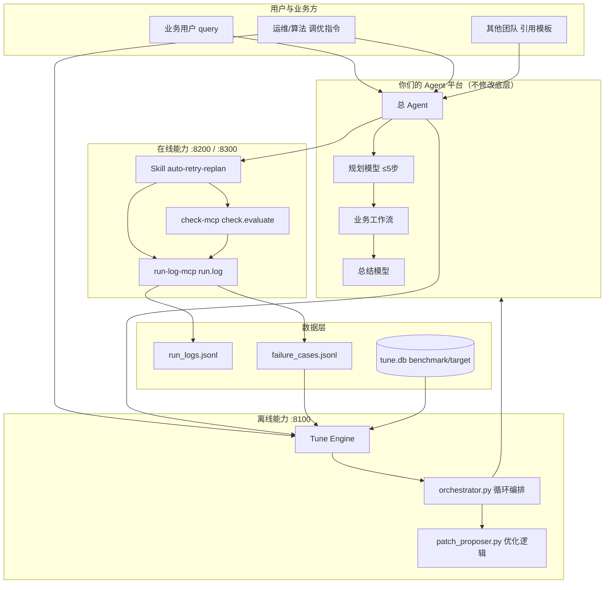
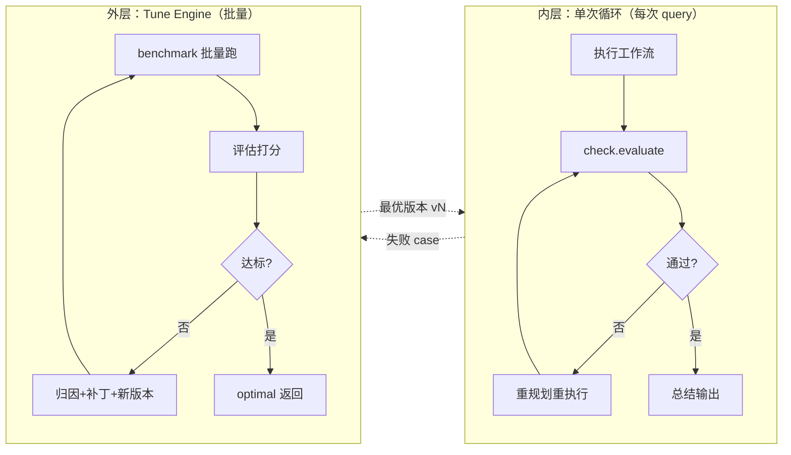
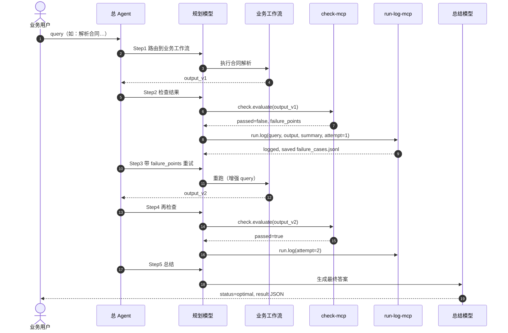
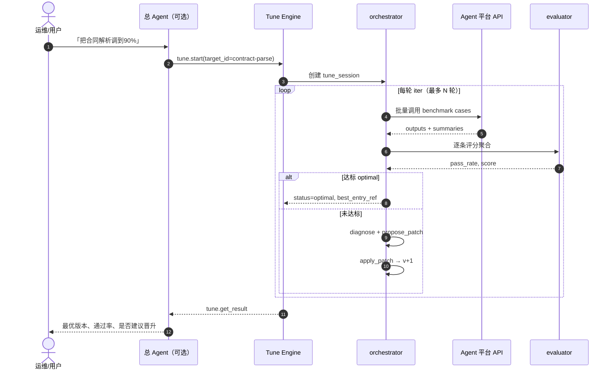
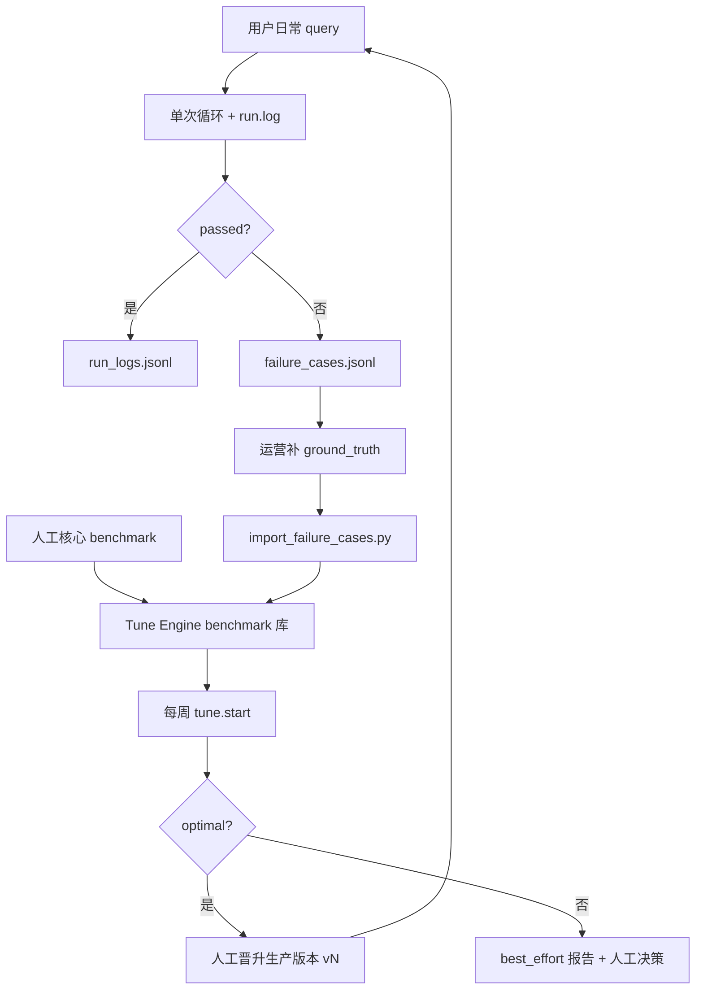
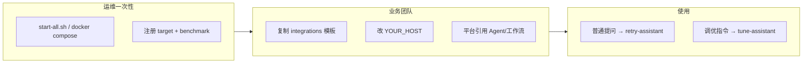
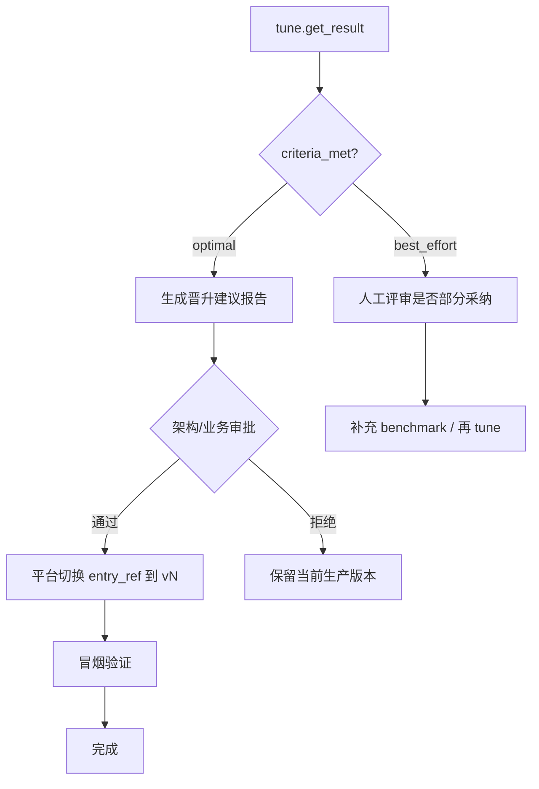
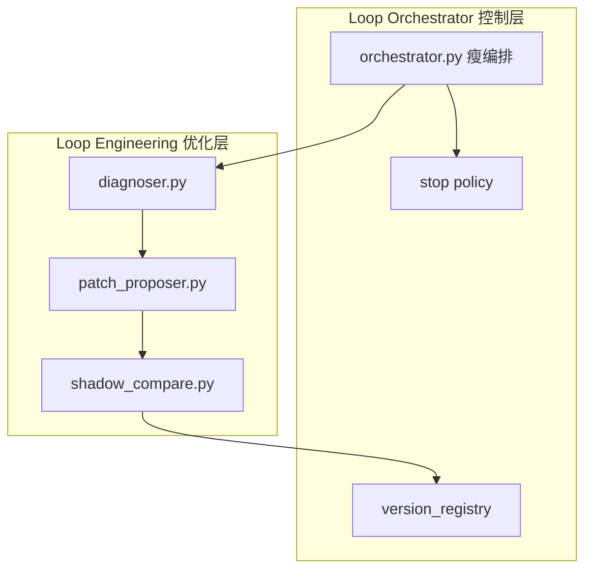
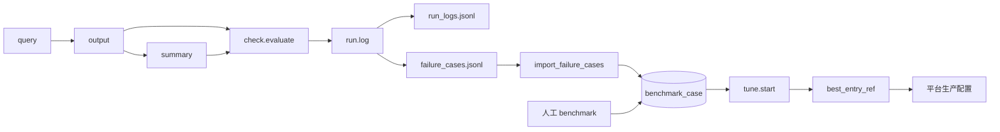
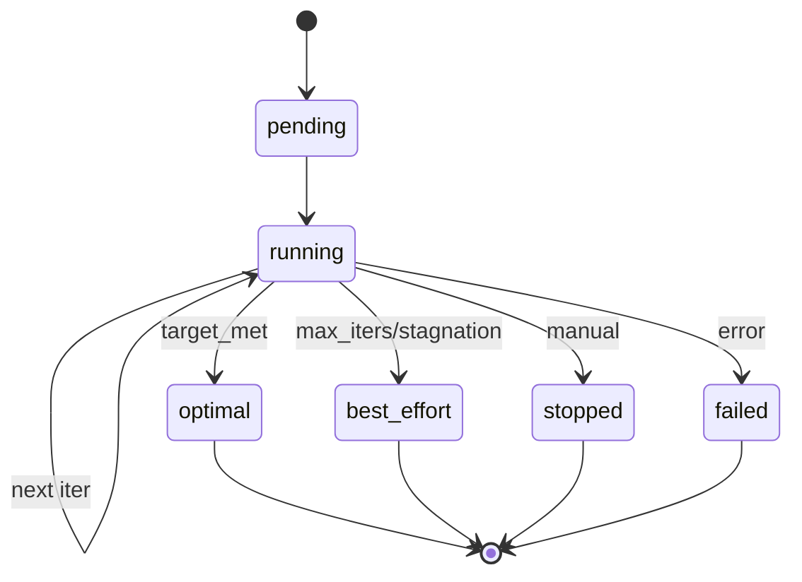

# Agent 自调优：技术路线图与业务流程图

> 版本：v1.0  
> 更新：2026-06-24  
> 仓库：https://github.com/wangxiaomo12138/lqy2026  
> 适用：仅能接入 Agent 平台、不可改底层的团队

---

## 目录

1. [目标与范围](#1-目标与范围)
2. [总体架构图](#2-总体架构图)
3. [业务流程图](#3-业务流程图)
4. [技术组件与成熟度](#4-技术组件与成熟度)
5. [技术路线图（分阶段）](#5-技术路线图分阶段)
6. [模块演进路线（Orchestrator vs Engineering）](#6-模块演进路线orchestrator-vs-engineering)
7. [数据流与状态流](#7-数据流与状态流)
8. [角色与职责](#8-角色与职责)
9. [里程碑与验收标准](#9-里程碑与验收标准)
10. [风险与依赖](#10-风险与依赖)

---

## 1. 目标与范围

### 1.1 业务目标

| 目标 | 指标示例 | 负责方案 |
|------|----------|----------|
| 单次提问答得更好 | 首次通过率 ↑、重试次数 ↓ | 单次循环（在线） |
| 长期能力持续提升 | benchmark 通过率 ≥ 90% | Tune Engine（离线） |
| 真实问题反哺优化 | 线上失败 case 入库率 | run-log-mcp + Tune |
| 他人零代码接入 | 引用 Agent/工作流即可用 | integrations 模板 |

### 1.2 范围边界

```text
在范围内：
  - check-mcp / run-log-mcp / tune-engine 三个服务
  - Skill + Agent/工作流引用模板
  - benchmark、评估、循环调优、失败 case 回流

不在范围内（本期不做）：
  - 修改 Agent 平台底层规划引擎
  - 自动无审批晋升生产（建议人工）
  - 替代平台自带工作流引擎
```

---

## 2. 总体架构图

### 2.1 系统全景



### 2.2 双循环关系



---

## 3. 业务流程图

### 3.1 流程一：用户普通提问（在线单次循环）

**参与角色：** 业务用户 → 总 Agent → 在线重试助手 / 业务工作流 → check-mcp → run-log-mcp



**业务结果：**
- 用户拿到当次最优答案
- 失败记录自动进入 `failure_cases.jsonl`（供后续离线调优）

---

### 3.2 流程二：批量自动调优（Tune Engine）

**参与角色：** 运维/总 Agent → Tune Engine → Agent 平台 → 评估器



**业务结果：**
- 得到 `best_entry_ref`（如 `wf_contract_parse@v5`）
- 人工确认后，在平台将生产配置切到该版本

---

### 3.3 流程三：真实案例回流 + 联合调优（推荐生产形态）



---

### 3.4 流程四：他人接入（零代码）



---

### 3.5 流程五：版本晋升（人工闸门）



---

## 4. 技术组件与成熟度

| 组件 | 端口/路径 | 当前状态 | 下一阶目标 |
|------|-----------|----------|------------|
| check-mcp | :8200 | ✅ MVP 可用 | 多 task_type 评估器插件化 |
| run-log-mcp | :8300 | ✅ MVP 可用 | 自动触发 tune 阈值脚本 |
| tune-engine API | :8100 | ✅ MVP 可用 | 鉴权、多租户 |
| orchestrator | orchestrator.py | ✅ 主循环可用 | 瘦身为纯编排 |
| patch_proposer | patch_proposer.py | ⚠️ 规则级 | LLM 归因 + 平台 patch API |
| shadow_compare | 未实现 | ❌ | 独立模块，晋升前必跑 |
| agent_platform 客户端 | agent_platform.py | ⚠️ Mock | 对接真实 query→answer API |
| integrations 模板 | integrations/ | ✅ 可用 | 按你们平台 UI 出截图版 |
| task-registry | task-registry.yaml | ✅ 可用 | 平台配置中心同步 |
| Docker 部署 | docker-compose | ✅ 可用 | CI/CD + 健康检查 |

**图例：** ✅ 完成　⚠️ 部分完成　❌ 未开始

---

## 5. 技术路线图（分阶段）

建议总周期约 12 周，分四阶段推进（阶段 1 与阶段 2 可并行）。

### 阶段 1：在线能力上线（第 1～3 周）

**目标：** 用户每次提问可自动重试，失败可记录。

| 周 | 任务 | 交付物 | 验收 |
|----|------|--------|------|
| W1 | 部署 check-mcp、run-log-mcp | 服务 :8200/:8300 可访问 | health 200 |
| W1 | 总 Agent 挂两个 MCP | 平台配置完成 | 工具列表可见 |
| W2 | 绑定 Skill auto-retry-replan | 平台 Skill 生效 | 规划含 check.evaluate |
| W2 | 引用 retry-assistant 或 wf_retry_wrapper | integrations 模板导入 | 架构评审通过 |
| W3 | 合同解析 task-registry 配置 | expected_fields 正确 | 合同样本测试通过 |
| W3 | 验证 run.log 写入 | failure_cases.jsonl 有数据 | 失败样本能查到 |

**阶段出口标准：** 10 条真实 query 测试，≥70% 经重试后 `check.evaluate` 通过。

---

### 阶段 2：离线 Tune Engine（第 2～5 周，与阶段 1 可并行）

**目标：** 批量调优合同解析，能跑出 optimal 或 best_effort。

| 周 | 任务 | 交付物 | 验收 |
|----|------|--------|------|
| W2 | 本地 run_demo.py 跑通 | Mock 循环 optimal | 3 轮内达标演示 |
| W3 | 准备 15～30 条人工 benchmark | JSON + ground_truth | 评审通过 |
| W4 | 对接 agent_platform.py | 真实 query→answer | 单条 API 调通 |
| W4 | POST /targets 注册 contract-parse | target 入库 | tune.start 可触发 |
| W5 | tune-mcp 挂总 Agent / tune-assistant | 自然语言触发调优 | 「调到90%」可跑 |

**阶段出口标准：** 人工 benchmark 上 pass_rate 从 baseline 提升 ≥15%。

---

### 阶段 3：联合闭环（第 6～8 周）

**目标：** 线上失败自动沉淀，定期批量调优，晋升后线上重试减少。

| 周 | 任务 | 交付物 | 验收 |
|----|------|--------|------|
| W6 | 建立 failure case 补答案 SOP | 运营文档 | 每周补 ≥5 条 |
| W6 | import_failure_cases 周任务 | cron/手册 | 导入成功日志 |
| W7 | 合并人工集 + 真实集 tune | 联合 benchmark | 通过率可复现 |
| W7 | run.stats 周报 | 通过率趋势 | 可展示 |
| W8 | 首次生产晋升 vN | 变更单 + 回滚方案 | 冒烟通过 |

**阶段出口标准：** 晋升后 2 周内，单次循环平均重试次数下降 ≥30%。

---

### 阶段 4：工程化与扩展（第 9～12 周）

**目标：** 可推广到多业务、可审计、可回滚。

| 周 | 任务 | 交付物 | 验收 |
|----|------|--------|------|
| W9 | 实现 shadow_compare.py | 晋升前对比 | 不再盲目晋升 |
| W9 | 拆分 diagnoser / version_registry | 模块边界清晰 | 单元测试 |
| W10 | tune-engine 鉴权 + 审计日志 | API Key / 操作记录 | 安全评审 |
| W10 | 晋升审批流（人工闸门表单） | 流程文档 | 100% 晋升有单 |
| W11 | 发票等新 task 接入 | task-registry 扩展 | 第二个 target optimal |
| W12 | Grafana/邮件告警 | 失败率超阈值告警 | on-call 可收到 |

**阶段出口标准：** ≥2 个业务 target 可独立完成注册、调优、晋升。

---

## 6. 模块演进路线（Orchestrator vs Engineering）

### 6.1 当前（MVP）

```text
orchestrator.py  = 编排 + 部分优化逻辑（合并）
patch_proposer.py = diagnose + propose（规则）
shadow_compare   = 未实现（直接晋升）
```

### 6.2 目标（工程化）



| 阶段 | Orchestrator | Engineering |
|------|--------------|-------------|
| MVP（现在） | 全包 | patch_proposer 规则 |
| Phase 4 | 只调度 | + shadow_compare |
| 长期 | 分布式任务队列 | LLM diagnoser + 平台 patch API |

---

## 7. 数据流与状态流

### 7.1 数据流



### 7.2 Tune Session 状态机



---

## 8. 角色与职责

| 角色 | 在线单次循环 | 离线 Tune | 接入模板 |
|------|--------------|-----------|----------|
| **运维/SRE** | 部署 MCP 服务 | 部署 tune-engine、cron | Docker/脚本 |
| **算法/Agent** | 写 Skill、task-registry | 写 evaluator、target | 维护 integrations |
| **业务运营** | 看 run.stats | 补 ground_truth | — |
| **架构审批** | — | 晋升生产版本 | 评审接入 |
| **其他团队** | 引用 retry-assistant | 注册自己 target | 只填 HOST |

---

## 9. 里程碑与验收标准

| 里程碑 | 时间 | 验收标准 |
|--------|------|----------|
| **M1 在线可用** | W3 | 单次循环 + run.log 跑通 |
| **M2 离线可用** | W5 | tune.start 在真实 API 上 optimal/best_effort |
| **M3 联合闭环** | W8 | 真实 case 入库 → tune → 晋升 → 重试下降 |
| **M4 多业务复制** | W12 | ≥2 个 target，他人可引用模板独立接入 |

---

## 10. 风险与依赖

| 风险 | 影响 | 缓解 |
|------|------|------|
| 平台无 Agent 运行 API | Tune Engine 无法对接 | 先 Mock；推动平台提供 query API |
| 规划模型不按 Skill 走 | 单次循环失效 | 强化工作流描述；抽检轨迹 |
| 无 ground_truth | 真实 case 无法 tune | 运营 SOP 补答案 |
| 自动晋升生产 | 回退风险 | 人工审批 + shadow_compare |
| 调优成本高 | token/时间超预算 | constraints 上限、async + 抽样 |

### 外部依赖清单

- [ ] 平台提供：`agent_id + query → answer` HTTP API
- [ ] 平台支持：挂 MCP、挂 Skill、引用 Agent/工作流
- [ ] 可选：平台提供配置 patch API（版本晋升自动化）

---

## 附录 A：一页纸速览

```text
┌─────────────────────────────────────────────────────────────┐
│  用户 query                                                  │
│    → 在线：Skill + check + run.log → 当次答好 + 记失败        │
│    → 离线：Tune Engine → 改配置版本 → 长期更好                │
│    → 联合：失败 case → benchmark → 每周 tune → 人工晋升       │
├─────────────────────────────────────────────────────────────┤
│  服务：8200 check | 8300 run-log | 8100 tune                 │
│  接入：integrations/agents + workflows 模板引用               │
│  文档：docs/他人接入指南.md | docs/单次循环-他人接入指南.md    │
└─────────────────────────────────────────────────────────────┘
```

## 附录 B：相关文档索引

| 文档 | 用途 |
|------|------|
| `docs/Agent自调优技术方案总览.md` | 架构与接入总览 |
| `docs/批量调优与真实案例对比.md` | 案例 A/B/C |
| `docs/他人接入指南.md` | Tune Engine 给别人用 |
| `docs/单次循环-他人接入指南.md` | 在线重试给别人用 |
| `tune-engine/spec/04-state-machine.md` | 状态机细节 |
| `tune-engine/spec/05-api-and-directory.md` | API 与目录 |

---

*路线图随项目演进更新，以仓库 main 分支为准。*
