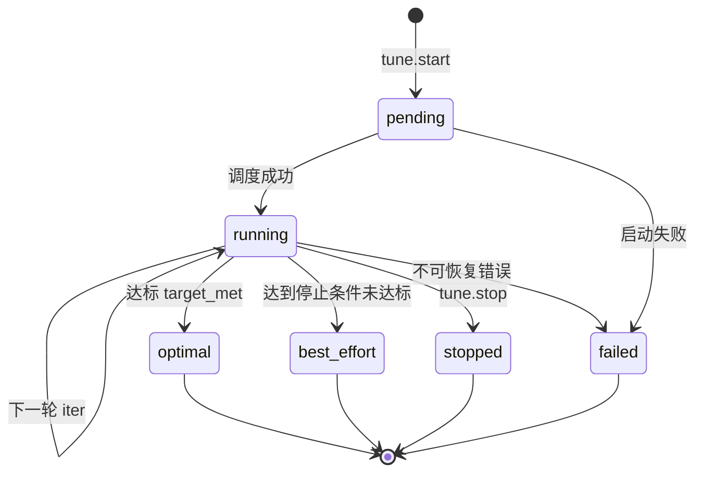
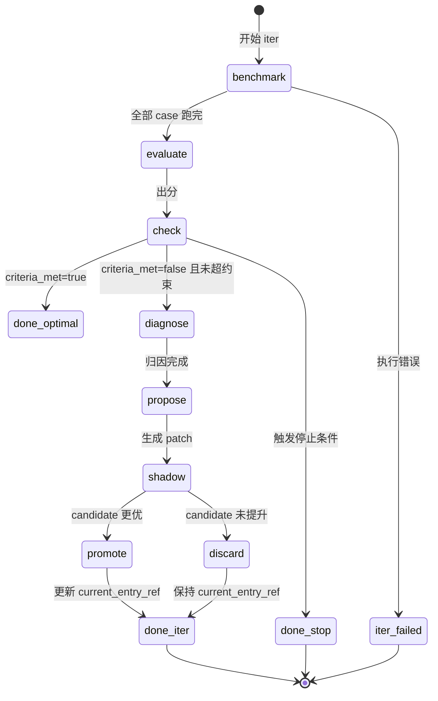

# Tune Engine 状态机

## 1. Session 状态流转



### 状态说明

| 状态 | 含义 | 对外行为 |
|------|------|----------|
| `pending` | 已创建，等待执行 | `tune.status` 显示排队中 |
| `running` | 正在跑某轮 iter | 可轮询 `tune.status` |
| `optimal` | 达标，调优成功 | `tune.get_result` 返回最优结果 |
| `best_effort` | 未达标但已到停止条件 | 返回当前最优 + recommendations |
| `stopped` | 人工中止 | 返回中止时最优 |
| `failed` | 异常失败 | 返回 error_message |

---

## 2. 单轮 Iter 状态流转



---

## 3. 主循环伪代码（Engine 核心）

```python
def run_session(session_id: str):
    session = load_session(session_id)
    target = load_target(session.target_id)
    session.status = "running"
    save(session)

    best = BestTracker(entry_ref=session.start_entry_ref, score=-1)

    try:
        for iter_no in range(1, session.max_iters + 1):
            session.current_iter = iter_no
            entry_ref = session.current_entry_ref

            # ---- Phase 1: Benchmark ----
            iter_rec = create_iter(session_id, iter_no, entry_ref)
            runs = run_benchmark(session, entry_ref, target.benchmark_suite_id)
            save_runs(runs)

            # ---- Phase 2: Evaluate ----
            eval_result = evaluate_runs(runs, target.evaluator_id)
            iter_rec.score = eval_result.aggregate_score
            iter_rec.pass_rate = eval_result.pass_rate
            iter_rec.metrics_json = eval_result.metrics
            iter_rec.eval_json = eval_result

            # 更新 session 最优
            if eval_result.aggregate_score > best.score:
                best.update(entry_ref, eval_result)

            session.best_entry_ref = best.entry_ref
            session.best_score = best.score
            session.best_metrics_json = best.metrics
            save(session)

            # ---- Phase 3: 达标？----
            if criteria_met(eval_result, session.success_criteria_json):
                iter_rec.status = "completed"
                finish_iter(iter_rec)
                session.status = "optimal"
                session.criteria_met = True
                session.stop_reason = "target_met"
                finish_session(session)
                return build_result(session, best)

            # ---- Phase 4: 停止条件？----
            stop = should_stop(session, eval_result, iter_no)
            if stop:
                iter_rec.status = "completed"
                finish_iter(iter_rec)
                session.status = "best_effort"
                session.stop_reason = stop.reason
                finish_session(session)
                return build_result(session, best)

            # evaluate_only 模式不调配置
            if session.mode == "evaluate_only":
                continue

            # ---- Phase 5: Diagnose + Patch ----
            diagnosis = diagnose(runs, eval_result)
            patch = propose_patch(diagnosis, target.patchable_components)
            iter_rec.diagnosis_json = diagnosis
            iter_rec.patch_json = patch
            iter_rec.patch_type = patch.target_type

            if session.mode == "dry_run":
                iter_rec.patch_applied = False
                iter_rec.status = "completed"
                finish_iter(iter_rec)
                continue

            candidate_ref = apply_patch(entry_ref, patch)
            iter_rec.candidate_entry_ref = candidate_ref

            # ---- Phase 6: Shadow Compare ----
            shadow = shadow_compare(
                baseline_ref=entry_ref,
                candidate_ref=candidate_ref,
                suite_id=target.benchmark_suite_id,
                sample_ratio=0.5,  # 可先用子集加速，最后一轮全量
            )
            iter_rec.shadow_compare_json = shadow

            if shadow.improved:
                promote(candidate_ref)
                session.current_entry_ref = candidate_ref
                iter_rec.patch_applied = True
                iter_rec.promoted = True
            else:
                discard(candidate_ref)
                iter_rec.patch_applied = True
                iter_rec.promoted = False

            iter_rec.status = "completed"
            finish_iter(iter_rec)
            save(session)

        # 跑满 max_iters
        session.status = "best_effort"
        session.stop_reason = "max_iters"
        finish_session(session)
        return build_result(session, best)

    except Exception as e:
        session.status = "failed"
        session.error_message = str(e)
        finish_session(session)
        raise
```

---

## 4. 停止条件 `should_stop`

按优先级检查：

```python
def should_stop(session, eval_result, iter_no):
    # 1. 预算
    if session.total_cost_tokens >= session.constraints.max_cost_tokens:
        return Stop("budget_exceeded")
    if session.total_duration_ms >= session.constraints.max_wall_time_sec * 1000:
        return Stop("budget_exceeded")

    # 2. 停滞：连续 N 轮提升 < min_delta
    window = session.constraints.stagnation_window  # 默认 3
    min_delta = session.constraints.min_delta      # 默认 0.02
    recent = load_recent_scores(session.session_id, window)
    if len(recent) >= window:
        if max(recent) - min(recent) < min_delta:
            return Stop("stagnation")

    # 3. 本轮 iter 已达上限（由 for 循环控制）
    return None
```

---

## 5. Shadow Compare 晋升规则

```python
def shadow_compare(baseline_ref, candidate_ref, suite_id, sample_ratio=1.0):
    cases = sample_benchmark_cases(suite_id, sample_ratio)
    base_scores = [run_and_score(baseline_ref, c) for c in cases]
    cand_scores = [run_and_score(candidate_ref, c) for c in cases]

    base_avg = avg(base_scores)
    cand_avg = avg(cand_scores)
    delta = cand_avg - base_avg

    improved = (
        delta >= 0.03                          # 平均分提升 >= 3%
        and cand_pass_rate >= base_pass_rate   # 通过率不下降
        and cand_p95 <= base_p95 * 1.10        # 时延涨幅 <= 10%
        and cand_safety == 1.0                 # 安全项全过（如有）
    )

    return {
        "baseline_ref": baseline_ref,
        "candidate_ref": candidate_ref,
        "baseline_score": base_avg,
        "candidate_score": cand_avg,
        "delta": delta,
        "improved": improved,
    }
```

---

## 6. MCP 与 Engine 的调用关系

```text
总 Agent / 工作流
    │
    ├─ tune.start ──────► 创建 tune_session (pending)
    │                         │
    │                         ▼
    │                    异步 Worker 执行 run_session()
    │                         │
    ├─ tune.status ◄──── 读 tune_session + tune_iter
    │
    └─ tune.get_result ◄─ session.status in (optimal, best_effort, stopped, failed)
                              返回 best_entry_ref + artifact
```

---

## 7. 合同解析 Evaluator 示例逻辑

```python
def contract_field_eval(run_output, ground_truth):
  """
  run_output: tune_run.output_json
  ground_truth: benchmark_case.ground_truth_json
  """
    fields = ["party_a", "party_b", "amount", "sign_date", "payment_terms"]
    correct = 0
    total = len(fields)
    failures = []

    for f in fields:
        pred = normalize(run_output.get(f))
        truth = normalize(ground_truth.get(f))
        if pred == truth:
            correct += 1
        else:
            failures.append({"field": f, "expected": truth, "actual": pred})

    field_accuracy = correct / total
    passed = field_accuracy >= 0.8 and len(failures) <= 2

    return {
        "score": field_accuracy,
        "passed": passed,
        "failures": failures,
    }
```
